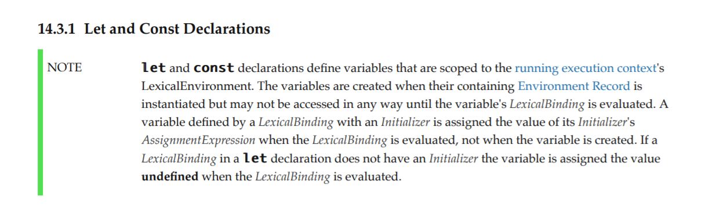
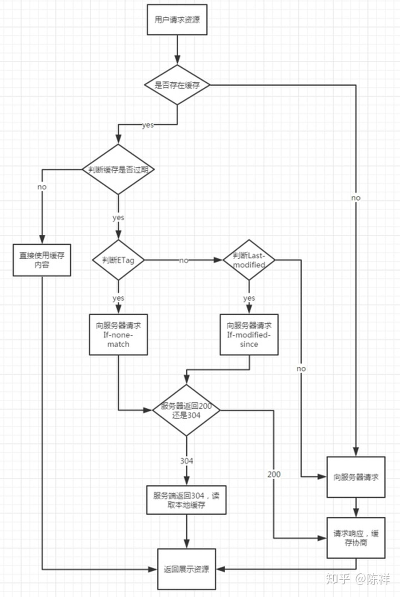

# 智文的前端小站

## 一、HTML

  ### H5新标签

1. header 表示头部
2. nav 表示导航
3. article 表示文章主体
4. aside 表示和页面主要内容有关，但不是页面的一部分，经常表示一个相关链接
5. footer 表示底部
6. audio 音频标签
7. video 视频标签

h5 新标签提供了更好的语义化支持

  ### meta标签

meta：文档级元数据元素，提供有关页面的元信息（meta-information），比如针对搜索引擎和更新频度的描述和关键词

#### 属性

- name：

  - description 用于网站内容的描述，告诉搜索引擎网站的主要内容

    ```html
    <meta name="description" content="网站的描述">
    ```

  - keywords 告诉搜索引擎网页的关键字

    ```html
    <meta name="keywords" content="网站的关键字">
    ```

  - viewport 指定移动端的窗口

    ```html
    <meta name="viewport" content="width=device-width, initial-scale=1.0">
    ```

- http-equiv：

  - content-type 设定网页字符集

    ```html
    <meta charset="utf-8">
    ```

  - X-UA-Compatible 用于告知浏览器以何种版本来渲染页面

    ```html
    <meta http-equiv="X-UA-Compatible" content="IE=edge">
    ```

  - cache-control 指导浏览器如何缓存某个响应以及缓存多长时间

    ```html
    <meta http-equiv="cache-control" content="no-cache">
    ```

    - no-cache: 先发送请求，与服务器确认该资源是否被更改，如果未被更改，则使用缓存。
    - no-store: 不允许缓存，每次都要去服务器上，下载完整的响应。（安全措施）
    - public : 缓存所有响应，但并非必须。因为max-age也可以做到相同效果
    - private : 只为单个用户缓存，因此不允许任何中继进行缓存。（比如说CDN就不允许缓存private的响应）
    - maxage : 表示当前请求开始，该响应在多久内能被缓存和重用，而不去服务器重新请求。例如：max-age=60表示响应可以再缓存和重用 60 秒。

## 二、CSS

### 选择器

#### 选择器列表

将多个选择器使用逗号组合起来形成选择器列表，当选择器列表中有选择器无效（语法错误）时，整个列表都会被忽略

#### 选择器种类

1. 类型选择器

   ```css
   h1{}
   ```

2. 类选择器

   ```css
   .box1{}   
   div.box1{}   /*div中所有box1类*/
   ```

3. ID选择器

   ```css
   #btn{}
   ```

4. 属性选择器

   ```css
   [title='mytitle']{}
   ```

5. 关系选择器

   1. 后代选择器

      ```css
      ul li{}
      ```

   2. 子代选择器

      ```css
      article > p{}
      ```

   3. 相邻兄弟选择器

      ```css
      h1 + p{}
      ```

   4. 通用兄弟选择器

      ```css
      h1 ~ p{}
      ```

6. 伪类选择器

   1. :checked

      ```css
      input:checked{}   /*选择所有被选中的input标签*/
      ```

   2. :default

      ```css
      input:default{}   /*选择所有默认的input*/
      ```

   3. :focus

      ```css
      input:focus{}   /*选择获得焦点的input*/
      ```

   4. :disabled

      ```css
      input:disabled{}   /*选择所有禁用的input*/
      ```

   5. :enabled

      ```css
      input:enabled{}   /*选择所有启用的input*/
      ```

   6. :first-child

      ```css
      p:first-child{}   /*选择每一组p标签中第一个p标签（第一个子代元素必须是p，否则不匹配）*/
      ```

   7. :first-of-type

      ```css
      p:first-of-type{}   /*选择一组p标签兄弟中的第一个p标签（不需要考虑父元素的第一个子代元素）*/
      ```

   8. :nth-child
   
7. 伪元素选择器

   1. ::before

      ```css
      div::before{
      	content: ">";   /*创建一个伪元素，作为该元素的第一个子元素，默认为行内元素*/
      }
      ```

   2. ::after

      ```css
      div::after{
        content: "<";   /*创建一个伪元素，作为已选中元素的最后一个子元素，默认是行内元素*/
      }
      ```

8. 通配选择器

   ```css
   *{
   	/*选择所有元素*/
   }
   ```


### 选择器权重

不同类型的选择器有不同的分数值，把这些分数相加就得到特定选择器的权重，然后就可以进行匹配。

一个选择器的优先级可以说是由四个部分相加 (分量)，可以认为是个十百千 — 四位数的四个位数：

1. **千位**： 如果声明在 [`style`](https://developer.mozilla.org/zh-CN/docs/Web/HTML/Global_attributes#attr-style) 的属性（内联样式）则该位得一分。这样的声明没有选择器，所以它得分总是1000。
2. **百位**： 选择器中包含ID选择器则该位得一分。
3. **十位**： 选择器中包含类选择器、属性选择器或者伪类则该位得一分。
4. **个位**：选择器中包含元素、伪元素选择器则该位得一分。

> 通用选择器 (`*`)，组合符 (`+`, `>`, `~`, ' ')，和否定伪类 (`:not`) 不会影响优先级。
>
> 在进行计算时不允许进行进位，例如，20 个类选择器仅仅意味着 20 个十位，而不能视为 两个百位，也就是说，无论多少个类选择器的权重叠加，都不会超过一个 ID 选择器。

`!important` 能覆盖所有规则

### 盒模型

#### 盒模型

组成一个块级盒模型需要：

- Content box：这个区域是用来显示内容，大小可以通过设置 [`width`](https://developer.mozilla.org/zh-CN/docs/Web/CSS/width) 和 [`height`](https://developer.mozilla.org/zh-CN/docs/Web/CSS/height)。
- Padding box：包围在内容区域外部的空白区域； 大小通过 [`padding`](https://developer.mozilla.org/zh-CN/docs/Web/CSS/padding) 相关属性设置。
- Border box：边框盒包裹内容和内边距。大小通过 [`border`](https://developer.mozilla.org/zh-CN/docs/Web/CSS/border) 相关属性设置。
- Margin box：这是最外面的区域，是盒子和其他元素之间的空白区域。大小通过 [`margin`](https://developer.mozilla.org/zh-CN/docs/Web/CSS/margin) 相关属性设置。

当设置width和height时，设置的是content box，增加内边距、边框和外边距不会影响内容区域的尺寸，但是会增加元素框的总尺寸。

元素的总宽度应该这样计算：

元素总宽度 = 宽度 + 左内边距 + 右内边距 + 左边框 + 右边框 + 左外边距 + 右外边距

元素的总高度应该这样计算：

元素总高度 = 高度 + 上内边距 + 下内边距 + 上边框 + 下边框 + 上外边距 + 下外边距

#### 外边距

外边距是盒子周围一圈看不到的空间。它会把其他元素从盒子旁边推开。 外边距属性值可以为正也可以为负。设置负值会导致和其他内容重叠。

##### 外边距折叠

如果有两个外边距相接的元素，这些外边距将==合并为一个外边距==，即最大的单个外边距的大小。

#### 内联盒子

对于内联盒子（内联元素），设置==宽度和高度会被忽略==，但==内边距，外边距和边框生效==，但它们不会改变其他内容与内联盒子的关系，因此==内边距和边框会与段落中的其他单词重叠==。解决方法：display: inline-block;

### BFC，.clearfix 清除塌陷

块级格式化上下文（Block Formatting Context, BFC），是Web页面的可视CSS渲染的一部分，是块盒子的布局过程发生的区域，也是浮动元素与其他元素交互的区域。

#### 创建BFC

- 根元素（html）
- 浮动元素（元素的 float 不是 none）
- 绝对定位元素（display: absolute 或 display: fixed）
- 行内块元素（display: inline-block）
- `display` 值为 `flow-root` 的元素
- 表格单元格（元素的 `display` 为 `table-cell`，HTML 表格单元格默认为该值）
- 表格标题（元素的`display`为 `table-caption`，HTML 表格标题默认为该值）
- 匿名表格单元格元素（元素的`display`为 `table`、`table-row`、 `table-row-group`、`table-header-group`、`table-footer-group`（分别是 HTML table、row、tbody、thead、tfoot 的默认属性）或 `inline-table`）
- overflow 不为 visible 的元素
- 弹性元素（flex 的直接子元素）
- 网格元素（gird 的直接子元素）

#### BFC的作用

- 父元素高度塌陷

  当子元素高度大于父元素，且子元素开启浮动后，由于子元素脱离了文档流，会导致父元素高度塌陷。

  ###### 解决方法

  - 改变父元素的 `overflow` 值，开启父元素的BFC，这时父元素会变成一个迷你布局，将包含浮动的子元素

  - 开启父元素的 `display: flow-root` ，它可以创建无副作用的 BFC。关于值 `flow-root`的这个名字，当你明白你实际上是在创建一个行为类似于根元素 （浏览器中的`<html>`元素） 的东西时，就能发现这个名字的意义了——即==创建一个上下文，里面将进行 [flow layout](https://developer.mozilla.org/zh-CN/docs/Web/CSS/CSS_Flow_Layout)==（也就是文档流布局）。

  - 添加一个新的空元素把父元素撑开（会占用仅有的两个伪元素）

    ```css
    .clearfix::before,   /*在前面加一个空的伪元素，解决父子外边距合并问题*/
    .clearfix::after{
        content:'';
        display:table;
        clear:both;   /*清除浮动影响，确保这个空元素能在浮动元素下面*/
    }
    ```

- 外边距合并

  两个相邻的盒子的外边距会合并在一起（①父元素有 margin-top，子元素也有 margin-top，且没有边框，这时两个 margin-top 重叠在一起，会产生合并,导致子元素的外边距无法在父元素内，父子元素会贴在一起；②两个兄弟元素之间的外边距重叠在一起,取最大值）

  ###### 解决方法

  - 给父元素加上边框（会改变盒子大小）
  - 开启父元素 BFC
  - 使用 clearfix 类（在父元素前面加一个空的伪元素来隔开两个外边距）

### 浮动
### 定位
### em，rem，以及 rem 进行移动端布局

#### em 和 rem

- em：font-size-of-the-element，em 作为 font-size 的单位时，其代表父元素的字体大小，em 作为其他属性单位时，代表自身字体大小
- rem：font-size-of-the-root-element，rem 作用于非根元素时，相对于根元素字体大小；rem 作用于根元素字体大小时，相对于其出初始字体大小

#### rem 布局

由于 100vw 转换为设计图里的 750px，假设有一个 30px 需要转换，可以得出 30px / 750px = (x)vw / 100vw，即 x = (100 / 750) * 30 ，然而每次需要换算时都进行 `(100 / 设计图宽度) * 需要转换的px` 实在是太麻烦了，所以使用 rem 来确定转换关系。

**思路**

==设置根元素大小为一个固定数值 * (100vw / 设计图宽度)，这样我们在进行计算时只需要除以那个固定数值（通常是 100）即可（单位是 rem）==，这时 1rem = 固定数值个设计图里的 px（100px）

rem 布局首先要操控根元素字体大小

```css
html{
    font-size: calc(100*100vw/750);
}
body{
  font-size:14px; /* 在这里把字体大小校正回来 */
}
```

这里是因为很多设计稿都是基于 iPhone6 来设计的，一般都是 750px（2 倍图，iPhone6 的设备宽度为 375px）所以除以  750 是为了在 iPhone6 设备下让 1rem 等于 100px。

```css
.menu li{
    display: table-cell;
    padding: .1rem .3rem;  /* 相当于10px 30px */
}
```


### 过渡和动画

#### 过渡

CSS 过渡 由简写属性`transition`定义是最好的方式，可以避免属性值列表长度不一，节省调试时间。

过渡的子属性有：

- `transition-property` 指定了哪些属性用于过渡，默认是 all
- `transition-duration` 指定了过渡的时长，可以为多个属性指定不同的时长，单位是 s 或者 ms
- `transition-timing-function` 指定了过渡的变化函数。默认是 ease
  - ease 先加速再减速
  - linear 线性匀速变化
  - ease-in 加速
  - ease-out 减速
  - steps() 指定分步执行过渡效果。接收两个参数，第一个是分成几步，第二个是 end 或 start，决定了每一阶段的开始还是结束时执行，默认是 end
  - cubic-bezier() 自定义运动曲线
- `transition-delay` 指定了执行的延迟时间，默认是 0

简写属性

​	简写属性要求两个时间中，第一个是持续时间，第二个是延迟时间

```css
div {
    transition: <property> <duration> <timing-function> <delay>;
}
```

过渡时必须是从数值向数值过渡，而==不能向 auto 过渡==。

#### 动画

在CSS中创建动画需要使用 `animation` 属性，该属性允许配置动画时间、时长以及其他动画细节，但该属性不能配置动画的实际表现，动画的实际表现是由 `@keyframes` 规则实现。

动画的子属性有：

- `animation-name` 指定由 `@keyframes` 描述的关键帧名称

- `animation-duration` 设置动画的时长

- `animation-delay` 设置延时，即从元素加载完成到动画开始执行的时间

- `animation-direction` 设置动画执的方向

  - normal：默认值，从头到尾，从头到尾...
  - reverse：从尾到头，从尾到头...
  - alternate：从头到尾，从尾到头，从头到尾...
  - alternate-reverse：从尾到头，从头到尾，从尾到头...

- `animation-iteration-count` 设置动画重复次数，可以指定 infinite 无限循环动画

- `animation-play-state` 动画默认在结束时跳回开始状态，要想保持结束时的状态，使用这个属性

  ```css
  /*没有鼠标没有悬停时，动画状态是暂停；一旦悬停，动画状态改为继续播放。*/
  div {
      animation: spin 1s linear infinite;
      animation-play-state: paused;
  }
  
  div:hover {
    animation-play-state: running;
  }
  ```

- `animation-timing-function` 指定了动画的运动曲线

- `animation-fill-mode` 指定动画的填充模式

  - `none`：默认值，结束后回到元素原来的状态。
  - `forwards`：结束后让动画停留在结束状态 （to 的状态）。
  - `backwards`：结束后让动画回到第一帧的状态（from 的状态）。
  - `both`: 根据 animation-direction 轮流应用 forwards 和 backwards 规则。

动画的简写属性

```css
/*以下两种写法是等价的*/
div:hover {
  animation: 2s 1s rainbow linear 3 forwards normal;
}

div:hover {
  animation-name: rainbow;
  animation-duration: 2s;
  animation-timing-function: linear;
  animation-delay: 1s;
  animation-fill-mode: forwards;
  animation-direction: normal;
  animation-iteration-count: 3;
}
```

使用 @keyframes 定义动画关键帧

> ​	`0%`表示动画的第一时刻，`100%`表示动画的最终时刻。因为这两个时间点十分重要，所以还有特殊的别名：`from`和`to`。这两个都是可选的，若`from/0%`或`to/100%`未指定，则浏览器使用计算值开始或结束动画。

```css
/*该例中<p>元素由浏览器窗口右边滑至左边*/
p {
  animation: 3s slidein;
}

@keyframes slidein {
  from {
    margin-left: 100%;
    width: 300%;
  }

  to {
    margin-left: 0%;
    width: 100%;
  }
}
```


### 变形

变形是通过 CSS 来改变元素的形状或位置，变形==不会影响页面的布局==，使用 transform 来设置变形效果

使用  `transform-origin` 来设置变形原点，可选值：left，top...或X,Y值。默认为center

#### 平移

​	若使用百分比，百分比相对自己计算。（可以通过这一点来使元素居中）

- `translateX()` 沿着X轴平移

- `translateY()` 沿着Y轴平移

- `translateZ()` 沿着Z轴平移，数值越大，离人越近。但是默认情况下网页是不支持透视的（大小不变），想要看见效果必须==设置网页视距==

  ```css
  html{
  	/*设置网页的视距是800px（人眼距离网页的距离）*/
  	perspective: 800px;
  }
  ```

#### 旋转

​	需要设置视距来产生大小变化效果

- `rotateX()` 沿着X轴顺时针旋转，单位是 deg（度数）或 turn（几圈）
- `rotateY()` 沿着Y轴顺时针旋转
- `rotateZ()` 沿着Z轴顺时针旋转

#### 缩放

- `scale()` 对X和Y轴都进行缩放
- `scaleX()` 对X轴进行缩放
- `scaleY()` 对Y轴进行缩放
- `scaleZ()` 对Z轴进行缩放

### flex 布局

flex 布局即为弹性布局，为盒模型开启`display: flex`后，该盒模型就会成为 flex 容器，他其中的子元素会成为弹性元素。

flex 容器有两根轴，分别是默认的==水平主轴==（main axis）和与主轴垂直的==辅轴==（cross axis），弹性元素默认沿着主轴排列。

#### flex 容器的属性

- flex-direction 修改主轴方向，可选 `row` , `row-reverse` , `column` , `column-reverse`，默认为 `row`
- flex-wrap 修改是否换行，可选 `nowrap` , `wrap` , `wrap-reverse`，默认为 `nowrap`
- flex-flow 上面两个属性的简写，可以同时设定两个属性，默认为 `row nowrap`
- justify-content 定义了元素在主轴上的排列方式，可选 `flex-start` , `flex-end` , `center` , `space-around` , `space-between`
- align-items 定义了元素在辅轴上的排列方式，可选 `flex-start` , `flex-end` , `center` , `baseline` , `stretch`
- align-content 定义了多条辅轴（有换行时生效），可选 `flex-start` , `flex-end` , `center` , `space-between` , `space-around` , `stretch`

#### 弹性元素的属性

- order 定义元素的排列顺序，默认都是0，数值越小越靠前，`.item{order: 1}`会让这个元素排在为0的元素后面
- flex-grow 定义了有空余空间时元素的放大比例，默认是0，即不放大。如果所有元素的`flex-grow`属性都为1，则它们将等分剩余空间（如果有的话）。如果一个元素的`flex-grow`属性为2，其他元素都为1，则前者占据的剩余空间将比其他元素多一倍。
- flex-shrink 定义了空间不够时元素如何收缩，默认为1，即默认都会等比例缩小。如果一个元素的`flex-shrink`属性为0，其他元素都为1，则空间不足时，前者不缩小。负值对该属性无效。
- align-self 允许元素设定自己的辅轴对齐方式，默认为 `auto`，即继承父元素的 `align-items` 属性。该属性可能取6个值，除了 `auto`，其他都与 `align-items` 属性完全一致。

### grid 布局

网格布局将网页分隔成一个个网格，可以组合任意不同的网格。

使用 `display: grid` 布局的元素称为“容器（container）”，其中的子元素称为“项目（item）”。

注意：项目只能是容器的顶层子元素，不包含项目的子元素。Grid 布局只对项目生效。

#### 行，列，单元格和网格线

容器里面的水平区域称为"行"（row），垂直区域称为"列"（column）。

行和列的交叉区域，称为"单元格"（cell）。

划分网格的线，称为"网格线"（grid line）。水平网格线划分出行，垂直网格线划分出列。

正常情况下，`n`行有`n + 1`根水平网格线，`m`列有`m + 1`根垂直网格线，比如三行就有四根水平网格线。

#### 容器属性

**grid-template-columns 属性， grid-template-rows 属性**

- `grid-template-columns` 定义了容器有多少列，以及每一列的宽度
- `grid-template-rows` 定义了容器有多少行，以及每一行的高度

**重复，auto-fill 及 fr**

1. repeat

   ```css
   .container {
     display: grid;
     grid-template-columns: repeat(3, 33.33%);
     grid-template-rows: repeat(3, 33.33%);
   }
   ```

2. auto-fill

   有时，单元格的大小是固定的，但是容器的大小不确定。如果希望每一行（或每一列）容纳尽可能多的单元格，这时可以使用`auto-fill`关键字表示自动填充。

   ```css
   .container {
     display: grid;
     grid-template-columns: repeat(auto-fill, 100px);
   }
   ```

   上面代码表示每列宽度`100px`，然后自动填充，直到容器不能放置更多的列。

3. fr单位

   为了方便表示比例关系，网格布局提供了`fr`关键字（fraction 的缩写，意为"片段"）。如果两列的宽度分别为`1fr`和`2fr`，就表示后者是前者的两倍。

   `fr`可以与绝对长度的单位结合使用，这时会非常方便。

   ```css
   .container {
     display: grid;
     grid-template-columns: 150px 1fr 2fr;
   }
   ```

   上面代码表示，第一列的宽度为 150 像素，第二列的宽度是第三列的一半。

**grid-row-gap 属性， grid-column-gap 属性， grid-gap 属性**

`grid-row-gap`属性设置行与行的间隔（行间距），`grid-column-gap`属性设置列与列的间隔（列间距）。

```css
.container {
  grid-row-gap: 20px;
  grid-column-gap: 20px;
}
```

上面代码中，`grid-row-gap`用于设置行间距，`grid-column-gap`用于设置列间距。

`grid-gap`属性是`grid-column-gap`和`grid-row-gap`的合并简写形式，语法如下。

```css
grid-gap: <grid-row-gap> <grid-column-gap>;
```

因此，上面一段 CSS 代码等同于下面的代码。

```css
.container {
  grid-gap: 20px 20px;
}
```

如果`grid-gap`省略了第二个值，浏览器认为第二个值等于第一个值。

> 根据最新标准，上面三个属性名的`grid-`前缀已经删除，`grid-column-gap`和`grid-row-gap`写成`column-gap`和`row-gap`，`grid-gap`写成`gap`。

**grid-template-areas 属性**

网格布局允许指定"区域"（area），一个区域由单个或多个单元格组成。`grid-template-areas`属性用于定义区域。

```css
.container {
  display: grid;
  grid-template-columns: 100px 100px 100px;
  grid-template-rows: 100px 100px 100px;
  grid-template-areas: 'a b c'
                       'd e f'
                       'g h i';
}
```

上面代码先划分出 9 个单元格，然后将其定名为`a`到`i`的九个区域，分别对应这九个单元格。

多个单元格合并成一个区域的写法如下。

```css
grid-template-areas: 'a a a'
                     'b b b'
                     'c c c';
```

上面代码将 9 个单元格分成`a`、`b`、`c`三个区域。

下面是一个布局实例。

```css
grid-template-areas: "header header header"
                     "main main sidebar"
                     "footer footer footer";
```

上面代码中，顶部是页眉区域`header`，底部是页脚区域`footer`，中间部分则为`main`和`sidebar`。

如果某些区域不需要利用，则使用"点"（`.`）表示。

```css
grid-template-areas: 'a . c'
                     'd . f'
                     'g . i';
```

上面代码中，中间一列为点，表示没有用到该单元格，或者该单元格不属于任何区域。

**grid-auto-flow 属性**

划分网格以后，容器的子元素会按照顺序，自动放置在每一个网格。默认的放置顺序是"先行后列"，即先填满第一行，再开始放入第二行，即下图数字的顺序。

这个顺序由`grid-auto-flow`属性决定，默认值是`row`，即"先行后列"。也可以将它设成`column`，变成"先列后行"。

`grid-auto-flow`属性除了设置成`row`和`column`，还可以设成`row dense`和`column dense`。这两个值主要用于，某些项目指定位置以后，剩下的项目怎么自动放置。

**justify-items 属性， align-items 属性， place-items 属性**

`justify-items`属性设置单元格内容的水平位置（左中右），`align-items`属性设置单元格内容的垂直位置（上中下）。

```css
.container {
  justify-items: start | end | center | stretch;
  align-items: start | end | center | stretch;
}
```

这两个属性的写法完全相同，都可以取下面这些值。

> - start：对齐单元格的起始边缘。
> - end：对齐单元格的结束边缘。
> - center：单元格内部居中。
> - stretch：拉伸，占满单元格的整个宽度（默认值）。

```css
.container {
  justify-items: start;
}
```

`place-items`属性是`align-items`属性和`justify-items`属性的合并简写形式。

```css
place-items: <align-items> <justify-items>;
```

下面是一个例子。

```css
place-items: start end;
```

如果省略第二个值，则浏览器认为与第一个值相等。

**justify-content 属性， align-content 属性， place-content 属性**

`justify-content`属性是==整个内容区域==在容器里面的水平位置（左中右），`align-content`属性是==整个内容区域==的垂直位置（上中下）。

```css
.container {
  justify-content: start | end | center | stretch | space-around | space-between | space-evenly;
  align-content: start | end | center | stretch | space-around | space-between | space-evenly;  
}
```

`place-content`属性是`align-content`属性和`justify-content`属性的合并简写形式。

```css
place-content: <align-content> <justify-content>
```

下面是一个例子。

```css
place-content: space-around space-evenly;
```

如果省略第二个值，浏览器就会假定第二个值等于第一个值。

#### 项目属性

**grid-column-start 属性， grid-column-end 属性， grid-row-start 属性， grid-row-end 属性**

项目的位置是可以指定的，具体方法就是指定项目的四个边框，分别定位在哪根网格线。

- `grid-column-start`属性：左边框所在的垂直网格线
- `grid-column-end`属性：右边框所在的垂直网格线
- `grid-row-start`属性：上边框所在的水平网格线
- `grid-row-end`属性：下边框所在的水平网格线

这四个属性的值，除了指定为第几个网格线，还可以指定为网格线的名字。

这四个属性的值还可以使用`span`关键字，表示"跨越"，即左右边框（上下边框）之间跨越多少个网格。

使用这四个属性，如果产生了项目的重叠，则使用`z-index`属性指定项目的重叠顺序。

**grid-column 属性， grid-row 属性**

`grid-column`属性是`grid-column-start`和`grid-column-end`的合并简写形式，`grid-row`属性是`grid-row-start`属性和`grid-row-end`的合并简写形式。

```css
.item {
  grid-column: <start-line> / <end-line>;
  grid-row: <start-line> / <end-line>;
}
```

下面是一个例子。

```css
.item-1 {
  grid-column: 1 / 3;
  grid-row: 1 / 2;
}
/* 等同于 */
.item-1 {
  grid-column-start: 1;
  grid-column-end: 3;
  grid-row-start: 1;
  grid-row-end: 2;
}
```

这两个属性之中，也可以使用`span`关键字，表示跨越多少个网格。

**grid-area 属性**

`grid-area`属性指定项目放在哪一个区域。

```css
.item-1 {
  grid-area: e;
}
```

`grid-area`属性还可用作`grid-row-start`、`grid-column-start`、`grid-row-end`、`grid-column-end`的合并简写形式，直接指定项目的位置。

```css
.item {
  grid-area: <row-start> / <column-start> / <row-end> / <column-end>;
}
```

下面是一个[例子](https://jsbin.com/duyafez/edit?css,output)。

```css
.item-1 {
  grid-area: 1 / 1 / 3 / 3;
}
```

**justify-self 属性， align-self 属性， place-self 属性**

`justify-self`属性设置单元格内容的水平位置（左中右），跟`justify-items`属性的用法完全一致，但只作用于单个项目。

`align-self`属性设置单元格内容的垂直位置（上中下），跟`align-items`属性的用法完全一致，也是只作用于单个项目。

```css
.item {
  justify-self: start | end | center | stretch;
  align-self: start | end | center | stretch;
}
```

这两个属性都可以取下面四个值。

- start：对齐单元格的起始边缘。
- end：对齐单元格的结束边缘。
- center：单元格内部居中。
- stretch：拉伸，占满单元格的整个宽度（默认值）。

#### 媒体查询

使用媒体查询来修改 grid 布局十分简单，只需要修改对应的 template-area

```css
@media (min-width: 500px) {
    .wrapper {
        grid-template-columns: repeat(9, 1fr);
        grid-template-areas:
          "hd hd hd hd   hd   hd   hd   hd   hd"
          "sd sd sd main main main main main main"
          "sd sd sd  ft  ft   ft   ft   ft   ft";
    }
}
@media (min-width: 700px) {
    .wrapper {
        grid-template-areas:
          "hd hd hd   hd   hd   hd   hd   hd hd"
          "sd sd main main main main main ft ft";
    }
}
```

## 三、JS

### 数据类型

JS中一共有 7 种简单数据类型和1种复杂数据类型

#### 简单数据类型

箭头后是 typeof 运算结果

- Number  -->  "number"
- String  -->  "string"
- Boolean  -->  "boolean"
- Undefined  -->  "undefined"
- Null -->  "object"(null表示空对象，所以不能用typeof判断null)
- Symbol  -->  "symbol"
- BigInt --> "bigint"

#### 复杂数据类型

- Object  -->  "object"

### 数组遍历方法

第一个参数为回调函数，第二个参数为 this 指向，可以自己来指定 this。

#### filter 过滤器

```js
let arr = [1, 2, 3, 4, 5, 6]

let newArr = arr.filter((item, index, arr) => {
	return items % 2 === 0
})

newArr // [2, 4, 6]
```

filter 接受一个回调函数（参数分别为：数组元素，下标和数组本身），并为每一个数组元素执行该回调，当该回调返回真值时，会将该元素添加进新的数组中去，返回值为过滤后的数组。

#### map 映射

```js
let arr = [1, 2, 3, 4]

let newArr = arr.map((item, index, arr) => {
	return items * 2
})

newArr // [2, 4, 6, 8]
```

map 方法接收一个回调函数（参数分别为：数组元素，下标和数组本身），并为每一个数组元素执行该回调，将该回调产生的新值存入新数组中，返回值为新数组。

#### forEach 遍历

```js
let arr = [1, 2, 3, 4]

arr.forEach((item, index, arr) => {
	// do something
})
```

forEach 方法就很朴实无华，接受一个回调函数，为每个元素执行该回调。

#### find / findIndex（ES6）

```js
let arr = [1, 2, 3, 4, 5]

// find
let val = arr.find((item, index, arr) => {
  return item === 3
})

val // 3

let i = arr.find((item, index, arr) => {
  return item === 3
})

i // 2
```

find 接收一个回调，为每一个元素执行回调，当回调函数返回真时，返回该元素，未找到时返回 `undefined`

findIndex 接受一个回调，找到符合要求的元素，返回该下标，未找到时返回 -1

#### reduce

reduce 和其他方法不同，接收两个参数，第一个为回调函数，第二个为初始值

回调函数接收四个参数：

- accumulator：上一次回调函数的返回值（累加器）
- current：当前被执行的数组元素
- currentIndex：当前被执行的数组元素下标
- sourceArray：数组本身

```js
// 应用1：累加求和
const list  = [
  { name: 'left', width: 20 },
  { name: 'center', width: 70 },
  { name: 'right', width: 10 },
];

const total = list.reduce((currentTotal, item) => {
  return currentTotal + item.width;
}, 0);

// total: 100
```

#### for...of

由于数组实现了 Iterator 接口，所以可以使用 for...of 进行遍历

```js
let arr = [1, 2, 3, 4]

for(let val of arr){
  console.log(val)
}
```


### 变量声明提升

当 JS 引擎运行代码时，为了保证代码的运行环境，会创建不同的上下文，并将代码入栈执行，创建上下文变量对象（VA）时，会==检索当前上下文中所有的变量，并添加到当前执行上下文的变量对象（全局上下文的 VA 指向 全局对象 GO）中==，初始化为 `undefined`（let 此时不会初始化，所以不能使用），当代码执行时，再将值==赋值==给变量。

### 原型和原型链

JS 中==每个对象==都有一个特殊的内置属性[[prototype]]，这个属性指向另外一个对象。

#### 访问原型

ES5 提供了 `Object.getPrototypeOf(obj)` 方法来访问原型。还有 `__proto__` 属性可以用来访问原型。

#### 对象的原型

当我们访问对象的属性时，会触发 [[get]] 操作。

这会先去当前对象中查找属性，如果找到了就直接使用，如果没找到就会沿着他的原型链查找。

#### 函数的原型

函数作为对象，也是有隐式原型（[[prototype]]）的，和普通对象一样。

但是函数作为函数，还有一个显示原型 `prototype`，在通过 new 调用函数的时候，会将创建的对象的 [[prototype]] 指向该显示原型。

**函数原型上的属性**：

constructor 属性：

该属性指向构造函数本身（`Person.prototype.constructor === Person`），且是不可枚举的（enumerable: false）

#### 原型链

当在一个对象身上读取属性时，会先在对象身上查找，如果没有的话，就会去它的原型对象身上查找。因为==原型对象也是一个对象==，所以会去原型对象的原型对象身上查找，这些原型形成的链条就叫做原型链。==原型链的顶层`Object.prototype.__proto__ = null`==。

顶层原型（Object.prototype）是属性查找的终点站，身上有很多自带的方法。

构造函数的显式原型的隐式原型（`Person.prototype.__proto__`）指向 `Object.prototype`。

由于构造函数的显式原型（也就是构造函数的实例的原型）是 Object 创建的（因为原型是个对象嘛），我们可以得出结论：==构造函数和他的实例都继承自 Object。事实上，所有类都继承自 Object==。

**注意**：

我们在基于原型的继承中判断一个类是否继承自另一个类的方法是：看看父类的显式原型（prototype）是否在子类的原型链上（也就是判断子类原型链上的原型是否是父类创建的）

**函数的隐式原型**：

对于构造函数来说，他也是对象，也有一个隐式原型，他的隐式原型（`__proto__`）指向 `Function.prototype`，而这个 `Function.prototype` 并不是一个对象，而是一个==函数==。这个函数的隐式原型被强制指向了 `Object.prototype`（按常理来说，函数是 Function 构造的，在这里应该指向 Function.prototype 自身）。这么做是为了保证所有的对象都继承自 Object。

Object 也是函数，所以 `Object.__proto__ === Function.prototype`。

Function 也类似，因为它也是一个函数，所以 `Function.prototye === Function.__proto__`，也就是说 Function 是由自己构建的（理论上看上去是这样的，我也没看过规范源码）。

### 继承的实现

#### 原型链继承

基本思想：父类实例作为子类原型对象，这样子类就可以通过原型链访问父类属性和方法。

```js
// 父类
function Person(){
  this.name = "Siven"
}

Person.prototype.eating = function(){
  console.log(this.name + " is eating~")
}

// 子类
function Student(sno){
  this.sno = sno
}

// 这是重点，将父类实例作为子类原型
Student.prototype = new Person()

// 原型方法（静态方法）绑定在父类实例上
Student.prototype.study = function(){
  console.log(this.name + " is studing~")
}
```

原型链继承的弊端：

1. 子类无法借用父类的构造函数。

2. 打印子类实例时，继承来的属性是打印不出来的。

3. 如果原型上有引用类型数据（继承了引用数据），当一个实例修改了该数据，那么对于所有实例来说，都修改了该数据。

#### 构造函数继承

为了解决子类借用父类构造函数的问题，我们可以使用构造函数继承（盗用构造函数）。

基本思想：在子类构造函数中通过 call 调用父类构造函数。

```js
// 父类
function Person(){
  this.name = "Siven"
  // 盗用构造函数只能将方法定义在实例上 
  this.eating = function(){
		console.log(this.name + " is eating~")
  }
}

// 子类
function Student(name, sno){
  // 调用父类构造函数
  Person.call(this, name)
  this.sno = sno
}
```

构造函数继承的弊端：

1. 虽然解决了借用构造函数的问题，但是父类的方法都绑定在了实例身上，没有复用。

#### 组合继承

组合继承集合了以上两种继承方式的优点。

基本思想：使用原型链继承原型上的方法，通过盗用构造函数继承实例属性。

```js
function Person(name){
  this.name = name
}

Person.prototype.eating = function(){
	console.log(this.name + " is eating")
}

function Student(name, sno){
  // 盗用父类构造函数
  Person.call(this, name)
  this.sno = sno
}

// 原型链继承，不需要传参数，因为盗用构造函数会覆盖掉原型属性
Student.prototype = new Person()

// Student方法
Student.prototype.study = function (){
  console.log(this.name + " is studing~")
}
```

组合式继承弥补了以上两种继承方式的不足，且保留了 instanceof 操作符和 isPrototypeOf() 方法识别合成对象的能力，是 JS 使用最多的继承模式。

组合式继承的弊端：构造函数调用了两次，而且原型上的属性没有用。

#### 原型式继承

2006年，道格拉斯·克罗克福德（JS 大宗师，JSON 之父，《JS 语言精粹》，《JS 悟道》作者）写了一篇文章《JavaScript 中的原型式继承》。这篇文章介绍了一种不涉及严格意义上构造函数的继承方法。文章最终给出了一个函数：

```js
function object(o){
  function F(){}
  F.prototype = o
  return new F()
}
```

这个 object 函数实际上就是后来 ES5 规范的 Object.create() 方法。Object.create() 接收两个参数，第一个为==作为新对象原型的对象==，第二个为给新对象定义的额外属性（可选）。

```js
// 原型式继承
let person = {
  name: "Siven",
  age: 18,
  friends: ["Greg"]
}

let student = Object.create(person, {
  name: {
    value: "ZhangSan", // 需要使用属性描述符来添加，添加的属性在这个新对象中
    enumerable: true
  }
})

console.log(student.__proto__ === person) // true
console.log(person.name) // Siven
console.log(student.name) // ZhangSan

student.friends.push("Evan")
console.log(person.friends) // [ 'Greg', 'Evan' ] 和原型链继承同样的问题
```

但是这样创建的实例原型上的引用类型依旧是全部实例共享的，因为他们指向同一块内存，这和原型链继承是一样的。

#### 寄生式继承

寄生式继承与原型式继承比较接近，也是道格拉斯提出的。

基本思路：创建一个工厂函数，在函数内部创建新对象继承父类（当然，是个对象，而不是构造函数）并定制这个新对象，然后将它返回。本质是 工厂函数+原型式继承。

```js
function createAnother(original){
  // 创建新对象
  let clone = Object.create(original)
  // 给新对象添加方法或属性
  clone.eat = function(){
    console.log(this.name + " is eating~")
  }
}

let person = {
  name: "Siven",
  age: 18
}

let student = createAnother(person)
student.eat() // "Siven is eating~"
```

这种模式适合主要关注对象，而不是构造函数和类型。

寄生式继承的弊端：

直接给对象添加函数，导致函数无法复用，和盗用构造函数类似。

#### 寄生式组合继承

组合式继承会在原型上创建属性，并在实例上创建同名属性覆盖掉原型属性。原型上的那一组属性其实没有用。

寄生式组合继承通过盗用构造函数继承属性，但使用混合式原型链继承方法。

基本思路：不通过调用父类构造函数来给子类原型赋值，而是取得父类原型的一个副本。本质就是使用寄生式继承来==继承父类的原型==，然后==将返回的新对象赋值给子类原型==。

```js
function inheritPrototype(subType, superType){
  // 创建对象
  let prototype = Object.create(superType)
  // 增强对象
  prototype.constructor = subType
  // 赋值对象
  subType.prototype = prototype
}
```

这个函数接收两个参数：子类构造函数和父类构造函数。

这个函数第一步创建了一个父类原型的副本，然后修改 constructor 属性（最好是用 Object.defineProperty() 创建，并设置不可枚举），最后将副本原型作为子类原型。

```js
// 寄生式组合继承
function Person(name, age){
  this.name = name
  this.age = age
}

// 父类原型方法
Person.prototype.eat = function(){
  console.log(this.name + " is eating~")
}

// 核心函数
function inheritPrototype(subType, superType){
  // 父类原型作为新对象的隐式原型
  let proto = Object.create(superType.prototype)
  Object.defineProperty(proto, "constructor",{
    value: subType,
    writable: true,
    configurable: true,
    enumerable: false
  })
  subType.prototype = proto
}

function Student(name, age, sno){
  // 借用父类构造方法添加属性，也是唯一一次
  Person.call(this, name, age)
  this.sno = sno
}

// 实现继承
inheritPrototype(Student, Person)

// 添加子类方法
Student.prototype.study = function(){
  console.log(this.name + " is studing!")
}

let student1 = new Student("Siven", 18, "1904010515")
student1.eat() // Siven is eating~
student1.study() // Siven is studing!
console.log(student1.name) // Siven
console.log(student1.age) // 18
console.log(student1.sno) // 1904010515
```

这种继承模式可以算是最好的继承模式了。

总的归纳一下这种模式：

**在子类和父类原型之间，创建了一个对象作为子类原型，该对象的隐式原型指向父类原型，子类的原型指向该对象。这样子类实例通过原型链可以访问到父类原型，和组合式继承类似，但是没有使用父类实例，而是通过寄生产生一个原型，也就不会出现两份属性了。**

问题：能不能直接把父类原型作为子类原型呢？

答：不能。这样做子类对原型的操作会影响父类。而且其他继承自这个父类的也会共享这些数据。

#### 多继承

JS 不支持多继承，但是我们可以用些奇淫巧技。

```js
class Person {
  constructor(name, age) {
    this.name = name
    this.age = age
  }
  sayHello() {
    console.log("Hello I am " + this.name)
  }
}

// 定义一个函数来对传入的类进行混入，实质是再创建并返回了一个子类
function mixinRunner(BaseClass) {
  return class extends BaseClass {
    running() {
      console.log("I'm Running!")
    }
  }
}

class Student extends Person {
  constructor(name, age, sno) {
    super(name, age)
    this.sno = sno
  }
  sayHello() {
    console.log("I am a student, sno is " + this.sno)
  }
}

let NewStudent = mixinRunner(Student)
let stu = new NewStudent('Siven', 18, '12345678')

// 或者写成一行，注意优先级，需要加上小括号
stu = new (mixinRunner(Student))('Siven', 18, '12345678')

stu.running() // I'm Running!
stu.sayHello() // I am a student, sno is 12345678
```

#### 多态

多态指为不同数据类型的实体提供统一的接口，或使用一个单一的符号来表示多个不同的类型。

传统面向对象多态的三个前提：

- 必须有继承（是多态的前提）
- 必须有重写（子类重写父类的方法）
- 必须有父类引用指向子类实例（子类也属于父类）

但是 JS 非常灵活，不需要以上这几点也可以实现多态。

### 执行上下文（重点哟）

函数每次调用产生一个函数执行上下文。

在js中一共有三种执行上下文（Execution Context），分别是全局上下文，函数上下文和 eval 上下文（==对象是没有上下文的==），执行上下文由三个部分组成：

- 变量对象：保存了这个上下文中定义的全部变量，函数和参数，在全局上下文，VO指向GO，在函数上下文，VO指向AO（`{ vars, function declarations, arguments... }`）
- 作用域链：头部为当前VO，后面是父级VO（`[variable object + [[scope]] ]`）
- this 指针：任何对象都可以作为执行上下文的 this 值（注意：this 不是VO的属性，而是执行上下文的一个属性），在全局上下文中，this 指向全局对象GO；在函数上下文中，this 会因为调用者的不同而成为不同的值

#### 上下文栈

JS 引擎为了能执行代码，会创建一个执行上下文栈（也叫函数调用栈），在执行每一个上下文时，会将它推入执行上下文栈，该栈的栈底是全局上下文。每个上下文可以通过 `return` 或者抛出异常来结束自身的上下文然后出栈销毁（函数每次执行都会产生一个函数上下文）。栈的顶部就是激活的上下文。

#### 执行上下文的创建阶段（以函数上下文为例）

1. 生成变量对象（VO），在这里也就是活动对象（AO）

   1. **检索当前上下文中的参数**。该过程生成 arguments 对象，并建立以形参变量名为属性名，形参变量值为属性值的属性；

   2. **检索当前上下文中的函数声明**。该过程建立以函数名为属性名，函数所在内存地址引用为属性值的属性；

   3. **检索当前上下文中的变量声明**。该过程建立以变量名为属性名，undefined 为属性值的属性。var 声明不会干扰已经声明过的变量，所以再次声明会被忽略。不使用声明是不会声明变量的，只是会为全局加了一个属性。

      ```js
      // 可以在声明之前调用是因为在生成执行上下文时（确切地说是生成活动对象时）就已经完成了函数的创建和引用
      fn(); // fn!!
      
      function fn(){
        console.log('fn!!');
      }
      
      var fn = 2;
      
      fn(); // TypeError: fn is not a function（fn = 2将函数的引用覆盖了）
      ```

2. 建立作用域链

   每个函数存储空间（声明时已经确定）中保存了一个 [[scope]] 内部属性，它保存了函数上一级上下文到全局上下文的所有变量对象，==该属性在声明时已经确定==。

   当函数被调用时，会创建自己的执行上下文和VO/AO，将该VO/AO加入到 [[scope]] 的最前端，构成完整的作用域链。

   代码执行时的标识符解析会沿着该链向上查找，直到全局上下文。

3. 确定 this 指向

   ==this 指向是在这时才确定的！只有在函数被调用，创建其上下文时才能确定 this==。

   分析 this 指向

   1. 全局上下文中`this`指向全局对象（window）
   2. 函数如果由对象调用，则指向该对象
   3. 如果该函数被独立调用，那么其内部的 `this` 指向 window（严格模式下指向 undefined）
   4. 构造函数中的`this`指向新创建的对象

   拓展：箭头函数的 this 指向

   箭头函数没有自己的 this，它会在创建时获取==上层上下文==中的 this。

   ```js
   var name = 'window'; 
   
   var A = {
      name: 'A',
      sayHello: () => {
         console.log(this.name)
      },
     foo: function(){
       return () => {
   			console.log(this.name)
       }
     }
   }
   
   A.sayHello(); // 输出window，获取了上一层的全局上下文（对象没有上下文）
   A.foo()(); // 输出A，上层上下文是foo函数上下文，foo是被A调用的，所以箭头函数this也指向A
   ```

#### 执行上下文的执行阶段

执行其中的代码，原先声明的对象会在这里赋值。

#### 执行上下文的销毁阶段

上下文出栈销毁，变量对象由于没有被引用而等待被垃圾回收（如果是闭包就不会被回收）。	

#### 函数被调用时发生了什么

创建AO -> 创建执行上下文（创建VO指向AO，AO加入作用域链头部，明确 this 指向）-> 执行上下文入栈 -> 执行代码

### 闭包（closure）

闭包——保存函数的AO

#### 闭包是什么

维基百科的定义（看看就行）：

在计算机科学中，**闭包**（英语：Closure），又称**词法闭包**（Lexical Closure）或**函数闭包**（function closures），是在支持头等函数的编程语言中实现词法绑定的一种技术。闭包在实现上是一个结构体，它存储了一个函数（通常是其入口地址）和一个关联的环境（相当于一个符号查找表）。环境里是若干对符号和值的对应关系，它既要包括约束变量（该函数内部绑定的符号），也要包括自由变量（在函数外部定义但在函数内被引用），有些函数也可能没有自由变量。闭包跟函数最大的不同在于，当捕捉闭包的时候，它的自由变量会在捕捉时被确定，这样即便脱离了捕捉时的上下文，它也能照常运行。

大概维基百科的意思是：一个函数在脱离了原有的上下文后，仍能访问原有上下文。

那么问题来了，怎么保存下来上一级上下文环境呢？

答案是保存下来上一级函数的活动对象AO，因为上一级函数的变量，参数，声明的函数都保存在AO上。

那么我们用闭包来干什么呢？

在 JS 中，函数内部可以访问上层的作用域，但是上层的作用域（函数外部）无法访问内层的作用域。有些时候，我们想要在外部来访问函数内部的变量（或是将某些私有变量藏进函数执行上下文中），这时，我们可以在函数内部返回一个函数，通过这个里层函数来访问外层函数。

#### 怎么创建一个闭包

```js
// 在这里我们引用一个经典的例子，创建一个外部无法随意修改值的计数器
// 这里是全局上下文
function createCounter(){  // 外层函数，外层函数上下文
  let cnt = 0
  return function(){
		return ++cnt;  // 里层函数，里层函数上下文
  }
}

let counter = createCounter() // counter是里层函数
console.log(counter());  // 1
console.log(counter());  // 2
console.log(counter());  // 3
console.log(counter());  // 4
```

#### 原理（最好先看看我写的执行上下文相关的内容）

我们为了不让外界随意修改cnt的值，创建了一个闭包，将想要藏起来的变量放进了外层函数活动对象中（变量对象）。当外层函数执行完后，该上下文会被弹出上下文栈，其变量对象理应会因为没有被外界引用而被垃圾回收（gc），相信你也注意到了，只要我们==保存下来这个对变量对象的引用==，不就能避免这个变量对象被回收，继而保存下来cnt了吗？

但是变量对象怎么找到并保存呢，这里我们使用了一点小技巧，里层函数的作用域链头部（[[scope]] 的头部）不就正是上一层上下文的变量对象吗？所以==只要外层函数内定义了其他函数==，这个外层函数的变量对象就不会被垃圾回收（从道理上来讲，里层函数还可能会用到他呢）。只要我们能拿到外层函数里的一个函数，那么我们就能操作外层函数的变量对象。

再回头看这个例子，第 10 行执行了外层函数，创建了一个包含 cnt = 0 的变量对象，又定义并返回了里层函数给 counter 变量，以此保存下来了外层变量对象。当里层函数再执行时（`counter()`），自然是先去作用域链上找自身的变量对象有没有 cnt ，发现没有后再往上找到我们一直苦心想要保存下来的外层变量对象，发现正好有 cnt，即执行 ++cnt，使 cnt = 1。

#### 例子与分析

在阮一峰老师的笔记那里找了两个例子

一：

```js
var name = "The Window";

var object = {
  name : "My Object",

  getNameFunc : function(){
    return function(){
      return this.name;
    };
  }
};

alert(object.getNameFunc()());
```

二：

```js
var name = "The Window";

var object = {
  name : "My Object",

  getNameFunc : function(){
    var that = this;
    return function(){
      return that.name;
    };
  }
};

alert(object.getNameFunc()());
```

分析：

一：

先说结论："The Window"。这里外层函数（`getNameFunc`）是对象的属性，所以上下文栈应该是：里层函数 -> 外层函数 -> 全局（对象没有上下文）。`object.getNameFunc()()` 可以分解为`object.getNameFunc()` 和 `()`，即先执行外层函数，得到里层函数，再执行里层函数。当执行外层函数时，返回了里层函数，所以该代码可以理解为`里层函数()`，这里的里层函数不是 object 调用的，而是独立调用，所以 this 指向全局，即输出 "The Window"。

二：

二和一的区别是外层函数声明了 that 变量来保存外层函数的 this，再来分析`object.getNameFunc()()` ，执行外层函数时（`object.getNameFunc()`），由于是 object 调用，this 指向 object（这里是执行时才能分析出来的哦，定义时是不知道this指向的），所以 that 指向的也是 object，保存在变量对象中，里层函数执行时，先找自身没有 that，随后找外层函数变量对象，发现有 that，指向了 object，于是 `that.name` 就是 `object.name` 了。

#### 感想

为什么大家一直觉得闭包很难呢，我觉得是因为对于闭包，不仅仅需要理解一个两个知识点，而是需要了解执行上下文，this 指向，垃圾回收，作用域链等知识，才能理解闭包的原理。所以我强烈建议把这些知识点都看过后，再来看看闭包。

### this 指向

JS 中的 this 相当灵活，无论是它出现的位置还是它代表的含义。this 机制也是 JS 中最复杂的机制之一。

总结：函数中的 this 和函数定义的位置无关，也和函数调用的位置无关，但是和==函数调用的方式有关==。

#### 全局作用域

在全局作用域下，浏览器绑定的是 `window`（GO）

在 node 环境下，绑定的是 `module.exports` 对象（{}）

#### 函数作用域

函数在调用时会创建一个执行上下文，上下文保存了VO，作用域链（scope chain）和 this 值（所以 this 只能在调用时确定，跟函数所处的位置无关）。

1. 当函数被独立调用时（可以看做被GO调用了），this 指向 GO。

2. 当函数被一个对象调用时，this 指向该对象。

3. 当一个函数使用 `call`，`bind`，`apply` 调用时，this 值可以自己绑定。

#### call，apply 和 bind

`call`，`apply` 和 `bind` 可以显示的指定 this 的值。

`call` 接受的第一个参数为需要绑定的 this 值，剩余的参数为原函数的参数，以逗号分隔的参数序列传入。

`apply` 第一个参数也是 this 值，但剩余参数以数组的形式传入，apply 一共只有两个参数。

`bind` 第一个参数是 this 值，返回一个==新的函数==（以上两个函数是直接执行的），新的函数的 this 指向绑定的 this。

注：如果传入的 this 是 `null` 或 `undefined`，则会被绑定到全局对象。

#### new 绑定

使用 new 关键字时，会进行以下操作：

1. 创建一个全新的对象
2. 这个对象会被进行 prototype 连接
3. 这个新对象会被绑定到函数调用的 this 上，调用这个函数
4. 如果函数没有返回其他对象，返回这个对象

#### 某些函数里的 this 的分析

1. setTimeout

   定时器内独立调用回调函数，所以指向 window。

2. 元素的事件回调

   在元素的事件回调函数中，this 指向该元素。

3. 数组的 forEach / map / filter 等方法

   在这些高阶函数的回调函数的 this，默认是 window，但是可以通过第二个参数来指定 this 值。

#### this 绑定优先级

new > 显示绑定（call） > 隐式绑定（对象调用）> 默认绑定（直接调用）

```js
let obj = {
	name: '张三',
  foo: function(){
		console.log(this)
  }
}

obj.foo.call("abc") // this 指向 String {"abc"}，说明 call 调用优先级高于隐式绑定

let o = new obj.foo() // 指向新建的对象，说明 new 优先级高于隐式绑定

// new 不能和 call/apply 一起使用
function bar(){
  console.log(this)
}
let baz = bar.bind("abc")
new baz() // 指向新建对象，说明 new 优先级高于显示绑定
```

####  箭头函数的 this

箭头函数不绑定 this，而是根据上层作用域来获取 this。

### 实现 call，apply 和 bind

```js
// call 实现
Function.prototype.myCall = function (thisArg, ...args){
  // 获取应该被调用的函数
  let fn = this

  // 传入 null 或 undefined，this 指向 window
  if(thisArg == null){
    fn(...args)
    return 
  }

  // 转换为对象
  thisArg = Object(thisArg)
  // 执行该函数
  thisArg.fn = fn
  let result = thisArg.fn(...args)
  delete thisArg.fn
  return result
}


function foo(...args){
  console.log(this)
  console.log(...args)
}

foo.myCall("123", 1, 2) // String{"123"} 1 2
foo.myCall(null) // window
foo.myCall({name: "Siven"}) // {name: "Siven"}
```

```js
// apply 实现
Function.prototype.myApply = function (thisArg, args) {
  // 传了第二个参数，但不是数组
  if (!Array.isArray(args)) {
    throw new Error("第二个参数必须为数组！")
  }
  // 保存调用的函数
  let fn = this
  // 如果 this 是 null 或 undefined
  thisArg = (thisArg == null) ? window : thisArg
  // 转为对象
  thisArg = Object(thisArg)
  // 判断第二个参数是不是数组
  args = args || []
  // 调用函数
  thisArg.fn = fn
  let result = thisArg.fn(...args)
  delete thisArg.fn
  return result
}

function bar(...rest) {
  console.log(this, ...rest)
}

bar.myApply("abc", [1, 2, 3]) // String {'abc', fn: ƒ} 1 2 3
```

```js
// bind 实现
function foo(a, b, c, d){
  console.log(this, a, b, c, d)
}

// // 原生 bind 这三种传参方式都可以
// let newFoo = foo.bind("abc", 1, 2, 3, 4)
// newFoo() // String {'abc'} 1 2 3 4

// newFoo = foo.bind("123")
// newFoo(1, 2, 3, 4) // String {'123'} 1 2 3 4

// newFoo = foo.bind("xyz", 1, 2)
// newFoo(3, 4) // String {'xyz'} 1 2 3 4

Function.prototype.myBind = function(thisArg, ...args){
  let fn = this
  thisArg = (thisArg == null)? window : thisArg
  thisArg = Object(thisArg)
  return function(...rest){
    thisArg.fn = fn
    // 将两次的参数拼接在一起
    let newArgs = [...args, ...rest]
    let result = thisArg.fn(...newArgs)
    delete thisArg.fn
    return result
  }
}

let newFoo = foo.myBind("abc", 1, 2, 3, 4)
newFoo() // String {'abc', fn: ƒ} 1 2 3 4

newFoo = foo.myBind("123")
newFoo(1, 2, 3, 4) // String {'123', fn: ƒ} 1 2 3 4

newFoo = foo.myBind("xyz", 1, 2)
newFoo(3, 4) // String {'xyz', fn: ƒ} 1 2 3 4
```

### arguments 

arguments 是一个对应于**传递给函数的参数**的**类数组对象**。

虽然很像数组，但是它并不是一个数组，而是一个对象。arguments 没有 foreach，map 等方法。

常见的对 arguments 对象的操作有以下三个：

1. 获取参数长度

   ```js
   arguments.length
   ```

2. 根据索引值获取某个参数

   ```js
   arguments[1] // 第二个参数
   ```

3. 获取函数本身

   ```js
   arguments.callee
   ```

arguments 转换为数组：

1. 自己遍历，放入数组

2. 使用 slice 提取每一个值，返回一个新的数组，使用 call 绑定 this

   ```js
   let newArr = Array.prototype.slice.call(arguments)
   // 或
   let newArr = [].slice.call(arguments)
   // 显示绑定优先于隐式绑定
   ```

3. Array.from() ES6 新增

   ```js
   let newArr = Array.from(arguments)
   ```

4. 展开运算符

   ```js
   let newArr = [...arguments]
   ```

注：箭头函数中没有 arguments，会去上层作用域里找。浏览器中全局没有 arguments，但是 node 环境有arguments。因为 node 会把这个文件当做一个模块，包裹进一个函数中执行。

### 严格模式

在 ES5 标准中，JS 提出了**严格模式**的概念。

严格模式很好理解，是一种具有限制性的 JS 模式，从而使代码隐式的脱离了“懒散模式”。支持严格模式的浏览器在检测到代码中有严格模式时，会以更严格的方式对代码进行检测和执行。

开启严格模式：

可以在 JS 文件里开启严格模式。

也可以对某一个函数开启严格模式。

添加 `"use strict"` 以开启严格模式。

在严格模式下：

- 无法意外的创建全局变量
- 静默失败的操作会抛出异常
- 试图删除不可删除的属性会抛出异常
- 不允许参数有相同名称
- 不允许使用 with
- eval 不在为上层引用变量（不会给上层添加变量）
- 直接调用的函数的 this 不再指向全局对象，而是 undefined

### JS 函数式编程

#### JS 纯函数

函数式编程中有一个很重要的概念是纯函数（Pure Function），JS 符合函数式编程的范式，所以也有纯函数的概念。

**纯函数在维基百科的定义**：

在程序设计中，若一个函数符合以下条件，则是纯函数：

- 此函数在输入相同值时，需产生相同的输出（依赖值被更改可能导致输出不同）。
- 函数的输出和输入值以外的其他隐藏信息或状态无关，也和由 I/O 设备产生的外部输出无关。
- 该函数不能有语义上可观察的函数副作用，诸如“触发事件”，使输出设备输出，或更改输出值以外物件的内容等（不能改外部的东西）。

**对比**：

slice 方法就是一个纯函数，它截取数组，当参数相同时有着确定的输出，而且不会更改原数组。

而 splice 就不是一个纯函数，它虽然也可以截取数组，但是会对原数组进行修改。

**纯函数的重要性**：

因为纯函数写的时候保证了函数的纯度，只是单纯的实现自己的业务逻辑即可，不需要关心传入的内容是如何获得的或者依赖其他的外部变量是否已经发生了修改，所以可以放心的使用。

#### 函数柯里化

柯里化也是函数式编程中很重要的概念。

柯里化是指把接收多个参数的函数，变成接收单一参数的函数（最初函数的第一个参数），并且返回接收余下参数，而且返回结果的新函数的技术。

柯里化声称：“==如果你固定某些参数，你将得到一个接收剩余参数的函数==”。

```js
// 原函数接收四个参数
function foo(m, n, x, y){
  return m + n + x + y
}

// 现在柯里化后的新函数每次接收一个参数
function bar(m){
  return function(n){
    return function(x){
      return function(y){
        return m + n + x + y
      }
    }
  }
}

// 使用箭头函数很好改写
let baz = (m) => (n) => (x) => (y) => m + n + x + y

// 调用时的不同
foo(1, 2, 3, 4) // 10
bar(1)(2)(3)(4) // 10
baz(1)(2)(3)(4) // 10
```

**为什么需要柯里化**：

在函数式编程中，我们其实希望一个函数处理的问题尽可能单一，而不是将一大堆的处理过程交给一个函数来处理。

那么我们就可以将每次传入的参数在单一函数中进行处理，处理完后在下一个函数中再使用处理之后的结果。

**柯里化函数的实现**：

为了能简化操作，我们希望有一个柯里化函数，来对普通函数进行柯里化。

```js
// 柯里化函数
function currying(fn) {
  return function curried (...args) {
    // 判断接受到的参数和原本参数是否已经一致
    if (args.length >= fn.length) {
      // 参数够了，绑定this，调用函数
      return fn.apply(this, args)
    }
    // 参数不够，返回新函数继续接收参数
    else {
      return function (...args2) {
        // 接收到新参数后，拼接参数，递归检查参数是否足够
        return curried.apply(this, [...args, ...args2])
      }
    }
  }
}
```

#### 组合函数

组合函数（compose function）是在 JavaScript 开发中一种对函数的使用技巧。

比如我们需要对一个数据进行函数调用，执行两个函数 fun1 和 fun2，这两个函数是依次执行的。

那么我们每次都要进行两个函数的调用，操作上就显得重复。

那么是否可以将这两个函数组合起来，自动依次调用呢？

这个过程就是对函数的组合，我们称之为“组合函数”。

```js
function double(num){
  return num * 2
}

function square(num){
  return num ** 2
}

// 先翻倍，再平方
console.log(square(double(2))

// 组合函数
function composeFun(fun1, fun2){
  return function(num){
    fun2(fun1(num))
  }
}

let comfn = composeFun(double, square)
comfn(2)
```

**组合函数的实现**：

```js
function compose(...fns){
  // 参数类型检查
  for(let fn of fns){
    if(typeof fn !== 'function'){
      throw new TypeError("参数必须全部是函数！")
    }
  }
  // 返回一个新函数，这个新函数就是组合函数
  return function(...args){
    let i = 0
    // 如果有函数的话就调用一次第一个函数，result就是函数返回值
    let result = fns.length ? fns[i].apply(this, args)
    // 依次调用所有函数，result每次更新为新结果
    while(++i < length){
      result = fns[i].call(this, result)
    }
    return result
  }
}
```


### 深拷贝和浅拷贝

在 JS 中，对于引用类型，数据是储存在堆区空间的，栈区空间中变量保存了堆区空间该数据的地址。

浅拷贝：

```js
function clone(origin){
  let originProto = Object.getPrototypeOf(origin)
	// 继承原型链
  return Object.assign(Object.create(originProto), origin)
}

let obj = {name: "Siven", age: 18, friends: {name: "zhangsan"}}

let shallowCopyObj = clone(obj)

// 此时shallowCopyObj就是obj的浅拷贝(不是同一个引用)，只有第一层是不同的引用
obj.name = "abc"
shallowCopyObj.friends.name // "Siven"

obj.friends.name = "lisi"
shallowCopyObj.friends.name // "lisi"
```

深拷贝：

```js
let obj = {name: "Siven", age: 18, friends: {name: "zhangsan"}}
let deepCopyObj = JSON.parse(JSON.stringify(obj))
// 在JSON解析的时候会创建一个新对象，完成深拷贝
obj.friends.name = "lisi"
deepCopyObj.friends.name // "zhangsan"
```


### 事件循环机制

JS 是一门==单线程且非阻塞==的语言，这意味着 JS 代码在执行的任何时候都只有一个主线程来处理所有的任务。而非阻塞是指当代码需要异步处理的时候，主线程会==挂起这个任务==，当异步任务处理完成之后，主线程再根据一定的规则来执行响应回调。

事实上，当任务处理完毕之后，JS 会将这个事件加入一个队列中，我们称这个队列为“事件队列”。被放入事件队列的事件不会立即执行其回调，而是等待==当前执行栈中的所有任务执行完毕后，主线程才会去查找事件队列中是否有任务==。

异步任务分为两种：微任务（microtask）和宏任务（macrotask）。不同的任务会被分到不同的任务队列。

当执行栈中的==所有任务被执行完毕==之后，会去检查**微任务队列**中是否有事件存在，如果存在，会依次执行对应回调==直到为空==。然后去**宏任务队列**中取出==一个事件==，把对应的回调加入当前执行栈，执行完执行栈中所有任务后，再次检查微任务队列是否有任务存在。无限重复此过程，就形成了一个无限循环，这个循环就叫做**事件循环**。

微任务主要包括：

- Promise.then
- MutationObserver（监视 DOM 变化）
- Object.observe（监视对象变化，脏检查）
- process.nextTick（node，在下一次事件循环 tick 时执行回调）

宏任务主要包括：

- setTimeoout
- setInterval
- setImmediate（node，和 0ms 的定时器类似，但是 process.nextTick 会优先于这两个执行）
- MessageChannel（创建消息通道）
- I/O
- UI 交互事件

### ES6~ES12 新特性

#### let 和 const

##### let

**块作用域**

ES6 之前是没有块级作用域的。

let 声明的变量仅在代码块中生效。所以 let 很适合作为 for 循环中的计数器。

使用 var 声明的变量在全局中有效，所以在循环结束后，所有对计数器 i 的引用都只想了同一个 i，也就是循环跳出时的 i 值。

而使用 let 声明的变量仅在块作用域中有效，所以**每个 i 仅在一次循环中有效，每次循环的 i 都是一个新的变量**。

```js
// ES5
let btns = documents.getElementsByTagName("button")
for(var i = 0; i < btns.length; i++){
	btns[i].onclick = function(){
		console.log("第"+i+"个按钮被点击了") // 在回调函数中访问i，此时代码已经执行完了，i一定是最后一个，所以点哪个都是循环跳出时的i值
  }
}
// ES5解决办法
for(var i = 0; i < btns.length; i++){
	// 使用闭包来解决这个问题，将i作为参数传入，回调函数每次读取i读取的是匿名闭包中的i
  (function(i) {
    btns[i].onclick = function(){
      console.log("第"+i+"个按钮被点击了")
    }
   })(i)
}

// ES6
for(let i = 0; i < btns.length; i++){
  btns[i].onclick = function(){
    console.log("第"+i+"个按钮被点击了")
  }
}
```

**暂时性死区**

let 变量声明后，就绑定在了所在块上，即使外界存在同名变量，也不能在 let 声明前在块中使用它。

由于暂时性死区，typeof 不在是百分之百安全的操作了。



> 使用 let/const 声明的变量会在包含他们的执行上下文初始化时被创建，但是在他们被词法绑定之前是不能访问它的值的。
>
> 使用初始化语句定义的变量将在词法绑定执行时通过初始化语句的赋值表达式为变量赋值，而不是在创建变量时赋值。
>
> 若是词法绑定时 let 声明没有初始化表达式，变量会在执行词法绑定时被赋值 undefined。

**不允许重复声明**

字面意思

**变量环境**

在 ES6 规范中，不再有 VO 对象了，取而代之的是 VE（Variable Environment，变量环境）。在 v8 引擎的实现里，VE 是一个 VariableMap 类型的 HashMap 来存储变量，而 window 也不由 v8 实现，而是浏览器实现（早期 window 是 GO 对象）。

##### const

使用 const 创建一个块级作用域的常量，一旦声明就不能改变。

和 let 一样勋在暂时性死区，不能重复声明。

**const 声明的引用类型只能保证指向的那块内存地址不会改动，不能保证引用类型内部被修改**。

#### 数组拓展

##### 数组的解构赋值

```js
// ES5
let a = 1, b = 2, c = 3

// ES6
let [a, b, c] = [1, 2, 3]
```

##### 扩展运算符

使用 `...` 扩展运算符将数组转换为一个逗号分隔的参数序列。

```js
...[1, 2, 3] ==> 1, 2, 3
```

应用：

- 合并数组

  ```js
  let arr1 = [1, 2, 3], arr2 = [4, 5]
  
  let newArr = [...arr1, ...arr2]
  ```

- 与解构赋值结合

  ```js
  const [first, ...rest] = [1, 2, 3, 4]
  
  first // 1
  rest // [2, 3, 4]
  ```

- 将字符串转换为数组

  ```js
  [..."Hello"] ==> ['H', 'e', 'l', 'l', 'o']
  ```

- 类数组转换为数组

  ```js
  let argumentsArr = [...arguments]
  ```

##### Array.from()

这个方法将类数组或可迭代对象转化为数组（其实也可以用扩展运算符）

#### 对象拓展

##### 属性和方法简写

```js
let foo = 'foo'

let obj = {
  // 属性简写
  foo,
  // 方法简写
  bar(){
    return 42
  }
}
```

##### 扩展运算符

扩展运算符也可以应用于对象

应用：

- 解构赋值

  ```js
  let { x, y, ...z } = { x: 1, y: 2, a: 3, b: 4 }
  
  x // 1
  y // 2
  z // { a: 3, b: 4 } (浅拷贝)
  ```

- 合并对象

  ```js
  let a = { foo: "foo" }, b = { bar: "bar" }
  
  let ab = { ...a, ...b }
  
  ab // { foo: "foo", bar: "bar" }
  ```

##### Object.assign()

这个方法用于浅拷贝对象。

第一个参数是目标对象，后面都是源对象。方法会将源对象的可枚举属性复制到目标对象上，后面的如果重名会覆盖掉前面的。

```js
let target = {a: 1}

let source1 = {b: 2}
let source2 = {c: 3}

Object.assign(target, source1, source2)

target // {a: 1, b: 2, c: 3}
```

如果传入的不是对象，则会将其转换为对象，null 和 undefined 无法转换为对象，会报错。

一个挺有意思的应用：

克隆对象（浅拷贝）：

```js
function clone(origin){
  let originProto = Object.getPrototypeOf(origin)
  return Object.assign(Object.create(originProto), origin)
}
```

#### Set 和 Map

##### Set

Set 类似于数组，但是成员的值都是唯一的，没有重复。

**创建 Set**

使用 Set 构造函数创建一个集合：

```js
const s = new Set([2, 3, 3, 4, 5, 3, 1])

for(let v of s){
  console.log(v)
}

// 1 2 3 4 5
```

Set 构造函数可以接收一个实现了 Iterable 接口的数据结构作为参数，用来初始化。

在 set 中，判断两个值是否相等使用算法“Same-value equality”，主要类似于 === 运算符，且 `NaN` 等于自身（每个 `set` 中只能添加一个 `NaN`）。

**Set 的属性和方法**

集合的属性：

- `Set.prototype.constructor` 指向集合的构造函数，默认是 Set 构造函数
- `Set.prototype.size` 返回集合的成员个数

集合的方法：

- `add(value)` 用来在集合中添加一个成员，返回集合本身
- `delete(value)` 用来在集合中删除一个成员，返回一个布尔值，代表删除是否成功
- `has(value)` 查看一个元素是否是集合的成员，返回一个布尔值
- `clear()` 清空集合，没有返回值

**Set 的遍历**

Set 实例有三个迭代器生成方法和一个遍历方法：

- `keys()` 返回键名的迭代器，由于集合键名和键值是一样的，所以这个方法和 `values()` 行为完全一致。
- `values()` 返回键值的迭代器
- `entries()` 返回键值对的迭代器
- `forEach()` 使用回调函数遍历每个成员

Set 的遍历顺序就是==插入顺序==，可以用来保存回调函数列表，调用时就能保证按照添加顺序调用。

```js
let set = new Set(['red', 'green', 'blue'])

for(let v of set.keys()){
  console.log(v)
}
// red
// green
// blue

for(let v of set.values()){
  console.log(v)
}
// red
// green
// blue

for(let i of set.entries()){
  console.log(i)
}

// ['red', 'red']
// ['green', 'green']
// ['blue', 'blue']

let s = new Set([1, 2, 3])

s.forEach((value, key) => {
	console.log(value * 2)
})

// 2
// 4
// 6
```

但是 `Set` 原生实现了迭代接口，所以可以直接使用 for...of 来遍历，省略 `vlues()`。

```js
let set = ['red', 'green', 'blue']

for(let item of set){
	console.log(item)
}

// red
// green
// blue
```

##### WeakSet

WeakSet 和 Set 类似，也是不能重复的值的集合，但是它和 Set 有两个区别：

1. WeakSet 的成员==只能是对象==，不能是其他类型的值
2. WeakSet 中的成员都是==弱引用==，不会阻止垃圾回收

由于弱集合中的成员可以被垃圾回收，所以内部成员数量取决于垃圾回收机制，是不可预测的。所以==弱集合不允许遍历==。

**构造函数与成员方法**

- `add(value)`
- `delete(value)`
- `has(value)`

```js
let ws = new WeakSet([[1, 2], [3, 4]])
// {[1, 2], [3, 4]}

let obj = {}, foo = {}

ws.add(obj)
// {[1, 2], [3, 4], {}}
ws.has(obj)
// true
```

==注意：弱集合没有 size 属性==

##### Map

JS 中的对象本质上是键值对的集合，键名只能是字符串。而 ES6 引入的 Map 数据结构解决了只能使用字符串作为键名的问题，提供了“值——值”的对应结构。

```js
const map = new Map();
const obj = {
  p: 'Hello World!'
}

map.set(obj, 'content')
map.get(obj) // 'content'

map.has(obj) // true
map.delete(obj) // true
map.has(obj) // false
```

Map 构造函数也接受一个数组作为参数，该数组的==成员是一个个表示键值对的数组==。

```js
const map = new Map([['name', '张三'], ['age', 18]])

map.has('name') // true
map.get('name') // '张三'
```

只有对同一个对象的引用，Map 才会将其视为同一个键名：

```js
const map = new Map()

map.set(['a'], 42)
map.get(['a']) // undefined
```

**实例的属性和方法**

属性：

- `size` 属性返回 Map 结构的成员总数

方法：

- `set(key, value)` 设置 `key` 对应的键值，返回整个 `Map` 结构。若该键已经有值了，会更新该值。
- `get(key)` 读取 `key` 对应的键值，若找不到，则返回 `undefined`。
- `has(key)` 返回一个布尔值，表示某个键是否在 Map 数据结构中。
- `delete(key)` 删除某个键，返回值为是布尔值，表示否删除成功。
- `clear()` 清空整个 `Map`，无返回值

**遍历方法**

Map 实例有三个迭代器生成方法和一个遍历方法：

- `keys()` 返回键名的迭代器
- `values()` 返回键值的迭代器
- `entries()` 返回键值对的迭代器
- `forEach()` 使用回调函数遍历每个成员

Map 的==遍历顺序就是插入顺序==

```js
const map = new Map([
  ['F', 'no'],
  ['T', 'yes']
])

// 遍历键名
for (let key of map.keys()){
	console.log(key)
}
// 'F'
// 'T'

// 遍历键值
for (let val of map.values()){
  console.log(val)
}
// 'no'
// 'yes'

// 遍历键值对
for (let item of map.entries()){
  console.log(item[0], item[1])
}

// 或者使用解构赋值
for (let [key, value] of map.entries()){
  console.log(key, value)
}

// 'F' 'no'
// 'T' 'yes'

// forEach 遍历，等同于使用 entries() 遍历
map.forEach((value, key) => {
	console.log(key, value)
})
```

**Map 与数组的转换**

将 Map 转换为数组比较快速的方法是使用扩展运算符：

```js
const map = new Map([
  [1, 'one'],
  [2, 'two'],
  [3, 'three']
])

let keys = [...Map.keys()]
// [1, 2, 3]
let values = [...Map.values()]
// ['one', 'two', 'three']
let keyValues = [...Map.entries()]
// [[1, 'one'], [2, 'two'], [3, 'three']]
// 等价于
keyValues = [...Map]
// [[1, 'one'], [2, 'two'], [3, 'three']]
```

将数组传入 Map 的构造函数就可以转换为 Map 了。

**Map 与对象的转换**

如果 Map 的==所有键名都是字符串==，则可以转换为对象：

```js
function strMap2Obj(map){
  let obj = {}
  for (let [key, value] of map){
    obj[key] = value
  }
  return obj
}
```

对象转换为 Map：

```js
function obj2StrMap(obj){
  let map = new Map
  for(let key of obj.keys()){
    map.set(key, obj[key])
  }
  return map
}
```

**Map 与 JSON 的转换**

Map 转换为 JSON：

当 Map 的键名都是字符串时，可以将 Map 转换为对象，再转换为 JSON；

当 Map 的键名不全是字符串时，可以将 Map 转换为数组（[...map]），再转换为 JSON。


JSON 转换为 Map：

可以将 JSON 转换为对象，再转换为 Map

##### WeakMap

弱映射和映射（Map）结构类似，区别为：

1. 弱映射只接受对象作为键名（不能是 null）
2. 弱映射键名指向的对象不计入垃圾回收机制


应用：

若是想在对象上添加一些数据，但是不希望干扰垃圾回收机制时，可以选择弱映射


API 的区别：

1. 没有遍历方法
2. 无法清空（不能使用 `clear()`）

所以弱映射只有四个方法：`get()`，`set()`，`has()`，`delete()`。


#### rest 参数，扩展运算符

##### rest 参数

ES6 引入了 rest 参数（...变量名），用于获取函数多余的参数，这样就不需要 `arguments` 对象了。rest 参数搭配的变量是一个数组，多余的参数将放入其中。

```js
function add(...rest){
  let sum = 0
  for(let val of values){
    sum += val
  }
  return sum
}

add(2, 3, 5) // 10
```

##### 扩展运算符

扩展运算符时三个点（...），如同 rest 参数的逆运算，将数组转化为一个逗号分隔的参数序列

```js
...[1, 2, 3] // 1, 2, 3
```

应用：

1. 合并数组

   ```js
   let arr1 = [1, 2], arr2 = [3, 4]
   let arr = [...arr1, ...arr2]
   arr // [1, 2, 3, 4]
   ```

2. 与解构赋值结合使用

   ```js
   const [first, ...rest] = [1, 2, 3, 4]
   first // 1
   rest // [2, 3, 4]
   ```

3. 将字符串转换为数组

   ```js
   [...'hello'] // ['h', 'e', 'l', 'l', 'o']
   ```

#### flat 数组降维

ES8 新增的 flat 方法接收一个参数，为降维的深度，返回降维的新数组，默认降一维。

```js
const arr = [1, 2, 3, [4, 5, 6, [7,8]]]

const newArr = arr.flat(2) // [1, 2, 3, 4, 5, 6, 7, 8] 三维数组 -> 二维数组
```

#### 私有属性

ES11 新增了私有属性，私有属性以#开头，在类外部无法访问。

```js
class Person{
  // 公有属性
  name;
  // 私有属性
  #age;
  #weight;
  constructor(name, age, weight){
		this.#age = age
  	this.#weight = weight
    this.name = name
  }
}


const zhangsan = new Person("zhangsan", 18, "65kg")
// Person {name: "zhangsan", #age: 18, #weight: "65kg"}
zhangsan.#age // Uncaught SyntaxError
```

#### BigInt

ES11新增。用来表示大整数，形式是在数字后面加一个n。

```js
const a = 521n
console.log(a, typeof a) // 521n "bigint"

// 函数
let n = 123
console.log(BigInt(n)) // 123n

// 大数值运算
let max = Number.MAX_SAFE_INTEGER
console.log(BigInt(max) + BigInt(3)) // BigInt只能和BigInt相运算
```

#### globalThis

ES11新增，绝对全局对象。始终指向全局对象（浏览器或 Node.js 都是）。让大家编写代码时尽量忽略环境。

```js
console.log(globalThis) // 全局GO
```

#### Promise

##### Promise 是什么

`Promise`是现在流行的 JS 异步解决方案，相较于传统的回调函数，`Promise`不会引起回调地狱问题。

##### Promises/A+ 规范

该规范规定了`Promise`的实现标准。

##### Promise 的基本用法

1. ###### 一个 Promise 对象只能有三种状态：

   - pending 状态
   - fulfilled 状态（resolve）
   - rejected 状态

2. ###### Promise 对象的状态装换

   一个 `Promise` 对象的状态只能由 pending 转换为 fulfilled 或 rejected，一旦状态转换完，就不会再改变，称为期约落定（settled）。一个 `Promise` 对象有可能一直处于 pending 状态。

3. ###### Promise 使用

   1. 创建 Promise 实例

      ​	`Promise` 构造函数接收一个函数作为参数，该函数可以有两个参数，通常我们命名为 `resolve` 和 `reject` 。它们由 JS 引擎传入，我们只需要定义形参。当我们调用 `resolve()` 或 `reject()` 时，会把期约的状态落定为 fulfilled 或 rejeccted。

      ​	`resolve()` 和 `reject()` 传入的第一个参数将会作为==期约的解决的值==或==拒绝的理由==，调用 `reject()` 会抛出一个异步错误，该错误无法被 try/catch 捕获，但可以通过拒绝程序捕获。

      <u>Tips</u>：可以设置一个定时器来定时拒绝期约 `reject()`，来避免由于异步原因卡在 pending 状态。由于期约状态只会改变一次，所以再次拒绝也会静默失败。

      ```js
      let promise = new Promise(function(resolve, reject){
          // 在这里发起异步操作，比如 ajax 请求
          // 这里的代码是一定会同步执行的
          if (/* 异步操作成功 */) {
              resolve(value);
          } else {
              reject(error);
          }
      })
      ```

      

   2. then 方法

      ​	ES `Promise`对象实现了 `thenable` 接口，通过 **Promise.prototype.then()**，每一个 Promise 实例都可以在期约落定后执行 then 方法来完成后续处理操作。

      ​	`then` 方法接收最多两个参数，分别是 `onResolved(value)` 和 `onReject(reason)`，通过传入的 `value` 参数和 `reason` 参数我们可以在这两个函数内分别进行成功处理和失败处理。由于期约只能落定一次，所以这两个函数只有一个能执行。

      ​	`then` 方法的返回值是一个新的 `Promise` 对象，这样我们就可以将 .then 进行==链式调用==。这个新的 `Promise` 对象会通过 ==Promise.resolve()== 来包装**成功处理程序**或**失败处理程序**的**返回值**（成功和失败都会返回一个成功的 ~，确实有点奇怪，但是仔细想想又没有错）。如果没有提供处理程序，将会 `Promise.resolve()` 来包装上一个期约解决后的值。如果处理程序中没有返回值，则会包装默认的 `undefined`。在处理程序中抛出异常则会返回一个 `rejected` 的期约。

      ```js
      // 第一个then通过返回了一个Promise.resolve(reason)，所以第二个then走的是成功调用
      let p = Promise.reject("oops!")
      p.then(value => {
        return value
      }, reason => {
        return reason
      }).then(value => {
        console.log('resolved!', value)
      }, reason => {
        console.log('rejected!', reason)
      })
      // resolved! oops!
      
      
      // 如果第一个then不写失败处理，那么第一个then返回了上一个Promise解决的值，也就是失败的'oops!'，所以第二个then方法走的是失败调用
      let p = Promise.reject("oops!")
      p.then(value => {
        return value
      }).then(value => {
        console.log('resolved!', value)
      }, reason => {
        console.log('rejected!', reason)
      })
      // rejected! oops!
      ```

   3. catch 方法和 finally 方法

      `Promise.prototype.catch()` 可以给期约添加失败处理程序。实质上是一个语法糖，相当于 `.then(null, onRejected)`。

      `Promise.prototype.finally()` 可以给期约添加 `onFinally` 处理程序，这个处理程序在期约成功和期约失败后都会执行。但是该方法没有办法知道期约的状态是成功还是拒绝。所以这个方法主要用来添加清理代码。

      ```js
      p.then()
      .then()
      .finally(() => {
      	// 在这里添加处理程序
      })
      ```

4. ###### 执行顺序

   `Promise` 中 `then` 的 onResolved/onRejected（说是 then 也一样），`catch`，`finally` 处理方法属于微任务，当期约落定时处理程序只是会进入微任务队列，而不是立即执行，具体执行时机需要分析 JS 事件循环机制。所以同步代码一定先异步处理代码先执行，即使在他后面。

#### class 语法糖

##### 	类定义

​	使用`class`关键字定义类时和函数定义类似，有类声明和类表达式两种方式，但是类定义不能提升（函数声明可以提升）。

```js
// 类声明
class Person{}

// 类表达式
// 这里声明的类叫Person，myPerson只能在类中使用
const Person = class myPerson{}

// 立即执行的class
const myClass = class {
  constructor(name){
    this.name = name
  }
}("Siven")
```

​	class 声明的类受块作用域限制，而传统 function 类没有

```js
{
	function FunctionDeclaration(){}	
  class ClassDeclaration {}
}
console.log(FunctionDeclaration) // FunctionDeclaration(){}
console.log(ClassDeclaration) // ReferenceError: ClassDeclaration is not defined
```

##### 类的本质

ECMAScript 中没有类这个类型，类实际上是个特殊的函数。

```js
class Person{}
typeof Person // function
Person.prototype // {}
let p = new Person()
p.__proto__ === Person.prototype // true
// 可以发现和ES5中的基于原型链的继承是一样的
```

类有`prototype`属性，`prototype`也有`constructor`指向类自身。

也可以使用`instanceof`来检测构造函数原型是否在实例的原型链上。

和 ES5 不同，**类没有变量提升**（因为要确保子类定义在父类之后）。

```js
class Person{}
let p = new Person()
p instanceof Person // true
```

##### 	类的基本语法

**构造函数**

​	使用`constructor`函数创建构造函数，不写构造函数则默认将构造函数设置为空函数。构造函数默认返回实例对象，不过完全可以指定另一个对象。一个类只能有一个构造函数，且必须要使用 new 关键字来调用（这是和普通构造函数主要的一个区别，普通构造函数可以直接调用）。

​	在使用`new`运算符时执行以下操作：

1. 在内存中创建一个新对象
2. 这个对象内部的`[[Prototype]]`属性（`__proto__`）设置为构造函数的`prototype`
3. 构造函数的`this`指向这个新对象
4. 执行构造函数（给新对象添加属性）
5. 如果构造函数返回非空对象，则返回该对象（不会被`instanceof`检测出和类有关联）；否则返回刚创建的对象

```js
class Person{
	constructor(){
		this.name = 'Tom'
  }
}
```

类构造函数和普通构造函数的区别：类构造函数若是不使用 new 会抛出错误，而普通构造函数会将属性添加在全局变量上

**实例方法**

在类块中定义的方法将作为原型方法为实例共享。而且类内部定义的所有函数都是不可枚举的（这点与 ES5 不一致）。

注意：在类中定义方法不需要加 function 关键字。

==不能在类块中给类的原型添加成员数据==。

```js
class Person {
  age: 18 // Uncaught SyntaxError: Unexpected token
  
  constructor(){
    this.name = 'Tom'
  }

  sayHi(){
    console.log('Hello! I am ' + this.name);
  }
}

let person = new Person()
person.sayHi() // Hello! I am Tom
```

**私有方法**

ES6 没有私有方法。

只能在名字前加一个_用以区分，或是将私有方法移出模块。

**私有变量**

在 ES6 依旧不支持私有属性，但是目前有一个阶段三的提案。

提案方法是在属性名之前，使用#来表示。

```js
class Person{
  #name // 私有变量
  constructor(name){
    #name = name
  }
	get name(){
    return #name
  }
	set name(newVal){
    #name = newVal
  }
}
```

#name 代表这是一个私有属性，在类外无法访问。私有属性可以和实例属性同名。

私有方法可以指定初始值，会在构造函数执行时初始化。

```js
class Person{
  #name = "Siven"
  constructor(){
    #name // "Siven"
  }
}
```

也可以用它来编写私有方法。

**this 指向**

类的方法内部如果含有 this，将默认指向类的实例。但是一旦单独使用该方法，this 就会指向其他。

```js
class Person{
  constructor(){
    this.name = "Siven"
  }
  
  sayName(){
    console.log(this.name)
  }
}

let siven = new Person()
siven.sayName() // "Siven"
let {sayName} = siven
satName() // 此时this指向window
```

为了能稳定的绑定 this，我们可以在类中将方法绑定this，或者直接使用箭头函数。

```js
class Person{
  constructor(){
    this.name = "Siven"
    this.sayName = this.sayName.bind(this)
  }
  
  sayName(){
    console.log(this.name)
  }
}
```

**静态方法**

使用`static`声明静态方法，就表示这个方法不会被实例继承，==在静态方法中，`this`指向类自身==。

父类的静态方法可以被子类继承（实现类似 `SubClass.__proto__ = SupClass`，即让子类可以沿着原型链得到父类的静态方法）。

```js
class Sup{
  static foo(){
    return 42
  }
}

class Sub extends Sup{}

Sub.foo() // 42

// 说明子类隐式原型即为父类
console.log(Sub.__proto__ === Sup) // true
```

静态方法也可以从 super 对象上调用。

静态方法非常适合作为实例工厂。

```js
class Person{
  constructor(age){
    this._age = age
  }
  
  static feet = 2

	static countFeet(){
    console.log(this.feet) // 2
	}

	// 使用随机年龄创建并返回一个实例对象
	static create(){
    return new Person(Math.floor(Math.radom() * 100))
  }
}

let p = Person.create()
```

**静态属性和实例属性**

ES6 明确规定，类中只有静态方法，没有静态属性。

```js
class Foo{
  // 无效写法
  prop: 1
	// 也是无效写法
	static prop: 2
}
```

但是我们直接在类上添加属性不就是静态属性了嘛

```js
class Foo{}

Foo.prop = 1
Foo.prop // 1
```

但是现在有一个 stage 3 的提案，规定了实例属性和静态属性的新的写法：

（**以下写法现在只能用 babel 转换，或是运行在少数实现了的浏览器上**）

```js
class Person{
  // 实例属性
	name = "Siven"
	// 也允许直接列出在构造函数中定义的属性
	age
  // 静态属性
  static result = 42
	
  constructor(age){
    this.age = age
  }
}
```

**get, set 函数**

```js
class Person {
  constructor(name, age){
    this._name = name
    this._age = age
  }

  sayHi(){
    console.log('Hello! I am ' + this._name);
  }

  get age(){
    if(this._age){
      return this._age
    }
    return 0
  }

  set age(newAge){
    if(newAge >= 0){
      this._age = newAge
    }
    return
  }
}

let person = new Person('Tom', 18)
person.sayHi() // Hello! I am Tom
console.log(person.age) // 18
person.age = 20
console.log(person.age) // 20
```

##### 类的继承

ES6 支持单继承，使用 `extends` 关键字，就可以继承任何拥有构造函数和原型的对象（包括 ES5 的构造函数类），继承后子类和父类完全一样。

```js
class Vechile {}

class Bus extends Vechile {}
// let Bus = class extends Vechile{} // 也可以用于表达式

let bus = new Bus()
console.log(bus instanceof Bus); // true
console.log(bus instanceof Vechile); // true

// 继承ES5的类
function Person() {}

class Engineer extends Person {}

let engineer = new Engineer()
console.log(engineer instanceof Engineer); // true
console.log(engineer instanceof Person); // true
```

`super` 的使用：

-  作为函数
  - 在构造函数中调用
- 作为对象
  - 在实例方法中代表父类的原型对象
  - 在静态方法中代表父类

子类必须在构造函数中使用 `super()` 调用父类的构造函数，否则会报错。

`super` 在这里表示父类的构造函数，用来新建父类的 this 对象。但是==不能在 `super()` 调用前使用 `this`==。这是==因为子类没有自己的 this 对象（就是最后要返回的那个实例），而是继承父类的 this 对象，然后对其进行加工。如果不调用 `super()` 方法，子类就得不到 this 对象==。

ES5 继承的实质是先创造子类的 this（new 的时候先创建 this 对象），然后再对 this 对象调用父类构造函数，将父类的方法和属性添加到 this 对象上面（`SuperClass.apply(this)`）。

ES6 的继承机制完全不同，子类的构造函数会先创造父类的实例对象 this（所以必须先调用 super 方法），然后再修改 this 对象来把它变成子类实例。

具体是：先使用父类构造函数构造一个父类实例，再修改这个实例的原型的 constructor 为子类（实际上用了 Reflect.constructor() 一步就完成了），这个对象就是要返回的对象，也就是 this 值。再根据子类的属性和方法增强这个对象（即执行除了 super() 的其他代码来自定义子类实例），最后把它返回出去。

`super` 在这里的作用其实相当于借用构造函数，即 `SuperClass.prototype.constructor.call(this)`。

作为函数调用时，`super()` 只能在构造函数中使用，否则会报错。

如果子类没有定义 constructor，那么默认添加的方法会是这样：

```js
class SubClass{
  constructor(...args){
    super(...args);
  }
}
```

`super` 作为**对象**，**在实例方法中指向父类的原型对象（即SuperClass.prototype）**，**在静态方法中指向父类**。

可以在实例方法中，通过 `super` 来调用父类方法来进行代码复用，也可以在静态方法中调用父类静态方法。

注意：

2. ==不能单独使用 super 关键字==，要么用它调用构造函数，要么用它调用方法
3. ==不能在 `super()` 调用前使用 `this`==
4. ==如果没有定义子类的构造函数，则会默认在子类的空构造函数中调用 `super()`==，并传入所有父类定义的参数
5. ==子类若是定义了构造函数，则要么调用 `super`，要么返回一个对象==

使用 `Object.getPrototypeOf` 可以获取父类：

```js
class SubClass extends SupClass {}

Object.getPrototypeOf(SubClass) === SupClass
```


#### Proxy 和 Reflect

Proxy 用于修改某些操作的默认行为，属于“元编程”，即对编程语言进行编程。

```js
var obj = new Proxy({}, {
  get: function(target, key, receiver){
    console.log(`getting ${key}!`)
    return Reflect.get(target, key, receiver)
  },
  set: function(target, key, value, receiver){
    console.log(`setting ${key}!`)
    return Reflect.set(target, key, value, receiver)
  }
})

obj.count = 1 // setting count!
++obj.count
// getting count!
// setting count!
// 2
```

Proxy 构造函数接收两个参数，第一个为 target ，表示要拦截的目标对象；第二个为 handler，用来制定拦截行为。

Proxy 代理目标对象之后，必须针对 Proxy 实例进行操作，而不是针对目标对象操作。

如果没有设置某个拦截操作，那么就会保留源对象的默认行为。

Proxy 支持的拦截操作（捕获器）：

1. get(target, propKey, receiver)

   拦截对象属性的读取，第一个参数是目标对象，第二个参数是要查询的属性，最后一个参数是代理对象，不限制返回值

2. set(target, propKey, value, receiver)

   拦截对象属性的设置，返回一个布尔值，表示是否成功

3. has(target, propKey)

   拦截 propKey in proxy 的操作，返回一个布尔值，表示属性是否存在

4. deleteProperty(target, propKey)

   拦截 delete proxy[propKey] 的操作，返回一个布尔值，表示是否删除成功

5. ownKeys(target)

   拦截 Object.getOwnPropertyNames(proxy)、Object.getOwnPropertySymbols(proxy)、Object.keys(proxy)，返回一个数组。该方法返回目标所有自身属性的属性名，而 Object.keys(proxy) 的返回结果仅包含目标对象自身的可遍历属性。返回值为包含字符串或符号的可枚举对象

   ......一共有13个捕获器

拦截器可以被继承：

```js
let proto = new Proxy({}, {
  get(target, propertyKey, receiver){
    console.log('GET ' + propertyKey)
    return target[propertyKey]
  }
})

// 沿着原型链查找时被捕获
let obj = Object.create(proto)
obj.xxx // "GET xxx"
```

在 Proxy 代理一个对象之后，通过 Proxy 调用方法时，this 指向 Proxy 代理，而不是 target。

```js
let target = {
	m(){
    console.log(this === proxy)
  }
}

let proxy = new Proxy(target, {})

target.m() // false
proxy.m() // true
```

由于并非所有的捕获器行为都像 get 那么简单，所以开发者不需要手动重建原始行为，而是可以调用全局 Reflect 上的同名方法（封装了原始行为）来轻松重建。

所有的 Proxy 捕获器都有对应的同名的反射（Reflect）API 方法，且具有与拦截器相同的行为。

```js
let target = {
  foo: 'bar'
}

let handler = {
  // 定义一个空的get捕获器，直接返回原始行为
  get(target, propKey, receiver){
    return Reflect.get(...arguments)
  }
  
  // 或者再简单点
  get: Reflect.get
}

let proxy = new Proxy(target, handler)
proxy.foo // bar
target.foo // bar
```

或者直接传入 Reflect 来创建一个空代理

```js
let proxy = new Proxy(target, Reflect)
```

使用反射来轻松构建一个代理：

```js
let target = {
  foo: 'foo',
  bar: 'bar'
}

let handler = {
  // 如果属性是foo就加三个叹号
  get(target, propKey, receiver){
		let extend = ''
    if(propKey === 'foo'){
      extend = '!!!'
    }
    return Reflect.get(...arguments) + extend
  }
}

let proxy = new Proxy(target, handler)
proxy.foo // "foo!!!"
target.foo // "foo"

proxy.bar // "bar"
target.bar // "bar"
```


#### 迭代器和生成器

##### 迭代器

为了实现通用迭代，ES6 引入了迭代器模式。

实现了 Iterator 接口的对象称之为”可迭代对象“，这个对象必须有一个属性以 `Symbol.iterator` 作为键，以一个工厂函数为值，该函数返回一个新的迭代器（指针对象）。

迭代器的遍历过程如下：

1. 创建一个指针对象（通过工厂函数），指向当前数据结构的起始位置。
2. 不断调用 `next()` 方法，将指针指向数据结构的下一个成员。
3. 直到指针指向数据结构的结束位置（`done: true`）。

每次调用 `next()` 方法时，==返回一个包含 `value` 和 `done` 属性的对象==。其中 `value` 属性是当前成员的值，`done` 是一个布尔值，标志着遍历是否结束。

```js
let obj = {
  // 尝试使用 for...of 循环来遍历 obj 内部的数组
  arr: ['a', 'b', 'c', 'd'],
  // 迭代器工厂函数
  [Symbol.iterator](){
    let i = 0

    return {
      // 使用箭头函数确保 this 指向 obj，普通函数会指向当前返回的对象
      next: () => {
        if(i >= this.arr.length){
          // 遍历完成
          return { done: true }
        }
        return { value: this.arr[i++], done: false }
      }
    }
  }
}

for(let val of obj){
  console.log(val)
}

// a
// b
// c
// d
```

使用迭代器可以用来进行以下操作：

1. for...of 循环
2. 解构
3. 扩展运算符
4. Array.from() 方法，从一个类数组或可迭代对象创建一个新的，浅拷贝的数组实例
5. 创建集合和映射
6. Promise.all() 和 Promise.race() 接收一个由期约组成的可迭代对象
7. yield* 操作符，在生成器中使用

##### 生成器

ES6 新增的生成器是一种新的异步解决方案，拥有在一个函数块中暂停和恢复代码执行的能力。

**基本概念**

生成器的形式是一个函数，函数名称前面加一个星号（*）表示他是一个生成器。只要是可以定义函数的地方都可以定义生成器。

```js
function* generatorFn(){
	yield 'hello'
  yield 'world'
  return 'ending'
}
let iterator = generatorFn()
```

以上代码定义了一个生成器，他拥有三个状态：`hello` , `world` 和 `return` 语句。

当 generator 函数调用后函数并不立即执行，而是返回一个迭代器对象，该对象指向函数内部状态，通过调用迭代器对象的 `next()` 方法来使指针移向下一个状态，也就是说，每次调用 `next()` 方法，内部指针就从函数头部或上一次停下来的地方开始执行，直到遇到下一条 yield 语句或 return 语句为止。换言之，generator 函数是分段执行的，yield 语句是暂停执行的标记，而 next 方法可以恢复执行。

```js
iterator.next()
// { value: 'hello', done: false }
iterator.next()
// { value: 'world', done: false }
iterator.next()
// { value: 'ending', done: true }
iterator.next()
// { value: undefined, done: true }
```

以上代码调用了 4 次 `next()` 方法。

第 1 次调用，`generatorFn` 函数开始执行，直到遇到第一条 `yield` 语句为止。`next()` 返回一个对象，它的 `value` 属性就是当前 `yield` 语句的值，`done` 属性值为 `false` 代表遍历还没有结束。

第 2 次调用，`generatorFn` 函数从上一次 `yield` 语句停下的地方开始执行，直到遇到下一条 `yield` 语句。`next()` 返回的对象的 `value` 属性是当前 `yield` 语句的值，`done` 属性值为 `false` 代表遍历还没有结束。

第 3 次调用，`generatorFn` 函数从上一次 `yield` 语句停下的地方开始执行，直到遇到 `return` 语句。`next()` 返回的对象的 `value` 属性是 `return` 后表达式的值，`done` 属性值为 `true` 代表遍历已经结束。

第 4 次调用，`generatorFn` 函数已经执行完毕。`next()` 返回的对象的 `value` 属性是 `undefined` ，`done` 属性值为 `true`。

**yield 表达式**

yield 语句是生成器函数中的暂停标志。迭代器对象的 `next` 方法的运行逻辑如下：

1. 遇到 `yield` 语句就暂停后面的操作，并将紧跟在 `yield` 后的表达式的值作为返回的对象的 `value` 属性值。
2. 再次调用时继续往下执行，直到遇到下一条 `yield` 语句或是 `return` 语句。
3. 遇到 `return` 语句就将 `return` 后面的表达式作为 `value` 值返回，若是没有 `return` 语句就将 `undefined` 作为 `value` 值。

**与 Iterator 接口的关系**

由于任意一个对象的 `Symbol.iterator` 方法等于该对象的迭代器对象生成函数，调用该函数会返回该对象的一个迭代器对象，所以可以将生成器函数赋值给对象的 `Symbol.iterator` 属性，从而使得该函数实现 Iterator 接口。

**next 方法的参数**

### DOM/BOM

#### DOM

DOM，Document Object Model。是 HTML 和 XML 文档的编程接口。通过 DOM，我们可以添加，删除，修改页面的各个部分。

##### 节点类型

DOM 中一共有 12 种节点类型，这些节点类型都继承自 Node 类型。

1. Node 类型：这个接口是每个 DOM 节点都必须实现的。所有节点都继承自 Node 类型，因此所有类型都共享相同的基本属性和方法。

   属性：

   - `nodeType` 属性：一个常量，标记了节点类型。
   - `childNodes` 属性：一个 NodeList 实例，是一个类数组，保存了所有子节点，会根据 DOM 实时改变。
   - `parentNode` 属性：保存了父元素。
   - `previousSibling` 和 `nextSibling` 属性：前一个兄弟节点和后一个兄弟节点，没有时为 null。
   - `firstChild` 和 `lastChild` 属性：第一个子节点和最后一个子节点，没有时为 null。

   方法：

   ​	方法都返回新添加的节点或被移除的节点。

   - `someNode.appendChild( newNode )`：向 childNodes 末尾添加新的节点。
   - `someNode.insertChild( newNode, childNode )`：向 childNodes 指定位置添加新节点（childNode之前，如果参照节点是 null，则插入最后一个）。
   - `someNode.replaceChild( newNode, childNode )`：把 childNode 替换为 newNode。
   - `someNode.removeChild( childNode )`：移除 childNode。
   - `someNode.cloneNode( isDeep )`：克隆一个节点或一个子树，返回克隆节点。isDeep 为 true 时，克隆整个子树，而不仅仅是 someNode。

2. Document 类型：这个类型表示文档节点。在浏览器中，document 是 HTMLDocument 的实例（HTMLDocument 继承自 Document），==表示整个 HTML 页面==。document 是 window 的属性，所以可以通过 window.document 访问 document。

   属性：

   - `document.HTMLElement`：得到`<html>`元素。

   - `document.body`：得到`<body>`元素。
   - `document.doctype`：得到`<!doctype>`的引用。
   - `document.title`：得到 title 标签中的文本，可以读写 title。
   - `document.domain`：获得当前域名。
   - `document.URL`：获得当前 URL。

   方法：

   - `document.getElementByID(id)`：通过 id 属性获取元素，返回第一个匹配到的节点。
   - `document.getElementsByTagName(tagName)`：通过标签名获取元素的集合，返回一个 HTMLCollection 对象，与 NodeList 类似。
   - `document.getElementsByName(name)`：通过 name 属性获取元素的集合，返回一个 HTMLCollection。多用于获取相同 name 的表单项。
   - `document.write(dataString)`：向文档中写入字符串。
   - `document.createElement(tagName)`：创建一个指定类型的元素节点并返回。
   - `document.createTextNode(dataString)`：创建一个文本节点，内容为传入字符串。

3. Element 类型：表示一个元素，是最常用的类型。HTMLElement 直接继承自 Element 类型，新添加了一些属性，每个属性都对应下列属性之一。所有 HTML 元素都是 HTMLElement 或其子类的实例。

   属性：

   - `id`：即 id 属性，元素的唯一标识。
   - `title`：元素的额外信息，通常以提示条形式展示。
   - `className`：相当于 class 属性，用于指定类名（class 是 JS 关键字，所以不能直接使用这个名字）。

   方法：

   - `el.getAttribute(attrName)`：获取元素的属性值，传入一个属性字符串，返回其属性值（字符串），没有值返回 null。
   - `el.setAttribute(attrName, value)`：设置属性值，两个参数均为字符串。
   - `el.removeAttribute(attrName)`：移除属性。

4. Text 类型：表示按字面解释的纯文本。

   属性：

   - `nodeValue`：获取文本内容。
   - `data`：获取文本内容，同 `nodeValue`。

   方法：

   - `textNode.appendData(text)`：向文本节点末尾添加文本。
   - `textNode.insertData(offset, text)`：在位置 offset 插入 text。
   - `textNode.deleteData(offset, count)`：从位置 offset 开始删除 count 个字符。
   - `textNode.replaceData(offset, count, text)`：从位置 offset 开始替换 count 个字符。

5. Comment 类型：表示注释节点。

##### DOM 编程

**动态脚本**

我们可以动态的在 DOM 中添加一个 script 标签来动态加载 JS 脚本。

```js
let script = document.createElement("script")
script.src = 'foo.js'
document.appendChild(script)
```

**动态样式**

和动态脚本的思路类似，我们可以动态引入 CSS 样式。

```js
let link = document.createElement("link")
link.rel = "stylesheet"
link.type = "text/css"
link.href = 'style.css'
document.getElementByTagName('head')[0].appendChild(link)
```

##### DOM 扩展

**Selector API**

Selector API 使得我们可以在 JS 中通过 CSS 选择器来查找元素。

- `someNode.querySelector(cssSelector)`：接收一个 CSS 选择器字符串作为参数，返回匹配的第一个后代元素。
- `someNode.querySelectorAll(cssSelector)`：接收一个 CSS 选择器字符串作为参数，返回所有匹配的后代元素（NodeList）。

**HTML 5**

HTML5 规定了许多关于 JS 的规范。

1. `someNode.getElementsByClassName(className)`：这个 API 是 HTML5 新增的最受欢迎的方法。接受一个 CSS 类名，返回后代元素中所有包含该类名的元素的 NodeList。

2. `classList`属性：这个属性是一个 DOMTokenList 实例，有以下方法：

   - `add(className)`：向类名列表中添加一个类名。如果重复，则什么也不做。
   - `contains(className)`：返回布尔值，表示指定的 className 是否存在。
   - `remove(className)`：删除指定类名。

3. 焦点管理：

   - `document.activeElement`：始终包含当前拥有焦点的 DOM 元素。

4. 自定义数据属性：这个我们在 Vue 动画中使用过，用来传入当前元素的索引值。HTML5 引入的这个属性可以添加自己的数据属性在元素上。

   ```html
   <div id="myDiv" data-appId="123" data-myName="Siven"></div>
   <script>
   	let myDiv = document.getElementById("myDiv")
     myDiv.dataset.appId // '123'
     myDiv.dataset.myName // 'Siven'
   </script>
   ```

   我们可以通过`data-`开头的属性来设置自定义数据属性，随后在元素的`dataset`属性中可以访问到这个属性，访问时没有`data-`，并使用小驼峰命名。

##### DOM2 和 DOM3

**存取元素样式**

所有元素都有一个 style 属性，包含元素所有的样式信息，但不包括继承来的样式。所有属性表示为小驼峰。

我们可以通过这个属性修改元素的样式。

**元素尺寸**

1. 偏移尺寸（都是只读的）：
   - `offsetHeight`：元素的垂直尺寸（int 类型，表示像素）。
   - `offsetLeft`：元素左边框外侧 距离 包含元素的左边框内侧 的像素数。
   - `offsetTop`：元素上边框外侧 距离 包含元素的上边框内侧 的像素数。
   - `offsetWidth`：元素水平尺寸。
2. 客户端尺寸（都是只读的）：
   - `clientHeight`：元素内容区高度（不含边框）
   - `clientWidth`：元素内容区宽度（不含边框）
3. 滚动尺寸（元素得是能滚动的，需要调整 overflow 属性）：
   - `scrollHeight`：没有滚动条出现时，元素内容的总高度。
   - `scrollLeft`：内容区左侧隐藏的像素数，设置这个属性可以改变元素的滚动位置。
   - `scrollTop`：内容区顶部隐藏的像素数，设置这个属性可以改变元素的滚动位置。
   - `scrollWidth`：没有滚动条出现时，元素内容的总高度。

### 模块化

#### CommonJS 模块化

CommonJS 模块化规范应用于 NodeJS 端，按照模块出现顺序==同步==加载模块，每个模块在加载一次之后==会被缓存==。模块导入后为==值的拷贝==。

##### 暴露模块

可以通过在 `module.exports` 上添加属性来暴露模块：

```js
let num = 1
function add(a, b){
	return a + b
}
module.exports.num = num
module.exports.add = add
```

也可以重写`module.exports`对象进行统一暴露：

```js
let num = 1
function add(a, b){
  return a + b
}
module.exports = {
  num,
  add
}
```

##### 导入模块

CommonJS 通过 `require` 语句来导入模块：

```js
let m = require('./module.js')
```

#### ES6 模块化

由于 CommonJS 不能用于浏览器端（同步加载模块会使浏览器“卡住”），ES6 推出了集 CommonJS 和 AMD 之大成者的 ES6 模块化规范，既可以应用在浏览器端，也可以应用在服务器端。

不同于 CommonJS，ES6 模块化异步递归加载依赖图，而且可以单独加载其中的某个接口。ES6 模块输出的是==值的只读引用（类似于 const）==。

##### 暴露模块

ES6 通过 `export` 语句暴露模块，该语句只能出现在模块顶级，不能嵌套在某个块中。

`export` 语句会被提升至顶部，所以和导出值的相对位置并不重要。

1. 命名暴露

   ```js
   // 命名行内暴露
   export const baz = 'baz'
   export const bar = 'bar', foo = 'foo'
   export function foo(){}
   export function* foo(){}
   export class Foo {}
   
   // 命名子句暴露
   export { foo }
   export { foo, bar }
   export {foo as myFoo, bar }
   ```

2. 默认暴露

   默认暴露语句在每个模块中只能有一个

   ```js
   export default 'foo'
   export default 123
   export default { foo: 'foo' }
   export { foo, bar as default }
   export default function(){}
   export default class {}
   ```

##### 导入模块

ES6 通过 `import` 语句导入模块，和 `export` 一样，该语句只能出现在模块顶级。

`import` 语句也会被提升至模块顶部，不过还是建议把 `import` 放在模块顶部。

```js
// 对于命名暴露，导入语句类似解构赋值，命名必须一样
import { foo, bar } from './fooBarModule.js'
import { foo as fooModule } from './fooBarModule.js' // 重命名导入模块
import { * } from './fooBarModule.js' // 使用 * 导入全部接口

// 对于默认暴露，可以省略大括号，也可以不知道确切的接口名
import foo from './fooModule.js'
```

如果不需要导出，只需要加载模块可以只通过路径加载：

```js
import './foo.js'
```

在浏览器中导入模块需要将 script 标签的 `type` 属性改为 `module` 来告诉浏览器这是一个模块而不是普通脚本：

```html
<script type="module">
  import { tag } from './html.js'
 
  const h1 = tag('h1', 'Hello Modules!')
  document.body.appendChild(h1)
</script>

<!-- 或作为外部脚本来引入 -->
<script type="module" src="./app.js"></script>
```

### JavaScript API

#### File API 与 Blob API

这两个 API 是为了让 Web 能安全的访问客户端机器上的文件。

**File 类型**

HTML5 在 DOM 上为文件输入添加了 files 集合。当用户选择了一个或多个文件时，这个 files 集合中会包含一组 File 对象，表示被选中的文件。每个 file 都有以下几种只读属性：

- name：本地系统中的文件名
- size：文件大小（字节）
- type：包含文件 MIME 类型的字符串

```js
let filesList = document.getElementById("files-list")
fileList.addEventListener("change", e => {
  let files = e.target.files
  for(let i = 0; i < files.length; i++){
		console.log(files[i].name, files[i].size)
  }
})
```

**FileReader 类型**

FileReader 类似 XHR，但却是异步的从客户端读取文件，而不是从服务器读取数据。FileReader 提供了几种方法来读取文件：

- `readAsText(file, encoding)`：从文件中读取纯文本内容并保存在 result 属性中，第二个参数表示编码，可选。
- `readAsDataURL(file)`：读取文件并将内容数据URI保存在 result 属性中。
- `readAsBinaryString(file)`：读取文件并将每个字符的二进制数据保存在 result 属性中。
- `readAsArrayBuffer(file)`：读取文件并将文件以 ArrayBuffer 形式存在 result 中。

```vue
<body>
  <div id="app">
    <input type="file" id="f" ref="file">
    <button @click="chooseFile">提交文件</button>
    <button @click="readFile">读取文件</button>
    <hr>
    <div style="border: 1px solid black; width: 800px; padding: 30px;" ref="showBox"></div>
  </div>
  <script src='./vue.js'></script>
  <script>
    const vm = new Vue({
      el: '#app',
      data: {
        files: []
      },
      methods: {
        chooseFile() {
          let files = this.$refs.file && this.$refs.file.files
          if (files) {
            for (let i = 0; i < files.length; i++) {
              console.log(files[i].name, files[i].size + "B")
            }
          }
          this.files = files
        },

        readFile(){
          // 读取第一个文件
          let firstFile = this.files[0],
          showBox = this.$refs.showBox;

          let reader = new FileReader()
          reader.onloadend = ()=>{
            console.log("读取完成！")
            showBox.innerText = reader.result
          }

          reader.readAsText(firstFile)
        }
      }
    })
  </script>
</body>
```

因为方法是异步的，所以可以添加三个事件：

- progress：每 50 毫秒触发一次，用来检测进度。传入一个 event 参数，其中有三个属性：lengthComputable、loaded 和 total。
- error：错误时触发，触发之后 FileReader 对象的 error 属性会包含一个 code 属性，其值代表：
  - 1：未找到文件
  - 2：安全错误
  - 3：读取被中断
  - 4：文件不可读
  - 5：编码错误
- load：表示读取完成，若触发了 error，则不会触发 load 事件。

**Blob 与部分读取**

有时我们需要读取部分文件（比如大文件的分块上传），这时我们可以使用 File 对象提供的 silce() 方法。silce 方法接收两个参数：**起始字节**和**要读取的字节数**。这个方法返回一个 Blob 实例，而 Blob 实际上是 File 的超类。

blob 代表二进制大对象（binary large object），是 JS 不可修改二进制数据的封装类型。

包含字符串的数组，ArrayBuffers，ArrayBufferViews，甚至是其他 Blob 都可以用来创建 blob。Blob 构造函数可以接受一个 options 参数，并在其中指定 MIME 类型。

```js
console.log(new Blob(['{"a": "b"}'], {type: "application/json"}))
// {size: 10, type: "application/json"}
```


### 异步请求

#### 原生 xhr 对象
#### Fetch API

Fetch API 能执行 xhr 对象的所有任务，且更容易使用。fetch 使用 Promise，而不是回调函数，且支持数据流处理。

**基本用法**

`fetch()` 方法暴露在全局作用域中，调用这个方法时，浏览器会向指定 URL 发送请求。`fetch()` 接受一个 URL 字符串作为参数，默认向该网址发出 GET 请求，返回一个 Promise 对象。

当请求成功时（只要服务器返回了响应），期约会解决为一个 `Response` 对象。这个对象是 API 的封装，调用其中的 API 来读取资源（稍后介绍该对象）。

当请求失败时，期约会被拒绝。可以通过 catch 或 then 的失败处理来进行处理。

```js
function getSomething() {
  fetch('https://api.uixsj.cn/hitokoto/get?type=hitokoto&code=json')
    .then(val => {
    return val.json()
  }, err => {
    console.log(err)
  })
    .then(data => {
    console.log("data: ", data)
  })
}
getSomething()
```

或者使用 await 语法来改写

```js
async function getSomething() {
  try {
    let result = await fetch('https://api.uixsj.cn/hitokoto/get?type=hitokoto&code=json')
    return await result.json()
  } catch (err) {
    console.log("Request Failed", err)
  }
}

getSomething()
  .then(val => {
  console.log(val)
})
```

**判断请求是否成功**

`fetch()`发出请求以后，有一个很重要的注意点：只有网络错误，或者无法连接时，`fetch()`才会报错，其他情况都不会报错，而是认为请求成功。

这就是说，即使服务器返回的状态码是 4xx 或 5xx，`fetch()`也不会报错（即 Promise 不会变为 `rejected`状态）。

只有通过`Response.status`属性，得到 HTTP 回应的真实状态码，才能判断请求是否成功。

**Response 对象**

Response 的同步属性：

Response 对象的读取都是异步的，但是它也有一些同步属性（只读），可以立即读取：

1. `Response.ok` 属性返回一个布尔值，表示请求是否成功，`true` 对应 HTTP 请求的状态码 200 到 299，`false` 对应其他的状态码。
2. `Response.status` 属性返回一个数字，表示 HTTP 回应的状态码（例如200，表示成功请求）。
3. `Response.statusText` 属性返回一个字符串，表示 HTTP 回应的状态信息（例如请求成功以后，服务器返回"OK"）。
4. `Response.url` 属性返回请求的 URL。如果 URL 存在跳转，该属性返回的是最终 URL。
5. `Response.type` 属性返回请求的类型。可能的值如下：
   - `basic`：普通请求，即同源请求。
   - `cors`：跨域请求。
   - `error`：网络错误，主要用于 Service Worker。
   - `opaque`：如果`fetch()`请求的`type`属性设为`no-cors`，就会返回这个值，详见请求部分。表示发出的是简单的跨域请求，类似`<form>`表单的那种跨域请求。
   - `opaqueredirect`：如果`fetch()`请求的`redirect`属性设为`manual`，就会返回这个值，详见请求部分。
6. `Response.redirected` 属性返回一个布尔值，表示请求是否发生过跳转。

Response 对象还有一个 headers 属性，指向一个 Headers 对象，对应 HTTP 回应的所有标头。

读取 Response 内容：

1. `response.text()` 返回一个期约，解决为将缓冲区转存得到的 utf-8 格式字符串
2. `response.json()` 返回一个期约，解决为将缓冲区转存得到的 JOSN
3. `response.formData()` 返回一个期约，解决为将缓冲区转存得到的 FormData 实例，主要用在 Service Worker 里面，拦截用户提交的表单，修改某些数据以后，再提交给服务器。
4. `response.arrayBuffer()` 返回一个期约，解决为将缓冲区转存得到的 ArrayBuffer 实例，主要用于获取流媒体文件。
5. `response.blob()` 返回一个期约，解决为将缓冲区转存得到的 Blob 实例，用于获取二进制文件。

**Response.clone()**

Stream 对象只能读取一次，读取完就没了。这意味着，前面的五个读取方法，只能使用一个，否则会报错。

Response 对象提供 `Response.clone()` 方法，创建 `Response` 对象的副本，实现多次读取。

**自定义 fetch 请求**

`fetch()` 的第一个参数是 URL，还可以接受第二个参数，作为==配置对象==，定制发出的 HTTP 请求。

```js
const response = fetch(url, {
  // 请求方法
  method: "GET",
  // 请求头
  headers: {
    "Content-Type": "text/plain;charset=UTF-8"
  },
  // 请求体
  body: undefined,
  // 用于设定 fetch() 请求的 referer 标头
  referrer: "about:client",
  // 用于设定 Referer 标头的规则
  referrerPolicy: "no-referrer-when-downgrade",
  // 请求模式，默认是 cors，允许跨域请求
  mode: "cors", 
  // 是否发送 cookie
  credentials: "same-origin",
  // 如何处理缓存
  cache: "default",
  // 指定 HTTP 跳转的处理方法。
  redirect: "follow",
  // 指定一个哈希值，用于检查 HTTP 回应传回的数据是否等于这个预先设定的哈希值。
  integrity: "",
  // 用于页面卸载时，告诉浏览器在后台保持连接，继续发送数据。
  keepalive: false,
  // 属性指定一个 AbortSignal 实例，用于取消 fetch() 请求
  signal: undefined
});
```

**取消 fetch 请求**

`fetch()`请求发送以后，如果中途想要取消，需要使用`AbortController`对象。

```js
let controller = new AbortController();
let signal = controller.signal;

fetch(url, {
  signal: controller.signal
});

signal.addEventListener('abort',
  () => console.log('abort!')
);

controller.abort(); // 取消

console.log(signal.aborted); // true
```

上面示例中，首先新建 AbortController 实例，然后发送`fetch()`请求，配置对象的`signal`属性必须指定接收 AbortController 实例发送的信号`controller.signal`。

`controller.abort()`方法用于发出取消信号。这时会触发`abort`事件，这个事件可以监听，也可以通过`controller.signal.aborted`属性判断取消信号是否已经发出。

下面是一个1秒后自动取消请求的例子。

```js
let controller = new AbortController();
setTimeout(() => controller.abort(), 1000);

try {
  let response = await fetch('/long-operation', {
    signal: controller.signal
  });
} catch(err) {
  if (err.name == 'AbortError') {
    console.log('Aborted!');
  } else {
    throw err;
  }
}
```

### JSON

`JSON.stringify()` 方法将一个 JavaScript 对象或值转换为 JSON 字符串，如果指定了一个 replacer 函数，则可以选择性地替换值，或者指定的 replacer 是数组，则可选择性地仅包含数组指定的属性。

```js
console.log(JSON.stringify({ x: 5, y: 6 }));
// expected output: '{"x":5,"y":6}'

console.log(JSON.stringify([new Number(3), new String('false'), new Boolean(false)]));
// expected output: '[3,"false",false]'

console.log(JSON.stringify({ x: [10, undefined, function(){}, Symbol('')] }));
// expected output: '{"x":[10,null,null,null]}'

console.log(JSON.stringify(new Date(2006, 0, 2, 15, 4, 5)));
// expected output: '"2006-01-02T15:04:05.000Z"'
```

#### 语法

**JSON.stringify(value[, replacer [, space]])**

#### 参数

- `value`

  将要序列化成 一个 JSON 字符串的值。

- `replacer` 可选

  如果该参数是一个函数，则在序列化过程中，被序列化的值的每个属性都会经过该函数的转换和处理；如果该参数是一个数组，则只有包含在这个数组中的属性名才会被序列化到最终的 JSON 字符串中；如果该参数为 null 或者未提供，则对象所有的属性都会被序列化。

- `space` 可选

  指定缩进用的空白字符串，用于美化输出（pretty-print）；如果参数是个数字，它代表有多少的空格；上限为10。该值若小于 1，则意味着没有空格；如果该参数为字符串（当字符串长度超过10个字母，取其前10个字母），该字符串将被作为空格；如果该参数没有提供（或者为 null），将没有空格。

#### 返回值

一个表示给定值的 JSON 字符串

#### 转换规则

笔者总结：

- 简单值（数字，字符串，布尔值，null）总是转换为和 toString 方法基本一样的字符串（JSON.stringify("abc") -> ""abc""）
- JSON不安全的值（undefined，function，symbol）
  - 单独转换返回 undefined
  - 在对象中会被忽略
  - 在数组中该项是 null（来确保单元位置不变）
- 对象含有循环引用则会报错
- 对象中含有toJSON方法则会根据该方法的返回值来转化（JSON.stringify( 对象中 toJSON 方法的返回值 )，所以 toJSON 应该返回一个 JSON 安全的任意类型的值 ）

MDN：

- 转换值如果有 toJSON() 方法，该方法定义什么值将被序列化。
- 非数组对象的属性不能保证以特定的顺序出现在序列化后的字符串中。
- 布尔值、数字、字符串的包装对象在序列化过程中会自动转换成对应的原始值。
- `undefined`、任意的函数以及 symbol 值，在序列化过程中会被忽略（出现在非数组对象的属性值中时）或者被转换成 `null`（出现在数组中时）。函数、undefined 被单独转换时，会返回 undefined，如`JSON.stringify(function(){})` or `JSON.stringify(undefined)`.
- 对包含循环引用的对象（对象之间相互引用，形成无限循环）执行此方法，会抛出错误。
- 所有以 symbol 为属性键的属性都会被完全忽略掉，即便 `replacer` 参数中强制指定包含了它们。
- Date 日期调用了 toJSON() 将其转换为了 string 字符串（同Date.toISOString()），因此会被当做字符串处理。
- NaN 和 Infinity 格式的数值及 null 都会被当做 null。
- 其他类型的对象，包括 Map/Set/WeakMap/WeakSet，仅会序列化可枚举的属性。

```js
JSON.stringify({});                        // '{}'
JSON.stringify(true);                      // 'true'
JSON.stringify("foo");                     // '"foo"'
JSON.stringify([1, "false", false]);       // '[1,"false",false]'
JSON.stringify({ x: 5 });                  // '{"x":5}'

JSON.stringify({x: 5, y: 6});
// '{"x":5,"y":6}'

JSON.stringify([new Number(1), new String("false"), new Boolean(false)]);
// '[1,"false",false]'

JSON.stringify({x: undefined, y: Object, z: Symbol("")});
// '{}'

JSON.stringify([undefined, Object, Symbol("")]);
// '[null,null,null]'

JSON.stringify({[Symbol("foo")]: "foo"});
// '{}'

JSON.stringify({[Symbol.for("foo")]: "foo"}, [Symbol.for("foo")]);
// '{}'
```

## 四、Webpack

### Webpack 基础

Webpack 是一个静态的模块打包工具，将我们开发时的各种资源和依赖打包为静态资源。

Webpack 支持各种模块化标准，包括 ES6 标准，CommonJS 标准，AMD 标准等。

#### 安装

安装 `webpack` 和 `webpack-cli` 

```shell
npm i webpack webpack-cli -D # 开发依赖
npm i webpack webpack-cli -g # 全局安装
```

注：在 Vue 和 React 项目中，`webpack-cli` 并不是必须的，Vue 使用 vue-cli-service 替代了 `webpack-cli`。

#### 使用

在命令行输入 `webpack` 即可使用 webpack 对项目进行打包，但是 webpack 不会对源代码除了 `import` 和 `export` 以外的语句做改变。想要将新版本语法进行转译需要配置 Babel。

但是为了多人合作，保证 `webpack` 的版本，我们一般使用项目中开发依赖的 `webpack`。有两种方式使用开发依赖的 `webpack`：1. 使用 npx 命令 2. 配置 package.json 的 script 脚本，这样执行时会先去 `node_modules/.bin/` 目录下查找依赖。

如果不配置入口，默认会去当前目录下的 src 文件夹下找 index.js。

#### 核心配置

在项目根目录下创建 `webpack.config.js` 文件，使用这个文件来完成 `webpack` 的配置。

因为这个文件会被在 node 环境解析，所以需要使用 CommonJS 模块化规范。

```js
// webpack.config.js
// 引入path来解析绝对路径
const path = require('path')

module.exports = {
  // 入口文件
	entry: "./src/main.js",
  
  // 输出文件
  output: {
    // 输出文件名
    filename: "bundle.js",
    // 输出路径（必须是一个绝对路径）
    // __dirname拿到当前项目的根路径，再拼接上我们需要的文件夹名
    path: path.resolve(__dirname, './build')
  }
}
```

####  打包 CSS 资源

配置完以上的配置项，只能打包 js 资源。要是想打包其他资源，就需要配置其他的模块。

打包 css 资源需要 css-loader 来解析 css，以及 style-loader 来创建 style 标签来插入 css。

使用 loader 需要先安装，直接在命令行使用 npm 安装即可。

```shell
npm i css-loader style-loader -D
```

配置 loader：

loader 需要配置在 module.rules 配置项下

```js
// webpack.config.js
const {resolve} = require('path')

module.exports = {
  entry: "./src/main.js",
  output: {
    path: resolve(__dirname, './build'),
    filename: 'built.js'
  },
  module: {
    rules: [
      {
        test: /\.css$/, // 匹配.css结尾的模块
        use: [
          "style-loader", // 顺序不能错，先通过css-loader对css文件进行解析，再通过style-loader加载样式
          "css-loader"
        ]
      }
    ]
  }
}
```

#### 打包 less 资源

首先要安装 less-loader，less-loader 通过调用 lessc 来解析 less 模块。

```js
// webpack.config.js
const {resolve} = require('path')

module.exports = {
  entry: "./src/main.js",
  output: {
    path: resolve(__dirname, './build'),
    filename: 'built.js'
  },
  module: {
    rules: [
      {
        test: /\.css$/, // 匹配.css结尾的模块
        use: [
          "style-loader", 
          "css-loader"
        ]
      },
      {
        test: /\.less$/, // 匹配.less结尾的模块
        use: [
          "style-loader", 
          "css-loader",
          "less-loader"
        ]
      }
      // 或者写在一起
      {
      	test: /\.(less|css))$/, // 匹配.less结尾的模块
        use: [
          "style-loader", 
          "css-loader",
          "less-loader"
        ]
      }
    ]
  }
}
```

#### PostCSS

PostCSS 是一个通过 JS 来转换样式的工具。他可以对 CSS 进行一些转换，比如自动添加浏览器前缀，css 样式重置。

使用 PostCSS：

1. 安装 postcss-loader（当然也可以在命令行里用）
2. 添加 postcss-loader 相关的插件（plugins）

```js
// webpack.config.js
const {resolve} = require('path')

module.exports = {
  entry: "./src/main.js",
  output: {
    path: resolve(__dirname, './build'),
    filename: 'built.js'
  },
  module: {
    rules: [
      {
        test: /\.css$/,
        use: [
          "style-loader", 
          "css-loader",
          // 由于要使用插件，所以不能简写
          {
            loader: "postcss-loader",
            options: {
              postcssOptions: {
                plugins: [
                  require("autoprefixer") // 自动添加浏览器前缀插件
                ]
              }
            }
          }
        ]
      }
    ]
  }
}
```

或者将 postcss 的配置单独抽离成一个文件（根目录下）：

```js
// postcss.config.js
module.exports = {
  plugins: [
    require("autoprefixer")
  ]
}
```

```js
// webpack.config.js
const {resolve} = require('path')

module.exports = {
  entry: "./src/main.js",
  output: {
    path: resolve(__dirname, './build'),
    filename: 'built.js'
  },
  module: {
    rules: [
      {
        test: /\.css$/,
        use: [
          "style-loader", 
          "css-loader",
          "postcss-loader" // 由于配置已经抽离，这里可以简写
        ]
      }
    ]
  }
}
```

#### 打包图片资源

要处理 png、jpg 等格式的图片，我们需要使用 file-loader。

file-loader 的作用就是帮助我们处理 import/require 方式引入的一个文件资源，并且会将它放到我们的输出文件夹中。

```js
// webpack.config.js
const {resolve} = require('path')

module.exports = {
  entry: "./src/main.js",
  output: {
    path: resolve(__dirname, './build'),
    filename: 'built.js'
  },
  module: {
    rules: [
      {
        test: /\.css$/,
        use: [
          "style-loader", 
          "css-loader",
          "postcss-loader"
        ]
      },
      {
        test: /\.(jpe?g|png|gif)$/,
        use: [
          {
            loader: "file-loader",
            options: {
              esModule: false
            }
          }
        ],
        type: 'javascript/auto' // webpack5 需要加这个才能使用旧的静态资源loader
      }
    ]
  }
}
```

我们还可以详细的配置图片打包的名字，哈希，后缀名。

使用 PlaceHolders 来完成文件名称处理：

- [ext] 处理文件的拓展名
- [name] 处理文件的名称
- [hash] 文件内容，使用 MD4 处理，生成一个 128 位的 hash 值（32 个十六进制）
- [contentHash] 在 file-loader 中和 [hash] 结果是一致的（在 webpack 的一些其他地方不一样）
- [hash:<length>] 截取 hash 的长度，默认 32 个字符太长了
- [path] 文件相对于 webpack 配置文件的路径

```js
// webpack.config.js
const {resolve} = require('path')
module.exports = {
  entry: './src/main.js',
  output: {
    path: resolve(__dirname, './build'),
    filename: "bundle.js"
  },
  module: {
    rules: [
      {
        test: /\.(jpe?g|png|gif)$/,
        use: {
          loader: "file-loader",
          options: {
            // outputPath: "img",
            name: "img/[name]_[hash:6].[ext]"
          }
        }
      }
    ],
    type: 'javascript/auto'
  }
}
```

我们还可以使用 url-loader 来打包，默认将文件转化为 base64 的 URI。

```js
const {resolve} = require('path')

module.exports = {
  entry: './src/main.js',
  output: {
    path: resolve(__dirname, './build'),
    filename: 'bundle.js'
  },
  module: {
    rules: [
      {
        test: /\.(jpe?g|png|gif)/,
        use: {
          loader: "url-loader",
          options: {
            limit: 8*1024, // 小于8K装换为base64
            esModule: false // 关闭es6模块，使用commonJS规范
          }
        }
      }
    ],
    type: "javascript/auto"
  }
}
```

在 webpack5 已经不推荐使用旧版的静态 loader 了，而是推荐使用**资源模块类型（asset module type）**。

资源模块类型通过添加 4 种新的模块类型来替换所有这些 loader：

- asset/resource 发送一个单独的文件并导出 URL。之前用 file-loader 实现。
- asset/inline 导出一个资源的 data URI。之前用 url-loader 实现。
- asset/source 导出资源的源代码。之前通过 raw-loader 实现。
- asset 在导出一个 data URI 和发送一个单独的文件之间自动选择。之前通过 url-loader，并且配置资源体积限制实现。

```js
const {resolve} = require('path')

module.exports = {
  entry: './src/main.js',
  output: {
    path: resolve(__dirname, './build'),
    filename: 'bundle.js'
  },
  module: {
    rules: [
      {
        test: /\.(jpe?g|png|gif)/,
        type: "asset",
        generator: {
          filename: "img/[name]_[hash:6][ext]" // 不需要加.了，拓展名可以拿到.
        },
        parser: {
          dataUrlCondition: {
            maxSize: 8*1024
          }
        }
      }
    ]
  }
}
```

#### 打包字体资源

```js
const {resolve} = require('path')

module.exports = {
  entry: './src/main.js',
  output: {
    path: resolve(__dirname, './build'),
    filename: 'bundle.js'
  },
  module: {
    rules: [
      {
        test: /\.(eot|ttf|woff2?)$/,
        use: {
          loader: "file-loader",
          options: {
            name: "font/[name]_[hash:6].[ext]"
          }
        }
      },
      
      // 或者使用asset
      {
      	test: /\.(eot|ttf|woff2?)$/,
        type: "asset/resource",
        generator: {
          filename: "font/[name]_[hash:6][ext]"
        }
      }
    ]
  }
}
```

#### 插件之删除之前的包

CleanWebpackPlugin 可以删除之前打包产生的 build 文件夹，不需要我们手动删除了。

安装：

```shell
npm i clean-webpack-plugin -D
```

使用：

```js
const { resolve } = require('path')
// 导入插件
const { CleanWebpackPlugin } = require('clean-webpack-plugin')

module.exports = {
  entry: './src/main.js',
  output: {
    path: resolve(__dirname, './build'),
    filename: 'bundle.js'
  },
  module: {
    rules: []
  },
  plugins: [
    // 在这里放插件对象
    new CleanWebpackPlugin()
  ]
}
```

#### 插件之生成HTML模板

HtmlWebpackPlugin 可以用来生成 dist 下的 index.html 文件。

安装：

```shell
npm i html-webpack-plugin -D
```

使用：

```js
const { resolve } = require('path')
const { CleanWebpackPlugin } = require('clean-webpack-plugin')
// 导入插件，这个插件不需要解构
const HtmlWebpackPlugin = require('html-webpack-plugin')

module.exports = {
  entry: './src/main.js',
  output: {
    path: resolve(__dirname, './build'),
    filename: 'bundle.js'
  },
  module: {
    rules: []
  },
  plugins: [
    new CleanWebpackPlugin(),
    new HtmlWebpackPlugin({
      template: "./src/index.html" // 使用模板
    })
  ]
}
```

#### source-map

当打包好的代码报错时，我们不知道错误在哪里。这时就需要 source-map 来将看不懂的代码来映射到源码上。

这样报错时，可以直接找到源码。

```js
const { resolve } = require('path')
const { CleanWebpackPlugin } = require('clean-webpack-plugin')
const HtmlWebpackPlugin = require('html-webpack-plugin')

module.exports = {
  entry: './src/main.js',
  output: {
    path: resolve(__dirname, './build'),
    filename: 'bundle.js'
  },
  module: {
    rules: []
  },
  plugins: [
    new CleanWebpackPlugin(),
    new HtmlWebpackPlugin({
      template: "./src/index.html"
    })
  ],
  mode: "development", // 开发模式
  devtool: "source-map" // 创建映射文件，方便调试代码
}
```

### Babel

Babel（巴别，指巴别塔）是一个工具链，主要用于旧浏览器或者环境中 ES6+ 代码转换为向后兼容的 JS 版本。

包括语法转换，源代码转换等。

#### 命令行使用

Babel 可以作为一个独立的工具来使用。

使用 Babel 首先要安装两个库：

```shell
npm i @babel/core @babel/cli -D

# @babel/core 是babel的核心代码，必须安装
# @babel/cli 是babel的命令行工具
```

使用 Babel：

```shell
# 将demo.js转换完输出到dist文件夹下
npx babel demo.js --out-dir dist
# 将demo.js转换完输出到test.js文件
npx babel demo.js --out-file test.js
```

**插件的使用**：

使用 Babel 对语法进行转化的时候，需要有特定的插件支持，不然无法转化。

```shell
# 安装箭头函数装换插件
npm i @babel/plugin-transform-arrow-functions -D
# 使用插件
npx babel demo.js --out-dir dist --plugins=@babel/plugin-transform-arrow-functions
```

但是这么做太麻烦了，不可能把每一个插件都一一安装使用，所以可以使用 Babel 的预设 preset：

```shell
# 安装预设
npm i @babel/preset-env -D
# 使用预设
npx babel demo.js --out-dir dist --presets=@babel/preset-env
```

#### Babel 底层原理

Babel 可以将一段代码（ES6，TS）转换为另一段代码（ES5），我们可以将 babel 看做是一个编译器。

Babel 也有编译器的工作流程：

1. 解析阶段（parsing）
2. 转换阶段（transformation）
3. 生成阶段（code generation）

源代码 --> 解析 --> 转换 --> 代码生成 --> 目标代码

更具体的是：

源代码 --> 词法分析 --> tokens 数组 --> 语法分析 --> AST 抽象语法树 --> 遍历 AST（查找需要修改的关键字） --> 访问 --> 应用插件 --> 新的 AST --> 目标代码

#### babel-loader

webpack 默认不会将 ES6+ 语法编译成 ES5 语法，所以需要在 webpack 中使用 babel。

安装 babel-loader：

```shell
npm i babel-loader @babel/core -D
```

使用：

```js
// webpack.config.js
module.exports = {
  ......
  modules: {
  	rules:[
  		{
  			test: /\.js$/,
  			use: {
          loader: "babel-loader",
          options: {
            // 使用插件来进行转换（太麻烦）
            plugins: [
              "@babel/plugin-transform-arrow-functions",
              "@babel/plugin-transform-block-scoping"
            ],
            // 或者直接使用预设（一般都直接使用预设）
            presets: [
              "@babel/preset-env"
            ]
          }
        }
			},
  	]
	},
  ......
}
```

其实还可以抽离出配置，在单独的文件中写 babel 的配置文件。

```js
// babel.config.js 或者是json文件，cjs文件，mjs文件
// 虽然 .babelrc.js 也可以，但是不利于monorepos的子包，现在更推荐使用babel.config.js
module.exports = {
  presets: [
    "@babel/preset-env"
  ]
}
```

```js
// webpack.config.js
module.exports = {
  ......
  modules: {
  	rules:[
  		{
  			test: /\.js$/,
        loader: "babel-loader",
			},
  	]
	},
  ......
}
```

### Webpack 打包 Vue

#### Vue 打包后的不同版本

1. **vue(.runtime).global(.prod).js**：

   通过浏览器 script 标签引入的时候引用的就是这个版本。

   有 runtime 的是删除了模板解析器的版本，不能解析 template 选项。

   有 prod 的是生产版本，被压缩过。

2. **vue(.runtime).esm-browser(.prod).js**：

   esm 代表 ES Module，这个版本是为浏览器通过 `<script type="module"></script>` 模块引入准备的。

3. **vue(.runtime).esm-bundler.js**：

   这个版本用于 webpack 等构建工具打包，默认是 vue.runtime.esm-bundler.js 版本，所以直接打包出来的项目是没有模板解析器的，不能解析 template。

   如果我们需要模板解析器，我们可以手动指定 vue.esm-bundler.js 版本。

   `import {createApp} from 'vue/dist/vue.esm-bundler'`

Vue 中一共有三种编写 DOM 的方式：

1. template 模板 
2. render 函数，通过 h 函数来编写渲染内容
3. 通过 .vue 文件中的 template 来编写模板

方式二的 h 函数可以直接返回一个 vnode 节点，方式一和方式三的 template 都需要特定的代码来对其进行解析。方式三可以通过 vue-loader 中的 @vue/compiler-sfc 对其进行编译和处理，而方式一我们则必须要通过源码中的模板解析器来解析（所以不能是 runtime 版本）。

#### vue-loader

安装并配置 vue-loader 和 @vue/compiler-sfc（Vue2 是 vue-template-compiler，有了这个就可以使用 runtime 版本的 vue 了，因为他可以进行模板解析），在 Vue2 中安装时用 vue-loader，Vue3 里安装时使用 vue-loader@next，配置 webpack 时都是 vue-loader。

还需要从 `vue-loader/dist/index` 引入 `VueLoaderPlugin` 这个插件，并配置在 webpack 的 plugins 配置中。

配置完后，就可以通过 webpack 打包 vue 项目了（太麻烦了！掀桌~ 直接用 Vue-CLI ！！）

### 开发环境下的自动打包

配置自动打包可以让我们在本地开启一个服务器，每次修改源代码时都会自动打包。

webpack 提供了以下几种可选的方式来完成自动编译：

- webpack watch mode
- webpack-dev-server（常用）
- webpack-dev-middleware

#### watch 模式

开启 watch 模式后，当依赖图中有更新时，代码将会重新编译。

开启 watch：

1. 在导出配置中，添加 `watch: true` 
2. 在命令将启动时，添加 `--watch`

watch 的不足：不会自动刷新网页（live reloading）。

#### dev-server

**安装**：

```shell
npm i webpack-dev-server -D
```

**启动 dev-server**：

```shell
webpack serve
# 也可以配置为脚本，直接：
npm run serve
```

**配置**：

dev-server 的配置写在 devServer 配置项中

```js
// webpack.config.js
module.exports = {
  ......
  target: "web", // 还可以配置为node，意为为什么环境打包
  devServer: {
    // 配置一个文件夹，当浏览器在打包的资源中找不到时，配置的服务器会去这个路径下找资源
    contentBase: "./public",
    
    // 开启模块热替换(hot module replacement)
    // 开启这个最好再配置一下target属性，不然容易出问题
    // 即使开启了也会导致刷新浏览器，因为它不知道哪些模块需要做热模替换
    // 所以在模块引入时需要再加一个判断，让webpack知道哪些模块需要热模替换
    // import "./src/js/m1.js"
    // if(module.hot){
    //   module.hot.accept("./src/js/m1.js", () => {
    //     console.log("m1模块发生更新了！")
		//   })
		// }
    // 但是真实开发这么写太折磨了，所以vue-cli已经做好了开箱即用的服务
    // vue-loader已经帮我们加了这些代码
    hot: true,
    
    // 主机地址，设置为0.0.0.0后监听IPV4上的所有地址，在同一网段下的主机都可以通过ip地址访问
    host: "0.0.0.0",
    // 端口号
    port: 8080,
    // 自动打开浏览器
    open: true,
    
    // 使用gzip压缩，在服务器向浏览器发送资源时可以使用gzip压缩，浏览器会自动解压
    // 但是在自己电脑上没啥用，因为不涉及网络传输
    compress: true,
    
    // 代理
    proxy: {
      // 请求/api时可以把你的请求代理到真实地址
      // "/api": "http://xxx.xxx.xxx.xxx:xxxx",
      // 但是这么做发出去的请求路径会加上/api，如果不希望加这个，需要重写路径
      "/api": {
        target: "http://xxx.xxx.xxx.xxx:xxxx",
        // 匹配以/api开头的路径，重写为空
        pathRewrite:{"^/api": ""},
        // 在服务器https即使没有证书时，也正确代理
        secure: false,
        // 是否更新代理后请求的headers中的host地址
        // 会给请求的headers设置为服务器的地址，来避免防爬虫服务器拒绝响应
        changeOrigin: true
      },
      
      // 解决SPA应用在路由跳转之后刷新页面返回404的问题
      historyApiFallback: true,
      
      // resolve模块解析
      resolve: {
        // 拓展名
      	extensions: ['.js', '.json', '.ts', '.vue'],
        // 路径别名
        alias: {
          "@": path.resolve(__dirname, "./src"),
          "js": path.resolve(__dirname, "./src/js")
        }
      },
    }
  },
  ......
}
```

```js
// 发送请求的代码
axios.get("/api/login").then(val => {})
```

1. hot 模块热替换：

   模块热替换（HMR）是指**在程序运行中，仅仅对某个模块做添加，删除，替换，而不用刷新整个页面**。

   开启 HMR 后，dev-server 不仅会开启一个 express 框架，还会开启一个 HMR server，这个服务器是一个 socket 长链接，而不是 HTTP 服务器。express 服务器负责直接提供静态资源，而 socket 服务器在文件发生变化之后，生成两个文件（一个.json文件，一个.js文件），将他们通过长链接发送给浏览器。浏览器拿到这两个文件之后，通过 HMR runtime 机制加载这两个文件，并且针对修改的模块进行更新。

2. proxy 代理：

   在我们开发中使用代理是很多的，因为要解决跨域问题（只是开发阶段，因为开发阶段后端不会解决跨域的）。

   devServer 开启本地代理后会将请求发送到一个代理服务器，这个代理服务器和浏览器没有跨域问题，再由代理服务器返回响应结果。

3. resolve 模块解析：

   在开发中使用的模块可能来自于自己编写的代码，也可能是第三方库。resolve 可以帮助 webpack 从每个 require/import 中找到需要引入的合适的代码模块。webpack 使用 enhance-resolve 来解析文件路径。

   webpack 能解析三种文件路径：

   - 绝对路径

     绝对路径不需要解析

   - 相对路径

     会拼接上下文来形成绝对路径

   - 模块路径

     在 `resolve.modules` 中指定的所有目录检索模块，默认值为 `["node_modules"]`，所以默认会去这里找文件。我们可以通过设置别名的方式来替换初识模块路径，配置 alias。

   webpack 通过路径找到一个文件时，会先判断他有没有扩展名，有的话直接打包，没有的话**会通过 `resolve.extensions` 作为文件扩展名依次来查找匹配文件**。`resolve.extensions` 配置项的默认值为 `['.wasm', '.mjs', '.js', '.json']`。所以我们在打包 vue 或 ts 时必须自己写上扩展名。

   当 webpack 找到的是一个文件夹时，会在文件夹中根据 `resolve.mainFiles` 配置选项中指定的文件顺序查找，再根据 `resolve.extensions` 来解析扩展名。`resolve.mainFiles` 配置项的默认值是 `['index']`（所以会自动去找 index 文件）。

4. alias 路径别名：

   当文件嵌套较多，路径复杂时，可以配置路径别名来简化路径。

### 区分开发环境和生产环境

目前我们所有的 webpack 配置信息都是放到一个配置文件中的：webpack.config.js，当配置越来越多，这个文件会变得不好维护。而且有些配置是在开发环境需要使用的，有些配置是在生产环境需要使用的，所以，我们最好对配置进行划分，方便我们维护和管理。

我们可以将生产环境配置，开发环境配置和公用配置单独放在一个 config 文件夹下，再脚本中分别配置生产和开发的命令使用的配置文件。

```json
// package.json
{
  "scripts": {
    "build": "webpack --config ./config/webpack.prod.config.js",
    "serve": "webpack --config ./config/webpack.dev.config.js"
  }
}
```

但是这样生产配置和开发配置还需要引入通用配置。我们可以通过 webpack-merge 来引入通用配置：

```shell
npm i webpack-merge -D
```

```js
// webpack.prod.config.js
// 导入函数
const {merge} = require('webpack-merge')
// 导入通用配置
const commonConfig = require('./webpack.comm.config.js')

// 合并，导出
module.exports = merge(commonConfig, {
  // 生产环境配置
})
```

### Vue-CLI 打包原理

命令行执行 script 命令之后，会去 node_modules 里找 .bin 目录下的 vue-cli-service，这个文件实际在 node_modules 下 @vue 文件夹下 cli-service 文件夹下 bin 下的 vue-cli-service.js 文件。这个文件最终会拿到 webpack，webpack-dev-server，和我们的配置，他会将我们的配置和默认的配置做一个 merge 后传入 webpack 函数，拿到编译之后的结果（compiler），再将结果传递给 dev-server，来打开 devServer 服务器。

## 五、Vite

Vite 是尤雨溪团队打造的新的打包工具，但是现在 webpack 还是使用最多的打包工具。

Vite 声称是下一代前端开发构建工具。具有更快的冷启动，更快的热模替换，更小的打包量。

Vite 默认的构建目标浏览器是能在 script 标签上支持**原生 ESM** 和**原生 ESM 动态导入**。

Vite 由两部分组成：

- 一个开发服务器，它基于原生 ES 模块提供了丰富的内建功能，HMR 的速度非常快。
- 一套构建指令，它使用 rollup 打开我们的代码，并且它是预配置的，可以输出生产环境的优化过的静态资源。

### 基本使用

使用 Vite 需要 node 版本 12 以上。

#### 安装

```shell
npm i vite -D
```

#### 使用

**启动项目**

```shell
npx vite
```

**CSS 资源**

对于 CSS 资源，Vite 可以直接将其打包，不需要配置 loader。

**less 资源**

Vite 可以直接支持 css 预处理器，只要安装了 less 依赖，Vite 就可以直接打包，不需要配置。

**postcss**

安装完 postcss 依赖之后，需要在根目录添加 postcss.config.js 配置文件。

```js
// postcss.config.js
module.exports = {
  plugins: [
    require('postcss-perset-env')
  ]
}
```

**TypeScript**

Vite 对 TS 原生支持，它会使用 ESBuild 来完成编译，只要直接导入即可。

**原理**

Vite 和 webpack 一样，会在本地开启一个服务器（Connect 写的），浏览器会去这个服务器请求资源，例如 .less 文件，.ts 文件等，这个服务器会将我们的代码转换为 ES6 的 JS 代码，再返回这些文件。

**Vite 对 Vue 的支持**

Vite 对 Vue 第一优先级支持。

Vue3 单文件组件：@vitejs/plugin-vue

Vue3 JSX 支持：@vitejs/plugin-vue-jsx

Vue 2 支持：underfin/vite-plugin-vue2

安装支持 Vue 的插件：

```shell
# 安装Vue
npm i @vitejs/plugin-vue -D
# 安装Vue单文件组件的模板解析器
npm i @vue/compiler-sfc -D
```

配置插件：

```js
// vite.config.js
const vue = require('@vitejs/plugin-vue')

module.exports = {
  plugins: [
    vue()
  ]
}
```

**打包项目**

```shell
# 打包项目
npx vite build
# 对打包好的项目进行预览，不需要再写一个服务器了
npx vite preview
```

可以配置好脚本来简化命令

```json
// package.json
"script": {
  "serve": "vite",
  "build": "vite build",
  "preview": "vite preview"
}
```

### ESBuild

Vite 这么快的原因一部分是因为使用了 ESBuild。

ESBuild 的功能和 Babel 类似，但是比 Babel 的功能更强一些。

ESBuild 的特点：

- **超快的构建速度**，并且不需要缓存
- 支持 ES6 和 CommonJS 模块化
- 支持 ES6 的 tree-shaking
- 支持 Go、JS 的 API
- 支持 TS 和 JSX 的语法编译

ESBuild 是使用 Go 编写的，无需转化为字节码，可以直接转化为机器码。而且 ESBuild 不像 JS 程序是单线程的，他是多线程的。ESBuild 的所有代码都是从零编写的，而不是使用第三方。

### Vite 脚手架工具

真实开发中不可能一点点搭建环境。这时需要使用 Vite 脚手架工具。

#### 安装

```shell
npm  i @vitejs/create-app -g
```

#### 使用

```shell
create-app 项目名
```

创建完了就可以去 package.json 里看看 script，开始写代码了。

## 六、浏览器与网络

### **浏览器缓存**

#### 浏览器缓存机制

① 浏览器在发送请求之前，会根据请求头的`expires`和`cache-control`判断是否命中（包括是否过期）强缓存策略，如果命中，直接从缓存获取资源，并不会发送请求。如果没有命中，则进入下一步。② 没有命中强缓存规则，浏览器会发送请求，根据请求头的`last-modified`和`etag`判断是否命中协商缓存，如果命中，直接从缓存获取资源。如果没有命中，则进入下一步。③ 如果前两步都没有命中，则直接从服务端获取资源。



#### 强缓存

强缓存：==不会向服务器发送请求，直接从缓存中读取数据==

强制缓存就是向浏览器缓存查找该请求结果，并根据该结果的缓存规则来决定是否使用该缓存结果的过程，强制缓存的情况主要有三种(暂不分析协商缓存过程)，如下：

1. 第一次请求，不存在缓存结果和缓存标识，直接向服务器发送请求
2. 存在缓存标识和缓存结果，但是已经失效，强制缓存失败，则使用协商缓存（暂不分析）
3. 存在该缓存结果和缓存标识，且该结果尚未失效，强制缓存生效，直接返回该结果

强制缓存的规则：当浏览器向服务器发送请求时，服务器会==将缓存规则放入 HTTP 响应报文头中==返回给浏览器，控制强制缓存的字段是`Cache-Control`和`Expires`，其中，`Cache-Control`比`Expires`优先级更高

1. Expires

   Expires指定了缓存过期时间，Expires = max-age + 请求时间，需要和Last-modified结合使用。在过期时间前浏览器可以直接从浏览器缓存取数据，而无需再次请求。

   > Expires 是 HTTP/1 的产物，受限于本地时间，如果修改了本地时间，可能会造成缓存失效。

   

2. Cache-Control

   在HTTP/1.1中，Cache-Control 是最重要的规则，主要用于控制网页缓存，主要取值为：

   - public：所有内容都将被缓存（客户端和代理服务器都可缓存）
   - private：所有内容只有客户端可以缓存，`Cache-Control`的默认取值
   - no-cache：客户端缓存内容，但是是否使用缓存则需要经过**协商缓存**来验证决定
   - no-store：所有内容都不会被缓存，即不使用强制缓存，也不使用协商缓存
   - max-age=xxx ：缓存内容将在xxx秒后失效

   > 需要注意的是，`no-cache`这个名字有一点误导。设置了`no-cache`之后，并不是说浏览器就不再缓存数据，只是浏览器在使用缓存数据时，需要先确认一下数据是否还跟服务器保持一致，也就是协商缓存。而`no-store`才表示不会被缓存，即不使用强制缓存，也不使用协商缓存


#### 协商缓存

协商缓存就是==强制缓存失效后==，浏览器==携带缓存标识==向服务器发起请求，由服务器根据缓存标识决定是否使用缓存的过程，主要有以下两种情况：

- 协商缓存生效，返回 304 和 Not Modified，浏览器从缓存中读取资源
- 协商缓存失效，返回 200 和请求结果，浏览器将请求结果重新写入缓存

Last-Modified 和 If-Modified-Since：

1. 浏览器首先发送一个请求，让服务器在响应头中返回请求的资源上次更新时间，就是`last-modified`，浏览器会缓存下这个时间。
2. 然后浏览器再下次请求中，请求头中带上`if-modified-since`:`[保存的last-modified的值]`。根据浏览器发送的修改时间和服务端的修改时间进行比对，一致的话代表资源没有改变，服务端返回正文为空的响应，让浏览器中缓存中读取资源，这就大大减小了请求的消耗。

由于 last-modified 依赖的是保存的绝对时间，还是会出现误差的情况：

1. 保存的时间是以秒为单位的，1秒内多次修改是无法捕捉到的；
2. 各机器读取到的时间不一致，就有出现误差的可能性。为了改善这个问题，提出了使用 etag。

etag

`etag`是`http`协议提供的若干机制中的一种`Web`缓存验证机制，并且允许客户端进行缓存协商。生成etag常用的方法包括对资源内容使用抗碰撞散列函数，使用最近修改的时间戳的哈希值，甚至只是一个版本号。 和`last-modified`一样. - 浏览器会先发送一个请求得到`etag`的值，然后再下一次请求在`request header`中带上`if-none-match`:`[保存的etag的值]`。 - 通过发送的`etag`的值和服务端重新生成的`etag`的值进行比对，如果一致代表资源没有改变，服务端返回正文为空的响应，告诉浏览器从缓存中读取资源。

> etag能够解决 last-modified 的一些缺点，但是 etag 每次服务端生成都需要进行读写操作，而 last-modified 只需要读取操作，从这方面来看，etag 的消耗是更大的。

二者对比 - 精确度上：`Etag`要优于`Last-Modified`。 - 优先级上：服务器校验优先考虑`Etag`。 - 性能上：`Etag`要逊于`Last-Modified`


#### 缓存存放的位置

浏览器的网络请求的 Size 会出现三种情况：`from memory cache(内存缓存)`、`from disk cache(磁盘缓存)`以及资源大小数值。

- from memory cache：不请求网络资源，资源在内存当中，读取快速，但是占用内存资源，且进程关闭时会释放内存
- from disk cache：不请求网络资源，资源在磁盘当中，需要进行io操作，速度慢
- 资源大小数值：从服务器下载最新资源

浏览器读取缓存的顺序为 memory –> disk。


#### 用户行为对浏览器缓存的影响

1. 打开网页，地址栏输入地址： 查找 `disk cache` 中是否有匹配。如有则使用；如没有则发送网络请求。
2. 普通刷新 (F5)：因为 TAB 并没有关闭，因此 `memory cache` 是可用的，会被优先使用(如果匹配的话)。其次才是 `disk cache`。
3. 强制刷新 (Ctrl + F5)：浏览器不使用缓存，因此发送的请求头部均带有 `Cache-control:no-cache`(为了兼容，还带了 `Pragma:no-cache`),服务器直接返回 200 和最新内容。

### cookie，session，token

#### cookie

cookie 用于在客户端存储会话信息。服务器通过 Set-Cookie HTTP头部来设置会话信息。

```http
HTTP/1.1 200 OK
Content-type: text/html
Set-Cookie: name=value
```

这个 HTTP 响应会设置一个名为 "name"，值为 "value" 的 cookie。浏览器会存储这些信息，并在之后的**每个请求**都会通过 HTTP 头部 cookie 再将它们返回服务器。

```http
GET /index.js HTTP/1.1
Cookie: name=value
```

这些信息可以用来唯一标识发送请求的客户端。

**限制**

为了保证 cookie 不被其他域访问，cookie 和创建它的域是绑定的。设置 cookie 后，它会与请求一起发送到创建它的域。

**构成**

cookie 在浏览器中由以下参数构成：

- 名称：唯一标识 cookie 的名称。==不区分大小写==，但是最好将它当做区分大小写，因为一些服务器区分。
- 值：存储在 cookie 里的字符串值，必须经过 URL 编码。
- 域：cookie 的有效域。==发送到这个域的所有请求都会包含对应的 cookie==。
- 路径：请求 URL 中包含这个路径才会发送 cookie 到服务器。例如，可以指定 cookie 只能由 `http://www.wrox.com/books/`访问，那么访问`http://www.wrox.com/`就不会携带 cookie，即使他们是同一个域。
- 过期时间：何时删除 cookie（即什么时候不携带 cookie 到服务器）。默认情况下，浏览器会在会话结束时删除所有 cookie。但是指定了过期时间后，会按照指定的时间来删除 cookie。
- 安全标志：设置后，只有 SSL 安全连接会携带 cookie。

这些参数在 Set-Cookie 头部中使用分号加空格隔开，比如：

```http
HTTP/1.1 200 OK
Content-type: text/html
Set-Cookie: name=value; expires=Mon, 22-Jan-07 07:10:24 GMT; domain=.wrox.com; secure; path=/
```

这里设置了名为“name”，值为“value”的 cookie，这个 cookie 在 2007 年 1 月 22 日 7:10:24 过期，对`www.wrox.com`以及`wrox.com`的子域及该域中的所有页面（通过 path 指定）有效（如`p2p.wrox.com`），但是只有 SSL 连接有效，因为有 secure 标识。

**JS 中的 cookie**

通过 BOM 中的 document.cookie 可以获取页面中所有有效 cookie 的字符串，以分号分隔。也可以使用它来设置 cookie。

```js
document.cookie = 'name=value; expires=expires_time; path=domain_path; domain=domain_name; secure'
```

设置 document.cookie 不会覆盖之前的 cookie（除非之前就有这个 cookie），和 Set-Cookie 一样，但是只有名值对是必须的。

### **WebStorage**

#### webstorage

web Storage 是 HTML 5 引入的一个重要的功能，它可以在客户端本地存储数据，类似 cookie，但其功能却比 cookie 强大的多。cookie 的大小只有 4Kb 左右（浏览器不同，大小也不同），而 web Storage 的大小有 5MB。其 API 提供的方法有以下几种：

```js
setItem (key, value) ——  保存数据，以键值对的方式储存信息。
getItem (key) ——  获取数据，将键值传入，即可获取到对应的value值。
removeItem (key) ——  删除单个数据，根据键值移除对应的信息。
clear () ——  删除所有的数据
key (index) —— 获取某个索引的key
```

#### localStorage

==localStorage 的生命周期是永久性的==。假若使用 localStorage 存储数据，即使关闭浏览器，也不会让数据消失，除非主动的去删除数据，使用的方法如上所示。localStorage 有 length 属性，可以查看其有多少条记录的数据。使用方法如下：

```js
var storage = null;
if(window.localStorage){              //判断浏览器是否支持localStorage
  storage = window.localStorage;     
  storage.setItem("name", "Rick");    //调用setItem方法，存储数据
  alert(storage.getItem("name"));     //调用getItem方法，弹框显示 name 为 Rick
  storage.removeItem("name");     		//调用removeItem方法，移除数据
  alert(storage.getItem("name"));   	//调用getItem方法，弹框显示 name 为 null
}
```

#### sessionStorage

==sessionStorage 的生命周期是在浏览器关闭前==。也就是说，在==整个浏览器未关闭前==，其数据一直都是存在的。 sessionStorage 也有 length 属性，其基本的判断和使用方法和 localStorage 的使用是一致的。
需要注意的有以下几点：

- 页面刷新不会消除数据，(==只有当全部关闭 index.html 和从其内部打开的所有页面或者直接关闭浏览器，才可以消除 sessionStorage 中的数据==。)
- 只有在当前页面打开的链接，才可以访 sessionStorage 的数据
- 使用 window.open 打开页面和改变 localtion.href 方式都可以获取到 sessionStorage 内部的数据

### 加载网页的全部过程

域名经过 DNS 解析，解析为 IP 地址和端口号，访问服务器之后服务器返回一个 index.html 文件，在解析 html 文件过程中停止解析，下载依赖的 css，js。

JS 代码在浏览器中的运行由浏览器内核（也叫排版引擎，layout engine）进行解析

浏览器内核：Gecko（早期被 NetScape 和火狐使用），Trident（IE4~IE11），Webkit（苹果开发，Safari，Chrome 之前也在用），Blink（Wbkit 的分支，Google 开发，目前 Chrome，Edge，Opera 都在用）

#### 浏览器加载和渲染过程

浏览器拿到 html 文件后，深度优先遍历形成 DOM 树（一个子树一个子树的构建，构建完一个就渲染一个），遇到依赖例如 CSS 或 JS，则发送请求来获取文件。对于 JS 来说，加载和解析执行是同步的，会停止 HTML 的解析，因为 JS 代码很可能会修改 DOM，而浏览器希望能得到一个稳定的 DOM，防止反复修改 DOM 树。对于 CSS，在 script 标签之前的外联 css 是同步加载的（即阻塞的，因为 JS 可能获取样式），内联的 CSS 也是同步加载的，而 script 标签之后的 CSS 是异步加载的。拿到 CSS 资源后，浏览器将它解析为 CSS 规则树，再结合 DOM 树生成渲染树（render tree），随后使用渲染树绘制页面。

浏览器并不是将所有的 HTML 解析完再构建和布局渲染树，而是解析一部分就显示一部分内容，这时可能还在通过网络加载其他资源。

这里我就不扒人家文章了，直接贴一个连接，写的很好：[浏览器加载页面的全过程](https://juejin.cn/post/6844903745730396174)；

#### JS 引擎和浏览器内核的关系

常见 JS 引擎：SpiderMonkey（第一个JS引擎，由JS作者开发），Chakra（微软开发，用于 IE），JavaScriptCore（苹果开发，用于 WebKit 引擎），V8（谷歌开发，使得 Chrome 脱颖而出）

以 WebKit 为例，WebKit 由两部分组成：

- WebCore：负责 HTML 解析，布局，渲染等
- JavaScriptCore：解析，执行 JS 代码（小程序用的也是它）

#### V8 引擎

JS 引擎将 JS 代码转换为机器码（01序列）。

V8 引擎由 C++ 编写，用于 node 端和浏览器端。V8 可以独立运行，也可以嵌入到任何 C++ 程序中。

V8引擎解析 JS 代码，形成 AST（抽象语法树），再通过 Ignition（解释器，意为“点火器”）转化为字节码（因为运行环境，cpu 架构不同，所以不直接转换为机器码），再转换为不同平台的汇编指令来执行。

在 AST 转换为字节码时，V8 引擎使用了 Turbofun（编译器，意为“涡轮增压”）来将经常执行的代码标记为热点代码，将其变为优化后的机器指令，下次再使用时不需要再进行转换。因为 JS 是动态类型的语言，所以可能出现类似同一个函数传入参数不同时机器码转换也不同的可能。此时，会把机器指令转回字节码，按照字节码的方式再进行转换，再执行。

##### 解析细节

浏览器内核将 JS 代码通过流交给 V8 引擎，Stream 获得源码并且进行编码转换；

Scanner 进行==词法分析==，将代码转换为 tokens；

接下来 tokens 经过 Paser 和 PreParser（解析和预解析）进行==语法分析==，Paser 将 tokens 转化为 AST。

> PreParser：因为并不是全部的 JS 代码在一开始就会被执行，那么对所有的 JS 代码进行解析必然会影响网页运行效率。所以 V8 引擎实现了 ==Lazy Parsing（延迟解析）== 方案，它的作用是==将不必要的函数进行预解析==，只解析暂时需要的内容，而==对函数的全量解析是在函数调用时才会进行==。比如，我们在 outer 函数中定义一个 inner 函数，这个 inner 函数就会进行预解析。
>

生成 AST 后，会被 Ignition 转化为字节码（也许也会被 Turbofun 优化为机器码，或是反优化为字节码），之后的过程就是代码的执行过程。

##### 全局代码执行

在代码解析为 AST 的时候，引擎会在堆中创建一个全局对象（GlobalObject，也叫 GO），里面有原生的那些方法和对象，其中有一个属性 window，指向了全局对象（所以 window.window.window === window）。

每当解析出变量时，引擎会将它挂载到全局对象中，值初始化为 `undefined`（let 不初始化）。

运行代码时，v8 引擎内部会有一个执行上下文栈（Execution Context Stack，也叫函数调用栈），代码运行时==都需要==放到这个栈中执行。为了全局代码能正常执行，会先创建全局执行上下文（Global Execution Context），并入栈。在全局上下文中，存在一个变量对象（Variable Object，指向全局对象 GO），保存了当前（全局）上下文的全部变量，在执行代码时会通过这个变量对象查找。

##### 过程总结

引擎拿到代码 -> 词法分析生成 tokens，并生成全局对象GO -> 语法分析生成 AST （解析和预解析）-> 生成全局执行上下文，其中变量对象 VA 指向 GO（生成时先检索函数声明，完成函数的创建和引用，再检索变量并初始化，变量和函数都挂载在 GO 上）-> 全局上下文入栈执行 -> ......

### preflight 请求

#### 什么是预检请求

由于浏览器拦截跨域请求的方法是：请求可以发送到服务器，但是返回的响应被浏览器拦截了，所以这种情况可能会对数据库进行修改，为了避免这种情况的发生，浏览器必须先使用`options`发起一次预检请求来询问服务器是否允许该跨域请求。通常`preflight`请求不需要用户自己去管理和干预，它的发出的响应都是由浏览器和服务器自动管理的。

#### 什么时候发送

只要==不满足以下任意一点==就会发送

1. 请求方法是`get`,`post`或`head`
2. 请求头只能包含`Accept` ,`Accept-Language` ,`Content-Language` ,`Content-Type`, `DPR`, `Downlink` ,`Save-Data`, `Viewport-Width` ,`Width`
3. Content-Type 只能包含以下三种类型 `text/plain` `multipart/form-data` `application/x-www-form-urlencoded`
4. `XMLHttpRequestUpload`对象没有注册任何事件监听器
5. 请求中不能使用`ReadableStream`对象

对于常规的开发来说，主要的限制在前三条。最常见的场景是==设置了自定义请求头==和==`Content-Type`类型不在支持的范围以内==。

#### 发送的 options 请求内容

```http
OPTIONS /cors HTTP/1.1
Origin: http://api.bob.com
Access-Control-Request-Method: PUT
Access-Control-Request-Headers: X-Custom-Header
Host: api.alice.com
Accept-Language: en-US
Connection: keep-alive
User-Agent: Mozilla/5.0...
```
其中，关键字段是`Origin`，表示请求来自哪个源。除了`Origin`字段，"预检"请求的头信息包括两个特殊字段。

**（1）Access-Control-Request-Method**

该字段是必须的，用来列出浏览器的 CORS 请求会用到哪些 HTTP 方法，上例是`PUT`。

**（2）Access-Control-Request-Headers**

该字段是一个逗号分隔的字符串，指定浏览器 CORS 请求会额外发送的头信息字段，上例是`X-Custom-Header`。

#### 服务器的回应

服务器收到"预检"请求以后，检查了`Origin`、`Access-Control-Request-Method`和`Access-Control-Request-Headers`字段以后，确认允许跨源请求，就可以做出回应。

```http
HTTP/1.1 200 OK
Date: Mon, 01 Dec 2008 01:15:39 GMT
Server: Apache/2.0.61 (Unix)
Access-Control-Allow-Origin: http://api.bob.com
Access-Control-Allow-Methods: GET, POST, PUT
Access-Control-Allow-Headers: X-Custom-Header
Content-Type: text/html; charset=utf-8
Content-Encoding: gzip
Content-Length: 0
Keep-Alive: timeout=2, max=100
Connection: Keep-Alive
Content-Type: text/plain
```

上面的 HTTP 回应中，关键的是`Access-Control-Allow-Origin`字段，表示`http://api.bob.com`可以请求数据。该字段也可以设为星号，表示同意任意跨源请求。

如果服务器否定了"预检"请求，会返回一个正常的 HTTP 回应，但是==没有任何CORS相关的头信息字段==。这时，浏览器就会认定，服务器不同意预检请求，因此触发一个错误，被`XMLHttpRequest`对象的`onerror`回调函数捕获。控制台会打印出如下的报错信息。

```
XMLHttpRequest cannot load http://api.alice.com.
Origin http://api.bob.com is not allowed by Access-Control-Allow-Origin.
```

服务器回应的其他 CORS 相关字段如下。

```http
Access-Control-Allow-Methods: GET, POST, PUT
Access-Control-Allow-Headers: X-Custom-Header
Access-Control-Allow-Credentials: true
Access-Control-Max-Age: 1728000
```

**（1）Access-Control-Allow-Methods**

==该字段必需==，它的值是逗号分隔的一个字符串，表明服务器支持的所有跨域请求的方法。注意，==返回的是所有支持的方法，而不单是浏览器请求的那个方法==。这是为了避免多次"预检"请求。

**（2）Access-Control-Allow-Headers**

如果浏览器请求包括`Access-Control-Request-Headers`字段，则`Access-Control-Allow-Headers`字段是必需的。它也是一个逗号分隔的字符串，表明服务器支持的所有头信息字段，==不限于浏览器在"预检"中请求的字段==。

**（3）Access-Control-Allow-Credentials**

该字段与简单请求时的含义相同。

**（4）Access-Control-Max-Age**

该字段可选，用来指定本次预检请求的有效期，单位为秒。上面结果中，有效期是 20 天（1728000秒），即允许缓存该条回应 1728000 秒（即 20 天），在此期间，不用发出另一条预检请求。

#### 浏览器的正常请求和回应

一旦服务器通过了"预检"请求，以后每次浏览器正常的 CORS 请求，就都跟简单请求一样，会有一个`Origin`头信息字段。服务器的回应，也都会有一个`Access-Control-Allow-Origin`头信息字段。

```http
PUT /cors HTTP/1.1
Origin: http://api.bob.com
Host: api.alice.com
X-Custom-Header: value
Accept-Language: en-US
Connection: keep-alive
User-Agent: Mozilla/5.0...
```

上面头信息的`Origin`字段是浏览器自动添加的。

下面是服务器正常的回应。

```http
Access-Control-Allow-Origin: http://api.bob.com
Content-Type: text/html; charset=utf-8
```

上面头信息中，`Access-Control-Allow-Origin`字段是==每次回应都必定包含的==。

### SEO 优化
### 跨域问题

#### 什么是跨域问题？

#### 怎么解决跨域问题？

1. 跨域资源共享 CORS

   [阮一峰 跨域资源共享 CORS 详解](http://www.ruanyifeng.com/blog/2016/04/cors.html)

2. jsonp

### Web 即时通信技术

HTTP 没有提供服务器向客户端发起连接的方式。所以只能从客户端向服务器发起询问。

现在实现 Web 端即时通讯技术主要有四种方式，分别是基于 HTTP 的轮询（polling），长轮询（comet）和长链接（SSE），和不是基于 HTTP 的 WebScoket。

#### 轮询

轮询（polling）机制实现很简单，只需要客户端设置一个定时器，每隔一段时间向服务器发送一个请求查看是否有数据更新即可。但是问题在于，服务器无论是否有更新都会直接返回请求。这样做很消耗资源，每次请求都是一次独立的HTTP请求，携带了大约 800 字节的首部。

#### 长轮询

长轮询（comet）和轮询机制类似，但是每次请求若是服务器没有更新，会挂起这个请求，等到有更新时再响应这个请求。若是达到超时尚未更新，客户端会重新发送一个请求。

这样做其实也有问题，但是和轮询机制比起来，若是延迟是一个重要的考虑因素，长轮询无疑比轮询机制更好。而在更新十分频繁的情况下，长轮询反而会比轮询更消耗资源。

#### 长链接

Server-Sent Events（SSE）是 HTML5 新增的功能，让服务器有了主动向客户端推送消息的能力。

浏览器通过 EventSource API 以 DOM 的形式接收到服务器推送的通知。

SSE 通过建立一个长链接来实现，浏览器会帮助管理所有底层细节，包括建立连接和解析消息。

#### WebSocket

WebSocket 能提供客户端与服务器之间的双向、基于消息的文本或二进制数据传输。它是浏览器中最接近套接字的 API。但 WebSocket 远远不是一个网络套接字，因为浏览器在这个简单的 API 之后隐藏了所有的复杂性，而且提供了更多的服务。

客户端请求建立 WebSocket 连接时，客户端会向服务器发送一个HTTP请求以初始化连接，服务器响应之后，连接使用 HTTP 的 Upgrade 头部从 HTTP 协议切换到 WebSocket 协议。这意味着 WebSocket 不能通过标准 HTTP 服务器实现，而必须使用支持该协议的专有服务器。

建立连接时，客户端发送一个标准的 HTTP GET 请求：

```http
GET /chat HTTP/1.1
Host: example.com:8000
Upgrade: websocket
Connection: Upgrade
Sec-WebSocket-Key: dGhlIHNhbXBsZSBub25jZQ==
Sec-WebSocket-Version: 13
```

服务器收到后响应一个 HTTP 报文（每一行以 \r\n 结尾，最后多一个空行）：

```http
HTTP/1.1 101 Switching Protocols
Upgrade: websocket
Connection: Upgrade
Sec-WebSocket-Accept: s3pPLMBiTxaQ9kYGzzhZRbK+xOo=

```

随后握手完成，双方通过 WebSocket 协议通信。**客户端或服务端都可以在任何时间点发送数据**。

**Pings 和 Pongs**

在经过握手之后的任意时刻里，无论客户端还是服务端都可以选择发送一个ping给另一方。 当ping消息收到的时候，接受的一方必须尽快回复一个pong消息。 例如，可以使用这种方式来确保客户端还是连接状态。

一个ping 或者 pong 都只是一个常规的帧， 只是这个帧是一个**控制帧**。Ping消息的opcode字段值为 `0x9`，pong消息的opcode值为 `0xA` 。当你获取到一个ping消息的时候，回复一个跟ping消息有相同载荷数据的pong消息 (对于ping和pong，最大载荷长度位125)。 你也有可能在没有发送ping消息的情况下，获取一个pong消息，当这种情况发生的时候忽略它。

> 如果在你有机会发送一个pong消息之前，你已经获取了超过一个的ping消息，那么你只发送一个pong消息。

**API**

可以通过构造函数来创建一个 WebSocket：

```js
let ws = new WebSocket("ws://www.example.com/server.php")
```

必须给构造函数传入一个绝对 URL。**同源策略不使用于 WebSocket**，因此可以打开任意站点的连接。

浏览器会在初始化 WebSocket 对象之后立即建立连接。与 XHR 类似，WebSocket 也有一个 readyState 属性来表示当前状态。

- webSocket.OPENING (0)：连接正在建立
- webSocket.OPEN(1)：连接已经建立
- webSocket.CLOSING(2)：连接正在关闭
- webSocket.CLOSE(3)：连接已经关闭

WebSocket 没有 readyStateChange 事件，而是有与上述不同状态对应的其他事件。

任何时候都可以通过 close 方法关闭连接。

```js
ws.close()
```

**发送和接收数据**

客户端向服务器发送消息时，可以使用 send 方法，并传入一个字符串、ArrayBuffer 或 Blob：

```js
let ws = new WebSocket("ws://www.example.com/server.php")

let stringData = "Hello World!"
let arrayBufferData = Unit8Array.from(['f', 'o', 'o'])
let blobData = new Blob(['f', 'o', 'o'])

ws.send(stringData)
ws.send(arrayBufferData)
ws.send(blobData)
```

服务器向客户端发送消息时，WebSocket 对象上会触发 message 事件。这个 message 事件与其他消息协议类似，可以通过 event.data 属性访问到有效载荷。

```js
ws.onmessage = function(event){
  let data = event.data
  // 可以对data做一些操作
}
```

**其他事件**

WebSocket 还可能触发其他几个事件：

- open：在连接成功建立时触发
- error：在发生错误时触发。连接无法存续
- close：在连接关闭时触发

### SSL/TLS

SSL 主要提供了三个功能：

- 数据加密：监听者只能得知数据大致数量，而不知道具体内容（对称加密）。
- 数据一致性：数据不会被篡改（摘要算法）。
- 身份认证：可以保证通讯两端是真正通讯的人，防止中间人攻击（数字签名+CA认证）。

SSL/TLS 是介于 HTTP 协议与 TCP 协议之间的一个独立协议，不仅可以用于 HTTPS，还可以用于其他协议。建立连接时需要先建立 TCP 连接。

看这篇文章，可以理解大致流程：[HTTPS 原理](https://juejin.cn/post/6844904089495535624)。

## 七、Vue

### 数据绑定

#### 单向数据绑定

使用 `v-bind` 进行单向数据绑定，数据只能从 data 流向页面。

和插值表达式一样，引号内（插值表达式是大括号内）被解析为 JS 表达式，可以直接读取到 data 中的所有属性。

```vue
v-bind:href="toURL" // 这里会去 data 中找 toURL 这个变量，没有会报错
```

#### 双向数据绑定

使用 `v-model` 进行双向数据绑定，数据不仅能从 data 流向页面，还能从页面流向 data。

`v-model` 默认收集的是 `value` 属性，一般应用在表单元素上。

### 事件修饰符

Vue 中的事件修饰符：

- prevent：阻止浏览器默认行为（原生 js 为 `event.preventDefault()`）

  ```vue
  @click.prevent="showInfo"
  ```

- stop：阻止事件冒泡（原生 js 为 `event.stopPropagation()`）

- once：事件只触发一次

- self：只有 event.target 是当前操作的元素时才触发事件

- capture：使用事件的捕获模式

- passive：事件的默认行为立即执行，无需等待事件回调执行完

### 计算属性与监视

#### 计算属性

使用 method 也可以实现响应式的变化，因为 Vue 中的数据都是响应式的，更新时会通知所有依赖。

但是更好的方式是使用计算属性，计算属性可以对新值进行缓存，性能会更好，且方便调试。

每个计算属性为一个对象，对象中有 `get` 方法和 `set` 方法，其作用和 `Object.defineProperty()` 的 getter 和 setter 一样（底层也是它），`set`接收一个参数，为修改后的新值。

在==初次读取数据==，以及==依赖的数据变化时==， `get` 函数都会调用。

当计算属性被修改时，`set` 函数被调用。

```vue
<div id="app">
  <input type="text" v-model="a"> <br>
  <input type="text" v-model="b"> <br>
  <input type="text" v-model="ab">
</div>
<script src='./vue.js'></script>
<script>
  const vm = new Vue({
    el: '#app',
    data: {
      a: 'Hello',
      b: 'World!'
    },
    computed: {
      ab: {
        get() {
          return this.a + '-' + this.b
        },
        set(value) {
          this.a = value.split("-")[0]
          this.b = value.split("-")[1]
          console.log("ab is modefied!")
        }
      }
    }
  })
</script>
```

当不需要 `set` 函数时，可以简写计算属性为一个函数，该函数为 `get`。一般我们都使用这种形式。

```vue
<div id="app">
  <input type="text" v-model="a"> <br>
  <input type="text" v-model="b"> <br>
  <input type="text" v-model="ab">
</div>
<script src='./vue.js'></script>
<script>
  const vm = new Vue({
    el: '#app',
    data: {
      a: 'Hello',
      b: 'World!'
    },
    computed: {
      ab(){
        return this.a + '-' + this.b
      }
    }
  })
</script>
```

#### 监视属性

监视属性可以监视一个变量（data中的数据），当他发生变化时做出一些操作。

可以在初始化 vm 实例时就传入 `watch` 配置对象，也可以在 `vm` 初始化后调用 `vm.$watch()` 来监听。

每一个属性配置为一个配置对象，包括是否立即执行一次函数（默认为 false），是否进行深度监视（默认为 false），和一个处理程序。

```vue
<script>
    const vm = new Vue({
      el: '#app',
      data: {
        a: 'Hello',
        b: 'World!',
        c: '',
        d: '',
        e: ''
      },
      watch: {
        a: {
          // 初始化时就先执行一次
          immediate: true,
          // 深度监视
          deep: true,
          // a 被修改时 handler 调用
          handler(newValue, oldValue){
            // do something...
          }
        },
        
        // 不需要其他配置对象时可以简写为函数
        b(newValue, oldValue){
          // do something...
        }
      }
    })
    
    // 在初始化后监视
    vm.$watch('c', function(newValue, oldValue){
      //do something...
    }, {
      immediate: true,
      deep: true
    })
  	// 或
  	vm.$watch('d', {
      immediate: true,
      deep: true,
      handler(newValue, oldValue){
        // do something...
      }
    })
  	// 或
  	vm.$watch('e', function(newValue, oldValue){
      //do something...
    })
  </script>
```

#### 计算属性和监视属性的对比

计算属性能做到的监视属性都可以做到，但是==计算属性中不能进行异步任务的返回==（因为计算属性需要一个同步的返回值）

注意在监视属性中的 this，回调函数需要箭头函数。

### 绑定样式

#### 绑定 class 样式

固定不变的样式通过 `class` 来指定，需要变化的样式通过 `:class` 来指定，最终会被 Vue 合成在一起形成一个 class。

##### 字符串写法

在双引号内绑定一个 `data` 数据，来进行添加 class

`:class="calssName"` 

适用于：样式类名不确定，需要动态指定

##### 数组写法

在双引号内写的变量为一个数组，成员为类名字符串，可以任意操作数组来操作样式类

`:class="classArr"` 

`data: { classArr: ['className1', 'className2', 'className3'] }` 

适用于：样式个数不确定，名字也不确定

或者在引号内写一个变量数组，成员为变量（不是字符串！），让 Vue 去 data 中找这些变量代表的样式类（一般不咋用）

`:class="[a, b, c]"`

`data: { a: 'className1', b: 'className2', c: 'className3' }`

##### 对象写法

在双引号内写的变量为一个对象，或直接写一个对象

`:class="classObj"`

`data: { classObj: { className1: true, className2: false } }`

适用于：要绑定的样式个数确定，名字也确定，但要动态决定用不用

#### 绑定 style 样式

可以通过给 style 属性绑定一个对象，来通过 Vue 控制样式（小驼峰命名属性名）。

```vue
<div :style="styleObj"></div>

...

data: {
	styleObj: {
		fontSize: '40px'
	}
}
```

还可以绑定数组来控制样式，数组成员为样式对象（上文写的`styleObj`，但这种写法不常用，太麻烦）。

### 条件渲染

#### v-show

使用 v-show 来动态控制是否展示元素（本质是操作 `display: none`，适合频繁切换的）

```vue
<div v-show="showBtn"></div>

...

data: {
	showBtn: false
}
```

#### v-if

也可以使用 v-if 来动态展示元素（删除 DOM 元素，适合切换频率低的）

```vue
<div v-if="showBtn"></div>

...

data: {
	showBtn: false
}
```

还可以和 v-else-if，v-else 组合，但是中间不能被其他元素隔开

```vue
<div v-if="showBtn == 1"></div>
<div v-else-if="showBtn == 2"></div>
<div v-else-if="showBtn == 3"></div>
<!-- v-else 不需要条件了 -->
<div v-else></div>
...

data: {
	showBtn: 2
}
```

### 列表渲染

在 Vue 中使用 v-for 指令来进行列表渲染。

```vue
<div id="app">
  <!-- 遍历数组 -->
  <p v-for="(item, index) in objList" :key="item.id">{{item}}------{{index}}</p>
  <br><br>
  <!-- 遍历对象 -->
  <p v-for="(value, key, i) in obj" :key="i">{{value}}-----{{key}}------{{i}}</p>
  <br><br>
  <!-- 普通循环,cnt从1开始 -->
  <p v-for="cnt in 10" :key="cnt">{{cnt}}</p>
</div>
<script src='./vue.js'></script>
<script>
  const vm = new Vue({
    el: "#app",
    data: {
      objList: [
        { id: 1, name: "name1" },
        { id: 2, name: "name2" },
        { id: 3, name: "name3" },
        { id: 4, name: "name4" }
      ],
      obj: {
        id: 1,
        name: 'Siven',
        age: 18
      }
    }
  })
</script>
```

v-for 可以遍历对象类型，也可以遍历数组类型，可以使用 in 关键字，也可以使用 of 关键字来遍历，是一样的。

v-for 最好搭配 key 一起使用，不然会有问题。需要保证 key 不同，一般使用 id。使用索引作为 key 时，如果在数组中间插入元素，生成的虚拟 DOM 会依旧根据索引来排序，导致 patch 时会有很多节点都发生变化（往后串了一位），如果同时还有其他子节点，patch 时却没有变化，就会发生错位。所以，如果不仅仅展示元素，还存在修改添加，最好使用 id 作为 key。

### 收集表单数据

在 Vue 中收集表单数据经常使用 `v-model` 指令进行数据的双向绑定，不同的表单类型有不同的收集细节：

- 若 `<input type="text"/>`，则 `v-model` 收集的是 `value` 属性，用户输入的也是 `value` 值。
- 若 `<input type="radio"/>`（单选框），则 `v-model` 收集的是 `value` 属性，且==需要给标签配置 `value` 值==。
- 若 `<input type="checkbox"/>`（多选框）
  - 没有配置 `input` 的 `value` 属性，那么收集到的就是 `checked` 属性（`true` 或 `false`，勾选未勾选）。
  - 配置了 `input` 的 `value` 属性，且 `v-model` 初始值为==非数组==，那么收集的也是 `checked` 属性。
  - 配置了 `input` 的 `value` 属性，且 `v-model` 初始值为==数组==，那么收集的就是 `value` 组成的数组。

`v-model` 的修饰符：

- `lazy`：失去焦点后再收集数据（适合多行输入）
- `number`：输入字符串转为有效数字
- `trim`：去除首尾空格

### 组件的 v-model

一个组件上的 v-model 默认会利用 value 属性和 input 事件来进行双向数据绑定。但是我们可以自定义 v-model 来应用在自定义组件上。

对于 `input` 来说：

```html
<input v-model="pageTitle">

<!-- 是以下的简写: -->

<input :value="pageTitle" @input="pageTitle = $event.target.value">
```

**Vue2**：

在 2.x 中，在组件上使用 `v-model` 相当于绑定 `value` 属性并触发 `input` 事件：

```vue
<ChildComponent v-model="pageTitle"/>

<!-- 是以下的简写: -->

<ChildComponent :value="pageTitle" @input="pageTitle = $event"/>
```

如果想要更改 prop 或事件名称，则需要在 `ChildComponent` 组件中添加 `model` 选项：

```html
<!-- ParentComponent.vue -->

<ChildComponent v-model="pageTitle"/>
```

```js
// ChildComponent.vue

export default {
  model: {
    prop: 'title',
    event: 'change'
  },
  props: {
    // 这将允许 `value` 属性用于其他用途
    value: String,
    // 使用 `title` 代替 `value` 作为 model 的 prop
    title: {
      type: String,
      default: 'Default title'
    }
  }
}
```

**Vue3**：

在 3.x 中，自定义组件上的 `v-model` 相当于传递了 `modelValue` 属性并接收抛出的 `update:modelValue` 事件：

```html
<ChildComponent v-model="pageTitle"/>

<!-- 是以下的简写: -->
<!-- 本质是子组件通过modelValue属性接收父组件的数据，数据改变时通过update:modelValue事件将数据传递给父组件 -->

<ChildComponent :modelValue="pageTitle" @update:modelValue="pageTitle = $event"/>
```

若需要更改 `model` 的名称，现在我们可以为 `v-model` 传递一个*参数*，以作为组件内 `model` 选项的替代（可以用来在一个组件上绑定多个 v-model，传入自定义参数之后，就相当于是把 modelValue 全部替换为了参数名）：

```html
<ChildComponent v-model:title="pageTitle"/>

<!-- 是以下的简写: -->

<ChildComponent :title="pageTitle" @update:title="pageTitle = $event"/>
```

我们也可以自己来封装表单组件来使用 v-model：

```vue
<!-- App.vue -->
<template>
  <my-input v-model="msg"></my-input>
  <h3>{{msg}}</h3>
</template>

<script>
import MyInput from './components/MyInput.vue'
  
export default {
  name: "App",
  components: {
    MyInput
  },
  data() {
    return {
      msg: "人生当苦无妨"
    };
  }
};
</script>
```

```vue
<!-- MyInput.vue -->
<template>
  <div>
    <input type="text" @input="changeValue">
  </div>
</template>

<script>
export default {
  name: "MyInput",
  emit: ["update:modelValue"],
  props: ["modelValue"],
  methods: {
    changeValue(event){
      // 触发事件，提交数据，数据是input事件中的值
      this.$emit("update:modelValue", event.target.value)
    }
  }
};
</script>
```

仔细思考一下需求，不就是数据写入时通知父元素写入新数据，数据读取时从父元素那里拿来数据嘛。

干脆再简化一些，使用 v-model 和计算属性：

```vue
<!-- MyInput.vue -->
<template>
  <div>
    <input v-model="value">
  </div>
</template>

<script>
export default {
  name: "MyInput",
  emit: ["update:modelValue"],
  props: ["modelValue"],
  computed: {
    value: {
      get(){
        // 读取数据时，把父元素传入的数据交出去
				return this.modelValue
      },
      set(value){
        // 写入值时将数据提交出去，让父组件写入
        this.$emit("update:modelValue", value)
      }
    }
  }
};
</script>
```


### 自定义指令

我们可以自定义指令，全部以 v- 开头，在自定义指令中我们需要自己来操纵 DOM。

自定义指令可以简写为函数：

```vue
<div id="app">
  <h2>当前的 n 值为：{{n}}</h2>
  <h2 v-big="n">十倍的 n 值为：</h2>
  <button @click="n++">+1</button>
</div>
<script>
  new Vue({
    el: "#app",
    data: {
      n: 1,
    },
    // 自定义指令
    directives: {
      // 自定义指令可以接受两个参数，第一个是所绑定指令的真实DOM，第二个是一个对象，包括许多需要的属性
      big(element, binding){
        // binding.value即为传入表达式的值
        element.innerText = element.innerText.split("：")[0] +'：'+ binding.value*10
      }
    }
  })
</script>
```

也可以写成对象：

```vue
<div id="app">
  <h2>当前的 n 值为：{{n}}</h2>
  <h2 v-big="n">十倍的 n 值为：</h2>
  <button @click="n++">+1</button>
  <hr>
  <!-- 使用自定义指令使他不仅绑定值，而且自动获取焦点 -->
  <input type="text" v-fbind:value="n">
</div>
<script>
  new Vue({
    el: "#app",
    data: {
      n: 1,
    },
    directives: {
      // 当指令与元素成功绑定时调用一次，以后指令所在模板重新解析时也会调用（所以不能在这里直接获取焦点，因为一开始绑定时元素还没有插入DOM）
      big(element, binding){
        element.innerText = element.innerText.split("：")[0] +'：'+ binding.value*10
      },
      // 对象形式
      fbind: {
        // 指令与元素绑定时调用
        bind(element, binding){
          element.value = binding.value
        },
        // 指令所在元素插入DOM时调用
        inserted(element, binding){
          element.focus()
        },
        // 数据更新时调用
        update(element, binding){
          element.value = binding.value
        }
      }
    }
  })
</script>
```

**所有指令相关的回调函数中的 this 都是 window**。

### 组件间通信

Vue 组件间通信分为以下几种：

- 父子组件间通信
- 兄弟组件间通信
- 祖先组件与后代组件间通信

#### 父子间通信

**父组件给子组件传递**：

可以通过 props 传递数据给子组件。

通过 props 我们可以在组件上注册一些自定义的 attributes。父组件可以通过标签来给这些 attribute 传值，子组件可以拿到这些数据。

props 可以为一个数组，其中的值为字符串，表示接受的属性名。也可以是一个对象，这时可以对传入值的类型进行限制，attribute 名称为 key， 类型为 value。

对象形式的 type 可以为：String、Number、Boolean、Array、Object、Date、Function 或 Symbol 类型。

```js
// Child.vue
new Vue({
  prop: {
    // name 需要一个String类型的值
    name: String,
    // age 需要一个Number类型的值，是必须的，且默认值为18，但是一般只需要使用一个
    age: {
      type: Number,
      default: 18,
      required: true
    }
  },
})
```

```vue
// Father.vue
<child name="Siven" age="18"></child>
```

**子组件给父组件传递**：

可以通过 $emit 触发自定义事件。

```vue
<!-- CounterControler.vue -->
<template>
	<div>
    <button @click="increment"> +1 </button>
  	<button @click="decrement"> -1 </button>
  </div>
</template>

<script>
	export default{
    methods: {
      increment(){
        // 如果有其他参数在后面跟上
        this.$emit("add")
      },
      decrement(){
        this.$emit("sub")
      },
    }
  }
</script>
```

```vue
<!-- 父组件.vue -->
<template>
	<div>
    <p>{{ cnt }}</p>
    <counter-controler @add="addOne" @sub="subOne"></counter-controler>
  </div>
</template>

<script>
  import CounterControler from "./components/CounterControler.vue"
	export default{
    components: {
      CounterControler
    },
    data(){
      return {
        cnt: 0,
      }
    },
    methods: {
      addOne(){
        this.cnt++
      },
      subOne(){
        this.cnt--
      }
    }
  }
</script>
```

子组件通过 $emit 来触发一个自定义的事件，父组件会通过事件监听来侦听到这个事件，并用自己的方法来处理，这个过程可以传递参数。

**使用ref**

父组件可以通过子组件的 ref 来获取子组件的 VC 实例，通过 VC 实例，可以得到子组件的数据。

#### 非父子组件通信

Vue2：

- 全局事件总线

Vue3：

- Provide/Inject
- Mitt 全局事件总线（Vue3 移除了全局事件总线，但可以通过第三方库实现）

还有 Vuex 可以进行全局的状态管理。

**全局事件总线**

为了提供各个组件间通信的能力，我们可以找到一个所有组件都可以访问到的，而且可以使用 `$on`、`$off`、`$emit` 的角色来提供通信。

在 Vue2 中，所有组件都是一个 Vue extend 出来的 VueComponnet 的实例，而 VueComponnet 的隐式原型是 Vue.prototype。所以，所有组件都可以通过原型链访问到 Vue.prototype 上的方法和属性（vc 实例的原型的原型）。我们可以将总线放置在 Vue.protoytpe 上，来让所有组件访问。

那么这个总线要怎么实现呢？首先它需要能够使用  `$on`、`$off`、`$emit` 方法，这就限制了它只能是 vm 实例或者是 vc 实例。我们这里直接使用 vm 实现。

```js
// main.js
import Vue from 'vue'
import App from './App.vue'

new Vue({
  el: "#app",
  render: h => h(App),
  // 在beforeCreate钩子里安装事件总线，因为需要在组件的那些代码还没执行时就先把总线安装好
  beforeCreate(){
    // 生命周期函数中的this指向vm实例
    Vue.prototype.$bus = this
  }
})
```

这样我们的“传话筒” vm 实例就已经安装完成了。我们可以在需要被传值的组件中使用 `$on` 来注册回调函数，在传值的组件中使用 `$emit` 触发事件并传递数据。

```vue
<!-- Counter.vue -->
<template>
  <h3>{{cnt}}</h3>
</template>

<script>
export default {
  name: 'Counter',
  data(){
    return {
      cnt: 0
    }
  },
  mounted(){
    // 挂载时绑定监听事件，通过参数拿到数据
    this.$bus.$on("addCnt", (data)=>{
      this.cnt++
      console.log(data)
    })
  },
  beforeDestroy(){
    this.$bus.off("addCnt")
  }
}
</script>
```

```vue
<!-- Controler.vue -->
<template>
  <button @click="add">+1</button>
</template>

<script>
export default {
  methods: {
    add(){
      // 触发事件，顺便传数据，这里没啥好传的，我随便传一个字符串
      this.$bus.$emit("addCnt", "hello")
    }
  }
}
</script>
```

但是 Vue 不鼓励使用 EventBus，因为从长期看来，事件总线并不好维护。

**provide 和 inject**

provide 和 inject 实现祖先组件与子孙组件通信。

事实上，可以将依赖注入看作是“long range props”，除了：

- 父组件不需要知道哪些组件使用了他提供的数据
- 子组件不需要知道数据来自哪里

祖先组件中：

```js
setup(){
	let myData = reactive({
    ...
  })
  provide("appData", myData) 
}

// 或者使用options
provide: {
  data: 42
}
// 如果需要使用data中的数据，就需要考虑this，这时可以写成函数形式
provide(){
  return {
    data: this.data // 这里传过去的值不是响应式的，可以用reactive或ref将它变成响应式数据再传递
  }
}
```

后代组件中：

```js
setup(){
  let appData = inject("appData")
  
  return {...toRefs(appData)}
}

// options
inject: ["data"
```

**mitt 库**

在 Vue3 中，vm 实例移除了 `$on`、`$off` 和 `$once` 方法，所以我们如果希望继续使用全局事件总线，要通过第三方的库。这里介绍一下 mitt 库。

**安装**

```shell
npm i mitt
```

**封装一个工具文件 eventbus.js**

```js
// eventbus.js
import mitt from 'mitt'
const emitter = mitt()
export default emiter
```

**监听事件**

```js
import emitter from './util/eventbus.js'

// 在钩子函数中绑定事件处理
created() {  
  emitter.on("add", data => {
    console.log(data)
  })
}
```

**触发事件**

```js
import emitter from './util/eventbus.js'

// 触发事件，携带数据
methods: {
  add(){
    emitter.emit("add", 42)
  }
}
```

### 插槽

插槽可以使组件复用性更高，我们可以在组件内编写固定的部分，将不固定的结构从父组件传入。

```vue
<!-- App.vue -->
<template>
	<ComA>
  	<span>你好！</span>
  </ComA>
</template>
```

```vue
<!-- ComA.vue -->
<template>
	<p>
    这是ComA组件
  </p>
	<slot>
  	这里写入的都是插槽的默认值，当真正传入时会被替换掉
  </slot>
</template>
```

这个组件在渲染时，`<slot></slot>`将会被替换为`<span>你好！</span>`，插槽内可以包括任意模板代码（可以有多个元素），包括其他组件。

但是在父模板里的所有内容都会在父作用域中编译，子模板中的内容会在子作用域中编译。这就意味着使用这种写法，插槽内的代码无法访问子作用域，只能访问父作用域。

**具名插槽**

当我们需要多个插槽时，我们就需要来标记每个插槽。为 slot 标签添加 name 属性来使他变为一个具名插槽，这么说有点不贴切，因为其实没有命名的插槽的 name 属性值为 default。

向插槽提供内容时，可以在一个`<tempalte>`上使用`v-slot`指令，并以参数的形式提供名称。

没有`v-solt`的`<template>`标签将被视为默认插槽的内容，传入没有`name`的插槽。如果有多个默认插槽，那么每个插槽都会收到相同的内容。

```vue
<!-- App.vue -->
<template>
  <div id="app">
    <com-a msg="hello">
      <template v-slot:first>
          我是 first 插槽
      </template>
			<!-- 简写形式 -->
      <template #second>
          我是 second 插槽
      </template>
    </com-a>
  </div>
</template>

<script>
  import ComA from './components/ComA.vue'

  export default {
    name: 'App',
    components: {
      ComA
    },
  }
</script>
```

```vue
<!-- ComA.vue -->
<template>
  <div>
    <span>ComA</span>
    <!-- 第一个具名插槽 -->
    <slot name="first"></slot>
    <p>{{msg}}</p>
    <!-- 第二个具名插槽 -->
    <slot name="second"></slot>
  </div>
</template>

<script>
  export default {
    name: "ComA",
    props: ["msg"]
  }
</script>
```

具名插槽可以简写为 #，默认插槽则需要带上插槽名 default。

**作用域插槽**

为了让插槽内容能访问子组件数据，我们可以使用作用域插槽。

```vue
<!-- App.vue -->
<template>
  <div id="app">
    <com-a :nameList="nameList">
      <template #default="slotProps">
          <p>我是默认插槽---{{slotProps.item}}</p>
      </template>
    </com-a>
  </div>
</template>

<script>
  import ComA from './components/ComA.vue'

  export default {
    name: 'App',
    components: {
      ComA
    },
    data() {
      return {
        nameList: ["Siven", "Steven", "Tim"]
      }
    },
  }
</script>
```

```vue
<!-- ComA.vue -->
<template>
  <div>
    <p>ComA</p>
    <slot v-for="item in nameList" :item="item"></slot>
  </div>
</template>

<script>
  export default {
    name: "ComA",
    props: ["nameList"],
  };
</script>
```

通过在子组件的 slot 标签上绑定属性，父组件可以在 v-slot 指令中通过值来接收这些数据，通常我们起名为 slotProps，所有的值都在这个对象上。我们就可以在父组件中使用子组件提供的数据了。

在这个例子中，我们把数据数组通过 props 传递给子组件，再从子组件通过插槽 prop 传递回父组件，在父组件中使用这些数据。

### 动态组件

在不同组件切换时，可以使用 `<component>` 内置组件和 `:is` 属性来动态切换组件，is 的值为已注册组件名。

```vue
<!-- App.vue -->
<template>
  <div id="app">
    <button v-for="(tab,index) in tabs" :key="index" @click="currCom = tab">{{tab}}</button>
    <component :is="currCom"></component>
  </div>
</template>

<script>
import ComA from './components/ComA.vue'
import ComB from './components/ComB.vue'

export default {
  name: 'App',
  components: {
    ComA,
    ComB
  },
  data() {
    return {
      tabs: ["ComA", "ComB"],
      currCom: "ComA"
    }
  },
</script>
```

```vue
<!-- ComA.vue/ComB.vue -->
<template>
  <div>ComA</div>
</template>

<script>
export default {
  name: "ComA",
}
</script>
```

使用 `<keep-alive>` 内置组件来包裹 `<component>` 标签可以使组件切换时，对之前的组件进行缓存，而不是销毁后重新渲染该组件。

`<keep-alive>`内置组件有一些属性：

- include：可以是字符串，正则或数组，匹配到的组件会被缓存，否则不进行缓存。
- exclude：和 include 一样，但是匹配到的不会进行缓存。
- max：可以是数字或字符串，表示最多缓存多少个组件，达到上限后，最久没被访问的会被销毁。

> `<keep-alive>` 首先会匹配组件的 `name` 属性，所以最好指定 `name` 属性。

### 异步组件

#### Webpack 代码分包

我们直接对项目进行打包之后，会把所有的 JS 代码打包进一个 JS 文件，导致那一个文件非常大，以至于首屏速度很慢。我们可以对一些不需要立即使用的模块进行代码分包，将他们打包到一些小的 chunk 文件，在需要时从服务器上加载下来，并运行代码。

```js
// ./util/math.js
export function sum(num1, num2) {
  return num1 + num2
}
```

```vue
<template>
	
</template> 

<script>
  // 这么引入模块，最后会被打包进app.js
	import {sum} from "./util/math.js"
  // 使用函数引入，返回值为一个Promise
  // 异步的引入和使用，后续webpack打包的时候会对其进行分包的操作
  import("./util/math.js").then({sum} => {
    console.log(sum(1, 2)) // 3
  })
  
  export default{
    
  }
</script>
```

#### Vue 实现异步组件

**Vue3:**

```Vue
<!-- AsyncCom.vue -->
<template>
	<p>{{msg}}</p>
</template>

<script>
	export default{
    data(){
      return {
        msg: "Hello!"
      }
    }
  }
</script>
```

```vue
<!-- App.vue -->
<template>
	<!-- 这就是一个异步组件了-->
	<async-com></async-com>
</template>

<script>
  // defineAsyncComponent接收一个工厂函数或一个对象，工厂函数需要返回一个Promise
  import {defineAsyncComponent} from 'vue'
  // 工厂函数
  const AsyncCom = defineAsyncComponent(() => import("./components/AsyncCom.vue"))
  // 对象写法
  const AsyncCom = defineAsyncComponent({
    // 需要加载的组件
    loader: () => import('./components/AsyncCom.vue'),
    // 异步组件加载时使用的组件（比如“正在加载”组件）
    loadingComponent: LoadingComponent,
    // 加载失败时使用的组件
    errorComponent: ErrorComponent,
    // 等多长时间再加载loading组件。默认值是 200 (毫秒)
    delay: 200,
    // 如果提供了超时时间且组件加载也超时了，
    // 则使用加载失败时使用的组件。默认值是：`Infinity`
    timeout: 3000
  })
  
	export default{
    components: {
      AsyncCom
    }
  }
</script>
```

### 过渡和动画

如果我们想给单个元素或是单个组件添加过渡效果，可以使用内置组件 transition 来完成。Vue 提供了 `transition` 的封装组件，在下列情形中，可以给任何元素和组件添加进入/离开过渡：

- 条件渲染 (使用 `v-if`)
- 条件展示 (使用 `v-show`)
- 动态组件
- 组件根节点

#### CSS过渡

```vue
<template>
  <button @click="isShow = !isShow">显示/隐藏</button>

  <transition name="title">
    <h2 v-if="isShow">人生当苦无妨，良人当归即好</h2>
  </transition>
</template>

<script>
export default {
  name: "App",
  data() {
    return {
      isShow: true,
    };
  },
};
</script>

<style>
  /* Vue2的.title-enter在Vue3中是.title-enter-from，.title-leave变为了.title-leave-from，表示的更加清晰了 */
  /* 表示进入前和出去之后透明度为0 */
  .title-enter, .title-leave-to{
    opacity: 0;
  }

  /* 表示进入后和出去之前透明度为1 */
  .title-enter-to, .title-leave{
    opacity: 1;
  }

  /* 表示动画激活时，需要应用什么样的样式 */
  .title-enter-active, .title-leave-active{
    transition: opacity 300ms;
  }
</style>
```

**六个CSS类**：

- `v-enter-from`：定义进入过渡开始时的状态。在元素插入DOM之前生效，在元素被插入DOM之后的下一帧移除。
- `v-enter-active`：定义进入过渡生效时的状态。在整个进入过渡的阶段中应用，在元素被插入之前生效，在过渡或动画完成之后移除。这个类可以被用来定义进入过渡的过程时间，延迟和曲线函数。
- `v-enter-to`：定义进入过渡结束的状态。在元素被插入DOM之后的下一帧生效，在过渡动画完成后移除。
- `v-leave-from`：定义离开过渡开始时的状态。在离开过渡被触发时生效，在下一帧移除。
- `v-leave-active`：定义过渡生效时的状态。在整个离开过渡的阶段中应用，在离开时立即生效，在过渡或动画完成之后移除。这个类可以被用来定义离开过渡的过程时间，延迟和曲线函数。
- `v-leave-to`：定义离开过渡结束的状态。在离开过渡被触发后的下一帧生效，在过渡动画完成后移除。


**transition 的原理**

当我们插入或删除 transition 组件中的元素时，Vue 会做以下处理：

1. 自动嗅探目标元素是否应用了CSS过渡或动画，如果有，在恰当的时机添加或删除CSS类名。
2. 如果 transition 组价提供了 JS 钩子函数，这些钩子函数将在恰当的时候调用。
3. 如果没有找到 JS 钩子也没有检测到CSS过渡或动画，DOM插入或删除将会立即执行。

#### CSS动画

```vue
<template>
  <div>
    <button @click="isShow = !isShow">显示/隐藏</button>
  </div>

  <transition name="title">
    <h2 v-if="isShow">人生当苦无妨，良人当归即好</h2>
  </transition>
</template>

<style>
  h2 {
    display: inline-block;
  }

  .title-enter-active {
    animation: bounce 2s ease;
  }
  .title-leave-active {
    animation: bounce 2s ease reverse;
  }

  @keyframes bounce {
    0% {
      transform: scale(0);
    }
    50% {
      transform: scale(1.2);
    }
    100% {
      transform: scale(1);
    }
  }
</style>
```

这次没有使用过渡，而是动画来实现。

因为已经定义了关键帧，所以不需要再添加类名来实现过渡，这次只需要写两个 active 就行。但是要注意的是，离开和进入时的动画可能是反向的哦。

#### 同时使用过渡和动画

```vue
<template>
  <div>
    <button @click="isShow = !isShow">显示/隐藏</button>
  </div>

  <transition name="title" type="animation">
    <h2 v-if="isShow">人生当苦无妨，良人当归即好</h2>
  </transition>
  <hr />
</template>

<style>
  h2 {
    display: inline-block;
  }
  
	/* transition过渡 */
  .title-enter-from, .title-leave-to{
    opacity: 0;
  }
  .title-enter-to, .title-leave-from{
    opacity: 1;
  }
  .title-enter-active, .title-leave-active{
    transition: opacity 2000ms ease;
  }

  /* animation过渡 */
  .title-enter-active {
    animation: bounce 2s ease;
  }
  .title-leave-active {
    animation: bounce 2s ease reverse;
  }

  @keyframes bounce {
    0% {
      transform: scale(0);
    }

    50% {
      transform: scale(1.2);
    }

    100% {
      transform: scale(1);
    }
  }
</style>
```

Vue为了知道过渡的完成，内部是在监听 transitionend 或 animationend，到底使用哪一个取决于元素应用的 CSS规则。

如果我们只是使用了其中的一个，那么Vue能自动识别类型并设置监听。但是同时应用过渡和动画，可能会导致过度时间不同，这个情况下可能某一个动画执行结束时，另外一个动画还没有结束。这时我们可以设置 transition 的 type 属性为 animation 或者 transition 来明确的告知 Vue 监听的类型。

**过渡的模式**

当我们想实现一个 transition 中的两个元素，一个移出，一个移入时，我们会发现在过渡时两个元素同时存在，导致过渡十分难看。

这时我们可以指定 transition 的 `mode` 属性为 `out-in` 或 `in-out`，来让元素先移出再移入或是先移入再移出。

```vue
<template>
  <div>
    <button @click="isShow = !isShow">显示/隐藏</button>
  </div>

	<!-- 指定切换模式为先出后入 -->
  <transition name="title" mode="out-in">
    <h2 v-if="isShow">人生当苦无妨</h2>
    <h2 v-else>良人当归即好</h2>
  </transition>
</template>

<style>
  .title-enter-from, .title-leave-to{
    opacity: 0;
  }
  .title-enter-to, .title-leave-from{
    opacity: 1;
  }
  .title-enter-active, .title-leave-active{
    transition: opacity 2000ms ease;
  }
</style>
```

如果想让元素或组件在初次渲染时有过渡效果，需要加上 `appear` 属性。

#### 第三方库

**animate.css**

如果我们手动一个个来编写这些动画，那么效率是比较低的，所以在开发中我们可能会引用一些第三方库的动画库， 比如 animate.css。

Animate.css 是一个已经准备好的、跨平台的动画库为我们的 web 项目，对于强调、主页、滑动、注意力引导非常有用。

**安装**

```shell
npm i animate.css
```

**引入**

```js
// main.js
import 'animate.css'
```

**使用**

- 可以直接使用 animate.css 提供的 keyframes：

  ```css
  .title-enter-active{
    animate: flip 2s;
  }
  .title-leave-active{
    animate: flip 2s reverse;
  }
  ```

- 也可以直接使用 animate.css 提供的类：

  ```html
  <transition name="title" 
              enter-active-class="animate__animated animate__lightSpeedInRight"
              leave-active-class="animate__animated animate__lightSpeedOutRight">
  	<h2>
      人生当苦无妨，良人当归即好
    </h2>
  </transition>
  ```

  我们可以通过以下 attribute 来自定义过渡类名（Vue2 就是去掉所有 from）:

  - enter-from-class
  - enter-active-class
  - enter-to-class
  - leave-from-class
  - leave-active-class
  - leave-to-class

  他们的优先级高于普通的类名，这对于 Vue 的过渡系统和其他第三方 CSS 动画库，如 Animate.css，结合使用十分有用。

**gsap 库**

当我们的应用涉及到比较复杂的，涉及变量的动画效果时，我们可能希望通过 JS 来实现一些动画效果，这时我们可以选择使用 gsap 库来完成。

gsap 是 The GreenSock Animation Platform（GreenSock 动画平台）的缩写，它可以以通过 JavaScript 为 CSS 属性、SVG、Canvas 等设置动画，并且是浏览器兼容的。

**安装**

```shell
npm i gsap
```

**导入**

```js
import gsap from 'gsap'
```

**使用**

钩子函数：

在使用动画之前，我们先来看一下 transition 组件给我们提供的 JavaScript 钩子，这些钩子可以帮助我们监听动画执行到什么阶段了。

```html
<transition
  v-on:before-enter="beforeEnter"
  v-on:enter="enter"
  v-on:after-enter="afterEnter"
  v-on:enter-cancelled="enterCancelled"

  v-on:before-leave="beforeLeave"
  v-on:leave="leave"
  v-on:after-leave="afterLeave"
  v-on:leave-cancelled="leaveCancelled"
>
  <!-- ... -->
</transition>
```

```js
// ...
methods: {
  // --------
  // 进入中
  // --------

  beforeEnter(el) {
    // ...
  },
  // 当与 CSS 结合使用时
  // 回调函数 done 是可选的
  enter(el, done) {
    // ...
    done()
  },
  afterEnter(el) {
    // ...
  },
  enterCancelled(el) {
    // ...
  },

  // --------
  // 离开时
  // --------

  beforeLeave(el) {
    // ...
  },
  // 当与 CSS 结合使用时
  // 回调函数 done 是可选的
  leave(el, done) {
    // ...
    done()
  },
  afterLeave(el) {
    // ...
  },
  // leaveCancelled 只用于 v-show 中
  leaveCancelled(el) {
    // ...
  }
}
```

当我们使用 JavaScript 来执行过渡动画时，需要进行 done 回调，否则它们将会被同步调用，过渡会立即完成。

添加 :css="false"，会让 Vue 会跳过 CSS 的检测，除了性能略高之外，这可以避免使用 JS 过渡时 CSS 规则的影响。

使用 gsap：

```vue
<template>
  <div>
    <button @click="isShow = !isShow">显示/隐藏</button>
  </div>

	<!-- 这里不需要初始化，所以只要这两个钩子 -->
  <transition name="title"
              @enter="enter"
              @leave="leave">
    <h2 v-if="isShow">人生当苦无妨，良人当归即好</h2>
  </transition>
  <hr />
</template>

<script>
  import gsap from 'gsap'

  export default {
    name: "App",
    data() {
      return {
        isShow: true,
      };
    },
    methods: {
      enter(el, done){
        // from代表从哪种状态恢复到当前状态，第一个参数是元素，第二个参数是具体状态,具体去查官网
        gsap.from(el, {
          scale: 0,
          x: 200,
          duration: 2,
          // 完成时调用done，防止自动同步调用done
          onComplete: done
        })
      },
      leave(el, done){
        gsap.to(el, {
          scale: 0,
          x: 200,
          duration: 2,
          onComplete: done
        })
      }
    }
  };
</script>

<style>
  h2 {
    display: inline-block;
  }
</style>
```

**gsap 实现数字变化**

```vue
<template>
  <button @click="cnt+=100">+100</button>
  <h3>{{counter}}</h3>
</template>

<script>
  import gsap from "gsap";

  export default {
    name: "App",
    components: {},
    data(){
      return {
        cnt: 0,
        showCounter: 0
      }
    },
    computed: {
      counter(){
        return this.showCounter.toFixed(0)
      }
    },
    watch: {
      cnt(newValue){
        gsap.to(this, {
          duration: 1,
          showCounter: newValue
        })
      }
    }
  };
</script>
```

数字变化时，通过 watch 调用 gsap 来变换数字。

#### 列表过渡

之前的过渡动画都是针对单个元素或组件的，对于一个列表，并且希望在该列表中添加或删除元素时也有动画时，我们需要使用`<transition-group></transition-group>`内置组件完成。

使用`<transition-group>`有如下的特点：

- 默认情况下，它不会渲染一个元素的包裹器（根标签），但是你可以指定一个元素并以 tag 属性进行渲染
- 过渡模式（mode="out-in"）不可用，因为我们不再相互切换特有的元素
- 内部元素总是需要提供唯一的 key 值（因为需要知道是哪个变化了）
- CSS 过渡的类将会应用在内部的元素中，而不是这个组/容器本身

**列表过渡基本使用**

我们做一个随机添加和删除的列表：

```vue
<template>
  <button @click="addNum">添加数字</button>
  <button @click="removeNum">删除数字</button>

  <transition-group tag="p" name="nums">
    <!-- 注意：这里的key必须不一样，否则Vue在patch时不知道哪个发生了变化 -->
    <span v-for="n in numbers" :key="n" class="num">{{n}}</span>
  </transition-group>

</template>

<script>
  export default {
    name: "App",
    components: {},
    data(){
      return {
        numbers: [0, 1, 2, 3, 4, 5],
        numbersCnt: 6
      }
    },
    methods: {
      addNum(){
        let randomIndex = Math.floor(Math.random()*this.numbers.length)
        this.numbers.splice(randomIndex, 0, this.numbersCnt++)
      },
      removeNum(){
        let randomIndex = Math.floor(Math.random()*this.numbers.length)
        this.numbers.splice(randomIndex, 1)
      }
    }
  };
</script>

<style scoped>
  .num{
    margin-right: 10px;
    /**
     * 不加的话只有opacity过渡，没有transform过渡。
     * 这是因为默认情况下行内元素在显示出来前是不能对它做位移之类的操作的。
     * 所以需要将它改为inline-block。
     */
    display: inline-block;
  }

  .nums-enter-from,
  .nums-leave-to{
    opacity: 0;
    transform: translateY(15px);
  }

  .nums-enter-active,
  .nums-leave-active{
    transition: all 1s;
  }
</style>
```

但是移除元素和添加元素时其他数字移动时没有动画。我们希望能给其他数字移动时也加上动画。

我们可以使用一个新增的 v-move 的 class 来完成动画。它会在元素改变位置的过程中应用，我们可以使用 name 自定义前缀。

```vue
<template>
  <button @click="addNum">添加数字</button>
  <button @click="removeNum">删除数字</button>

  <transition-group tag="p" name="nums">
    <!-- 注意：这里的key必须不一样，否则Vue在patch时不知道哪个发生了变化 -->
    <span v-for="n in numbers" :key="n" class="num">{{n}}</span>
  </transition-group>

</template>

<script>
	// ...
</script>

<style scoped>
  .num{
    margin-right: 10px;
    display: inline-block;
  }

  .nums-enter-from,
  .nums-leave-to{
    opacity: 0;
    transform: translateY(15px);
  }

  .nums-enter-active,
  .nums-leave-active{
    transition: all 1s;
  }

  /**
   * 因为移除时，元素依旧占据着位置，导致后面的元素移不动，所以会在元素移除后直接跳过去.
   * 所以在这里让被移除的元素在移除时开启绝对定位，脱离文档流。
   * 元素脱离文档流后就不在占据位置，后面的元素就可以正常过渡了。
   */
  .nums-leave-active{
    position: absolute;
  }

  /* 在元素移动时会添加这个类 */
  .nums-move{
    transition: transform 1s;
  }
</style>
```

这次的动画效果就很完美了。

还可以通过打乱 numbers 的顺序来实现洗牌效果。

**列表交替过渡**

我们再做一个列表交替消失的动画。

```vue
<template>
  <input type="text" v-model="keyword" />
  <transition-group tag="ul" 
                    name="items"
                    @before-enter="beforeEnter"
                    @enter="enter"
                    @leave="leave">
    <!-- 通过data-index将li的index传递给钩子函数来完成延迟 -->
    <li v-for="(item, index) in showList" :key="item" :data-index="index">
      {{ item }}
    </li>
  </transition-group>
</template>

<script>
import gsap from 'gsap'

export default {
  name: "App",
  data() {
    return {
      keyword: "",
      itemList: ["123", "234", "345", "456", "567"],
    };
  },
  methods: {
    // 元素进入之前的初始状态
    beforeEnter(el){
      el.style.opacity = 0
      // 最好加上高度改变，不然下面的元素往上跑时没有动画会有点卡
      el.style.height = 0
    },
    enter(el, done){
      gsap.to(el, {
        opacity: 1,
        height: '1.5em',
        duration: 0.5,
        // 因为每个元素的延迟时间不同，所以使用index来完成延迟
        delay: el.dataset.index * 0.1,
        onComplete: done
      })
    },
    leave(el, done){
      gsap.to(el, {
        opacity: 0,
        height: 0,
        duration: 0.5,
        delay: el.dataset.index * 0.1,
        onComplete: done
      })
    }
  },
  computed: {
    showList() {
      // 任意字符串包含空串，没输入时就是全部展示
      return this.itemList.filter((item) => {
        return item.includes(this.keyword);
      });
    },
  },
};
</script>
```


### 变化侦测

Vue 会监视 `data` 中所有数据（递归的深度监视），对于对象和数组，Vue 的变化侦测并不一样

#### 对象的变化侦测

通过 `Object.defineProperty()` 设置属性的 setter 函数来收集依赖，在 getter 函数中触发依赖（通知变化）。

在新建 Vue 实例时就要传入所有数据，后添加进 `_data` 或是 `Vue 实例`的数据不会变为响应式数据，若是想要追加数据，可以用 `Vue.set()` 函数添加，也会变为响应式数据，但 ==`set` 函数的目标对象不能是 Vue 实例，或者 Vue 实例的根数据对象==。

```vue
// Vue.set( target, propertyName/index, value )

Vue.set(vm.student, "name", "张三")
// 或
vm.$set(vm.student, "name", "张三")
```

#### 数组的变化侦测

Vue 重写并覆盖了所有能修改数组的方法，来拦截对数组的操作，但是==直接通过下标修改数组还是无法被侦测到==。

- push
- pop
- shift
- unshift
- splice
- sort
- reverse

同样，通过 `set` 方法也可以修改数组元素（响应式）

### 虚拟 DOM

其实在 Vue1.0 时，某些状态发生变化时，Vue 立即可以知道哪些结点使用了这个状态。但由于粒度太细，每一个绑定都有一个 watcher，这对于一个大型项目来说开销太大。

所以在 Vue2.0 时引入了虚拟 DOM，当变化发生时，只会通知到组件级别，然后在组件中进行虚拟 DOM 的对比（patch），再之后更新视图。

#### VNode

在 Vue 中，有一个 VNode 类，使用它可以实例化不同类型的 vnode 实例，来表示不同类型的 DOM 元素。

通过 vnode，可以创建一个真实 DOM 元素，再插入到视图中。

由于每次都是先创建 vnode，再创建 DOM，所以可以将 vnode 储存起来，与下一次进行对比。来找到哪里不同，再去修改 DOM。所以说使用 vnode 来缓存状态是它最重要的作用。

#### VNode 的类型

1. 注释节点

   注释节点只有两个有效属性：text 和 isComment，剩下都是默认的 undefined 或 false。

2. 文本节点

   文本节点只有一个 text 属性。

3. 克隆节点

   有时不需要执行渲染函数来创建新节点，这时就要使用克隆节点来对已有节点进行克隆。

   克隆节点和被克隆节点之间唯一的区别是 isCloned 属性。克隆节点的该属性为 true。

4. 元素节点

   元素节点有以下 4 种有效属性：

   - tag：节点的名称，如 p，ul，li 等。
   - data：节点上的数据，如 attrs，class，style等。
   - children：当前节点的子节点列表。
   - context：当前组件的 Vue 实例。

5. 组件节点

   组件节点和元素节点类似，但有两个独有的属性：

   - componentOptions：组件节点的选项参数，包含 propsData，tag 和 children 等信息。
   - componentInstance：组件的实例，也是 Vue 的实例。

6. 函数式组件

   和组件节点类似，担忧两个独有属性：functionalContext 和 functionalOptions。

#### patch

patch 是虚拟 DOM 最核心的部分，负责将 vnode 渲染成真实的 DOM。

patch 并不是暴力的渲染整个负责的 DOM，而是会将新旧 vnode 进行对比，之后再去对需要的节点进行更新。本质上是用 JS 的运算成本替换 DOM 操作的成本。

##### 新增节点

当 oldVNode 不存在时，直接使用 vnode 创建元素并渲染视图。

或者，当 vnode 和 oldVNode 完全不是同一个节点时，用 vnode 创建一个新 DOM 节点，用它去替换 oldVNode 对应的真实 DOM 节点。

只有三种节点会被创建并插入到 DOM 中：元素节点，注释节点和文本节点。

使用 createElement 创建一个节点，并使用 appendChild 方法插入到指定父节点上。

由于节点通常会带有子节点，所以在创建节点时，会递归地创建节点。

##### 删除节点

当 vnode 和 oldVNode 完全不是同一个节点时，需要将新的 vnode 创建的 DOM 节点插入在 oldVNode 节点旁边，然后删除 oldVNode 对应的旧节点，完成替换过程。

##### 更新节点

当新旧节点是同一个节点时，就需要对这两个节点进行更细致的对比，然后再更新。

**静态节点**

在更新节点时，首先判断新旧节点是否是静态节点，若是静态节点，可以直接跳过更新的过程。

静态节点指的是那些一旦渲染到页面上之后，无论日后状态发生怎样的变化，都不会发生任何变化的节点。

**新节点有文本属性**

若是新节点有文本属性，那么直接调用 setTextContent 方法来更新节点的文本。

也就是说，若是新旧节点文本属性不一样，我们可以直接将 DOM 节点的文本更新为新节点的文本。

**新节点无文本属性**

新节点没有 text 属性，所以它是一个元素节点。所以有两种情况：有子节点和没有子节点。

1. 有子节点

   若旧虚拟节点有子节点，那么需要更详细地对比新旧节点。可能会移动某个子节点的位置，也可能增加或删除某个子节点。

2. 没有子节点

   新节点既没有 text 属性，也没有 children 属性，说明这是一个空节点。那么原有的旧虚拟节点可以直接删除变成一个空节点。

### 模板编译

通过模板编译，我们可以在 Vue 的模板中使用很多 HTML 语法中不存在的功能。

模板编译的主要目标是生成渲染函数。而渲染函数的作用是每次执行它，都会使用当前最新的状态生成一份新的 vnode，然后使用这个 vnode 进行渲染。

#### 将模板编译成渲染函数

将模板编译成渲染函数分为两个步骤：

1. 将模板解析成 AST 
2. 使用 AST 生成渲染函数

但由于静态节点不需要反复渲染，所以在生成 AST 后，会遍历一遍 AST，标记所有的静态节点，然后再生成渲染函数。这样在虚拟 DOM 中更新节点时，发现有这个标记，就不会重新渲染他。

所以，模板编译分为三个部分：

- 将模板解析成为 AST --> 解析器
- 遍历 AST 标记静态节点 --> 优化器
- 使用 AST 生成渲染函数 --> 代码生成器

##### 解析器

解析器负责将模板解析为 AST。

生成 AST 的过程中需要借助 HTML 解析器，当 HTML 解析器触发不同的钩子函数时，我们可以构建出不同的节点。

随后，我们可以通过栈来得到当前正在构建的节点的父节点，然后将构建出来的节点添加到父节点的下面。

最终，当 HTML 解析器运行完毕后，我们就可以得到一个完整的带 DOM 层级关系的 AST。

##### 优化器

优化器负责标记静态节点（永远都不会发生变化的 DOM 节点）。

标记静态节点的好处：

1. 每次重新渲染时，不需要为静态子树创建新节点。
2. 在虚拟 DOM 打补丁（patching）的过程可以跳过。

优化器通过递归的方式从上向下标记静态节点，如果一个节点被标记为静态节点，而它的子节点却被标记为动态节点，说明该节点不是静态节点，可以将其改为动态节点。

查找静态根节点时也是递归的方式，当查找到第一个静态节点时，标记为静态根节点，同时不再继续向下查找。

##### 代码生成器

代码生成器负责将 AST 装换为渲染函数中的内容，这个内容可以成为“代码字符串”。代码字符串可以被包装在函数中执行，这个函数就是我们通常说的渲染函数。

```vue
<div id="el">Hello {{name}}</div>
// 这段html模板的代码字符串为
'with(this){return _c("div",{attrs:{"id":"el"}},[_v("Hello "+_s(name))])}'
// 格式化后为：
with(this){
	return _c{
		"div",
		{
			attrs: {"id": "el"}
		},
		[
			_v("Hello " + _s(name))
		]
	}
}

// 函数_c的参数中执行了函数_v，而函数_v的参数中又执行了函数_s
// 其中函数_c其实是createElement的别名。它提供三个参数：标签名，模板相关属性的对象，子节点列表
// 通过_c，我们可以得到一个vnode
```


### 生命周期函数

生命周期函数又叫生命周期回调函数、生命周期钩子。是 Vue 在关键时刻帮我们调用的一些特殊名称的函数。

生命周期函数中的 this 指向 vm 或组件实例对象。

一共有四对生命周期函数

1. `beforeCreate`：这时 vm 实例已经创建，但是==数据监测和数据代理还没有开始，无法通过 vm 访问 data 和 methods 等数据==。
2. `created`：此时，数据监测和数据代理已经完成，==data 和 methods 已经可以访问==，但是还没有进行挂载。
3. `beforeMount`：此时模板解析已经完成，并==生成了虚拟 DOM（在内存中）==，但还没有生成真实 DOM，页面显示的是未经编译的 DOM 结构，==不能在这时操作 DOM==。
4. `mounted`：这时==已经将虚拟 DOM 转化为真实 DOM 并插入 DOM 中，页面中呈现的是已经被 Vue 编译过的 DOM，可以进行 DOM 操作==，至此，初始化完成。一般在此进行：开启定时器，发送网络请求，订阅消息，绑定自定义事件等初始化操作。
5. `beforeUpdete`：此时==数据是新的，但是页面是旧的==。
6. `updated`：此时已经生成新的 vnode，与旧的 vnode 进行了对比（patch），==完成了页面更新==。
7. `beforeDestroy`：此时==实例中的 data，methods，指令等都可用，马上要执行销毁流程==，一般在此时执行：关闭定时器、取消订阅消息，解绑自定义事件等收尾操作。
8. `destroyed`：实例已经销毁。
9. `activated`：被 `keep-alive` 缓存的组件激活时被调用。
10. `deactivated`：被 `keep-alive` 缓存的组件失活时被调用。

## 八、Node.js

Node.js 是一个基于 v8 引擎的 JS 运行时环境。

### Node 的 REPL

REPL：Read-Eval-Print Loop，即“读取-求值-输出”循环。是一个简单的，交互式的编程环境。

在命令行中输入 `node` 进入REPL环境。
